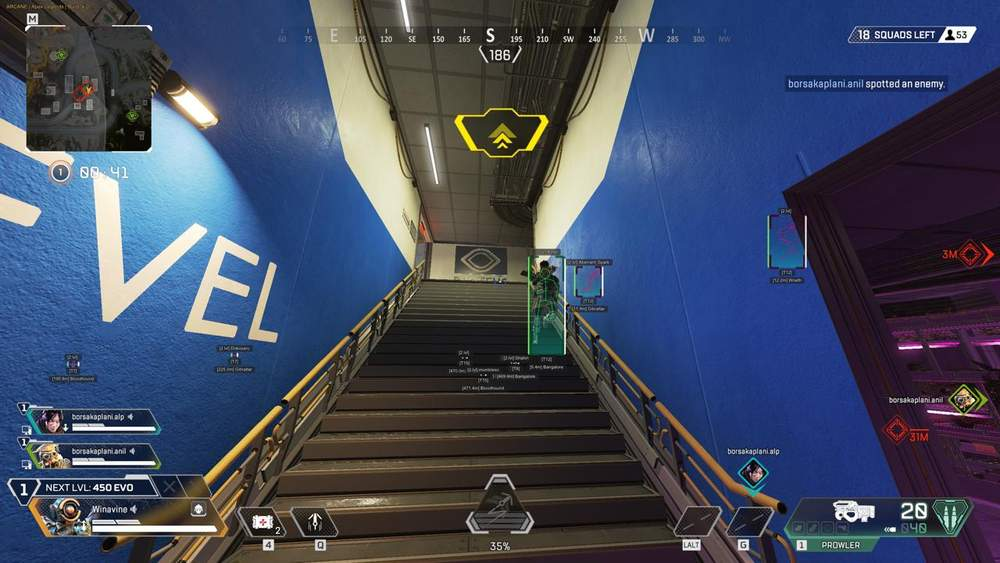
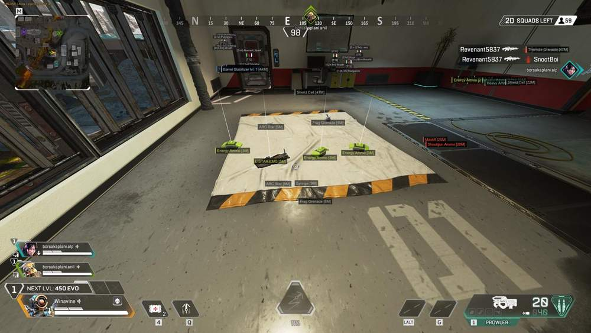
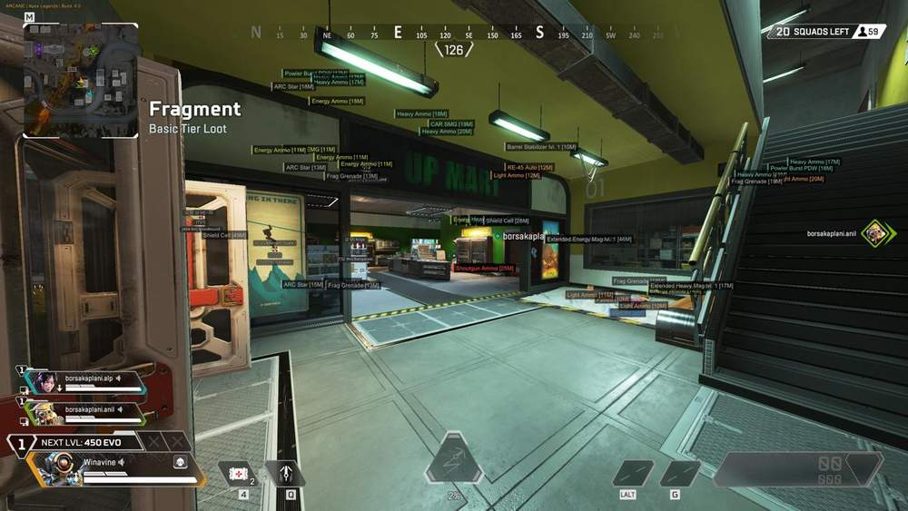
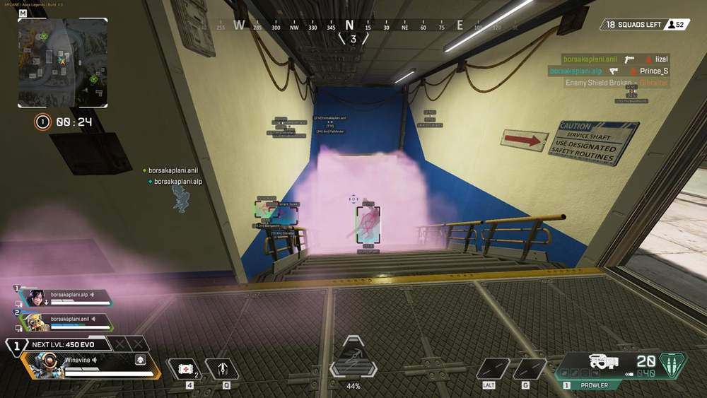
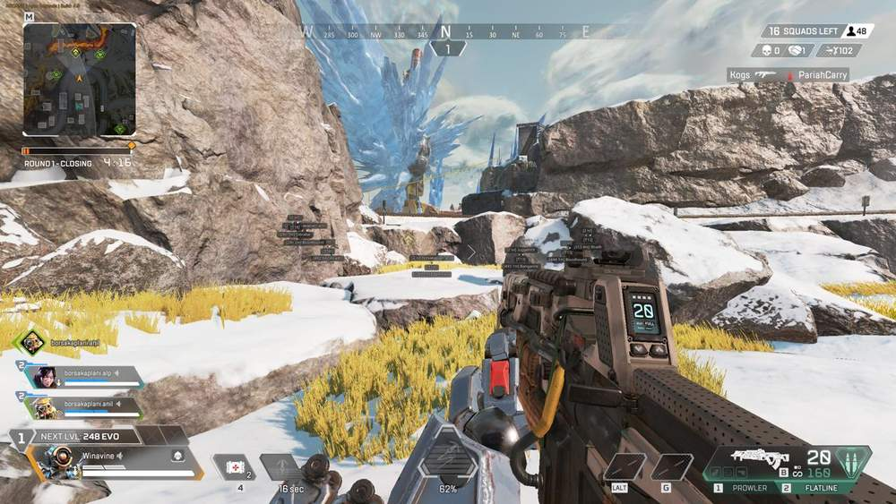

# Apex – Apex Legends [ ☢ Arcane ]

## 📸 Скриншоты

    

* Функционал Apex Legends [ ☢ Arcane ]:

### 🎯 Aimbot

* **Aimbot** – включение аимбота
* **Always Active** – постоянная работа аима без удержания клавиши
* **Prediction** – расчёт траектории движения цели
* **Recoil Control** – компенсация отдачи оружия
* **Target Bots** – выбор ботов в качестве целей
* **Target Teammates** – выбор союзников в качестве целей
* **Target Knocked** – наведение на нокнутых противников
* **Visible Check** – проверка видимости цели
* **Switch Delay** – настройка задержки перед сменой цели
* **Radius (FOV)** – настройка области поиска цели
* **Draw FOV** – отображение рабочей области аима
* **Activation Key (First, Second)** – настройка двух клавиш активации
* **Mode (Legit, Rage)** – выбор режима работы аимбота: Legit / Rage
* **Bone** – выбор части тела для наведения
* **Bone Selection Mode (Select, Random, Closest)** – выбор метода определения части тела
* **TriggerBot** – автоматический выстрел при наведении на противника

### 👤 Player ESP

* **2D Boxes** – отображение игроков с помощью 2D-боксов
* **Lines** – отображение линий до игроков
* **Skeleton** – отображение скелетов игроков
* **Health Bar** – отображение запаса здоровья
* **Shield Bar** – отображение количества брони
* **Nickname** – отображение никнеймов игроков
* **Level** – отображение уровня аккаунта
* **Platform** – отображение платформы игрока: Steam / EA / Console
* **Distance** – отображение дистанции до игрока
* **Max Distance** – настройка максимальной дистанции работы Player ESP
* **Legend Name** – отображение имени легенды
* **Team Number** – отображение номера команды
* **Weapon** – отображение оружия в руках игрока
* **View Line** – отображение направления взгляда
* **Draw Bots** – отображение ботов
* **Draw Teammates** – отображение союзников
* **Draw Knocked** – отображение нокнутых игроков
* **Draw Visible** – отображение видимых игроков

### 🔍 Loot ESP

* **Items ESP** – включение отображения предметов
* **Distance** – отображение дистанции до предметов
* **Max Distance** – настройка максимальной дистанции работы Loot ESP
* **Name** – отображение названий предметов
* **Quality Filter (White, Blue, Purple, Gold, Red)** – фильтрация предметов по качеству
* **Ammo (Light, Heavy, Shotgun, Energy, Sniper)** – отображение различных типов боеприпасов
* **Attachments** – отображение модификаций для оружия
* **Backpacks** – отображение рюкзаков
* **Helmets** – отображение шлемов
* **Body Shields** – отображение нагрудной брони
* **Knockdown Shields** – отображение щитов для нокнутых игроков
* **Meds and Armor** – отображение аптечек и зарядов для брони
* **Grenades** – отображение гранат и взрывчатки
* **Others** – отображение остальных предметов

### ✨ Glow

* **Enable Outlines** – включение обводки моделей персонажей
* **Draw Bots** – включение обводки моделей ботов
* **Draw Teammates** – включение обводки союзников
* **Draw Knockeds** – включение обводки нокнутых игроков
* **Items Display** – отображение предметов с помощью Glow
* **Items Distance** – настройка дистанции работы Loot Glow
* **Weapon Display** – отображение оружия с помощью Glow
* **Draw Fill** – включение заливки моделей
* **Brightness** – настройка яркости обводки и заливки
* **Outline Radius** – настройка толщины обводки
* **Mode** – выбор базового или расширенного режима настройки
* **Outline Style** – выбор стиля обводки персонажей и предметов
* **Fill Style** – выбор стиля заливки моделей

### ⚙️ Misc

* **Radar** – отображение игроков во встроенном радаре
* **Skinchanger** – установка различных скинов для оружия
* **Crosshair** – настраиваемый прицел в центре экрана
* **Super Glide** – упрощённое выполнение супер-скольжения
* **Bunny Hop** – автоматизация распрыжки
* **Wall Jump** – упрощённое выполнение прыжка от стены
* **Tap Strafe** – упрощённое выполнение Tap Strafe
* **CFG System** – сохранение и загрузка конфигураций
* **StreamProof** – скрытие интерфейса на видео, скриншотах и стримах
* **Localization** – поддержка английского, русского и китайского языков

## 🖥 Системные требования

* **Apex Legends [ ☢ Arcane ]:** 
* ⚙️ **️ Операционная система:** Windows 10-11
* 🔲 **Процессор:** Intel / AMD
* 🔲 **Видеокарта:** Nvidia / AMD
* 🖥 **Режим игры:** В окне без рамок / Оконный
* 🌐 **Поддерживаемые версии игры:** Steam / EA App
* 🤖 **Встроенный спуфер:** Да