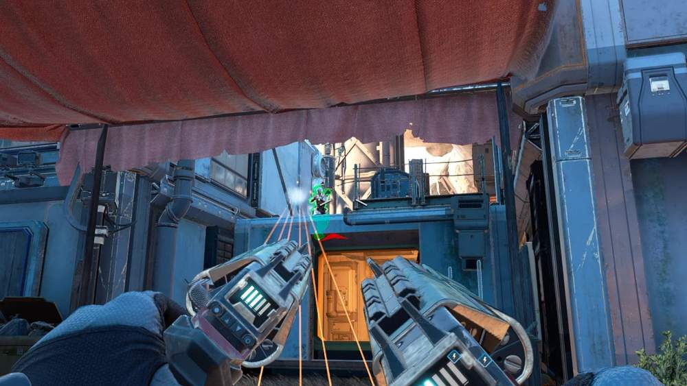
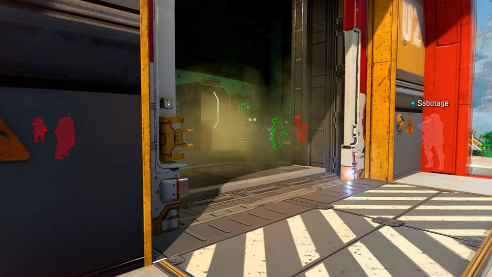
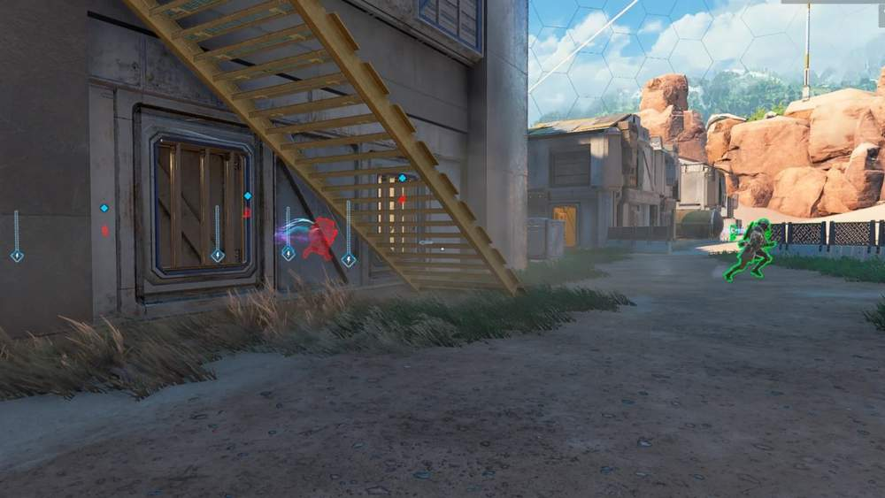
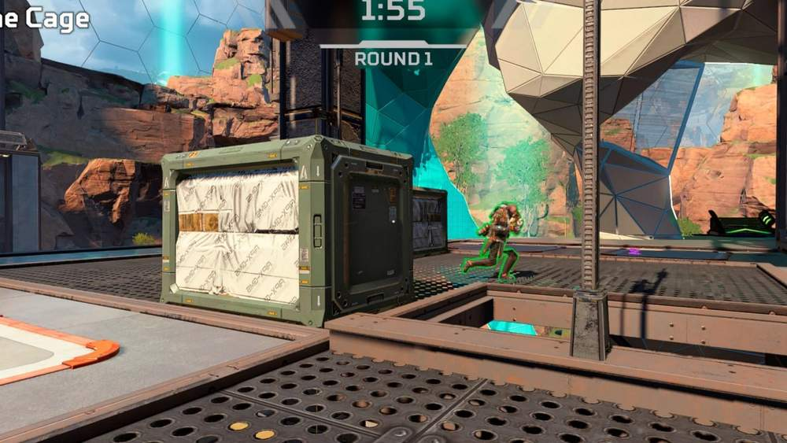
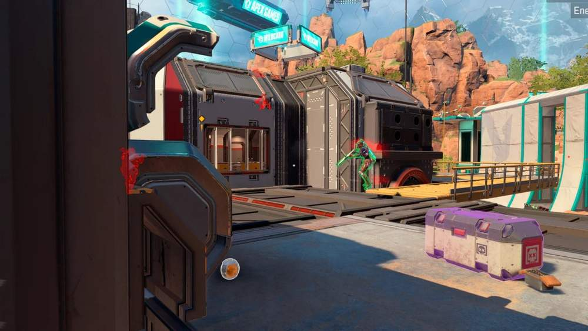

# Apex – Apex Legends [ ☢ Phoenix X-RAY ]

## 📸 Скриншоты

    

* **Функционал Apex Legends [ ☢ Phoenix X** – RAY ]:
* **X** – RAY — отображение противников через препятствия
* **WALLHACK** – визуальное отслеживание врагов сквозь стены и объекты карты
* **See Enemies Through Obstacles** – возможность видеть врагов через различные преграды
* **Enemy Only** – отображение только противников без лишней информации
* **Visible Check** – видимые враги подсвечиваются отдельным цветом
* **HWID Spoofer** – есть встроенный спуфер для обхода бана по железу

## 🖥 Системные требования

* **Apex Legends [ ☢ Phoenix X-RAY ]:** 
* ⚙️ **️ Операционная система:** Windows 10 - 11 (21H2  -  25H2)
* 🔲 **Процессор:** Intel | AMD
* 🔲 **Видеокарта:** Nvidia | AMD
* 🌐 **Поддерживаемые версии игры:** Steam, Origin, EA Game APP
* 🤖 **Встроенный спуфер:** Да