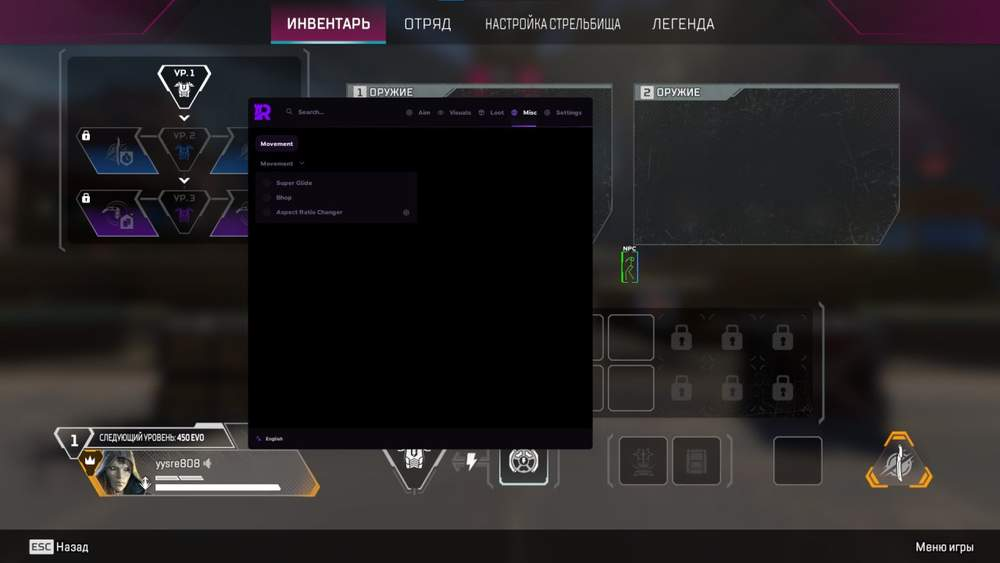
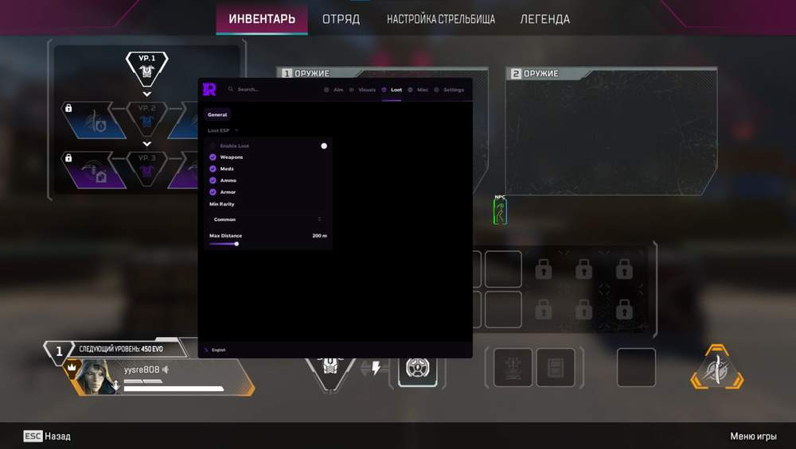
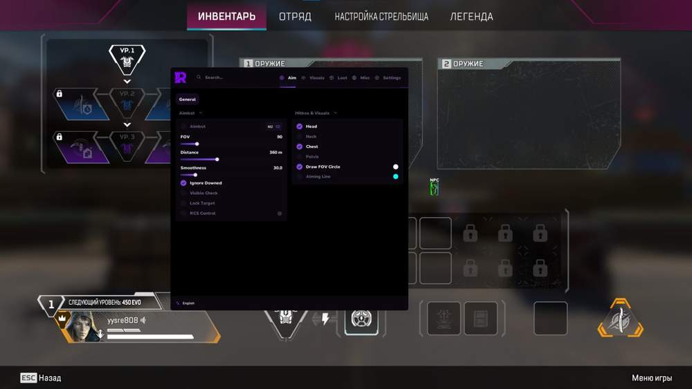
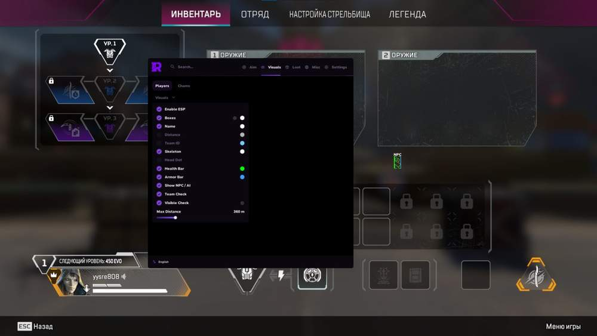

# Apex – Apex Legends [ ☢ Rampart ]

## 📸 Скриншоты

   

* Функционал Apex Legends [ ☢ Rampart ]:

### 🎯 Aimbot

* **Aimbot** – основной режим аима
* **FOV** – настройка радиуса FOV
* **Distance** – настройка дистанции работы аима
* **Smoothness** – настройка плавности наведения
* **Ignore Downed** – игнорирование сбитых игроков
* **Visible Check** – проверка видимости цели
* **Lock Target** – захват цели
* **RCS Control** – контроль отдачи

### 🎯 Hitbox & Visuals

* **Head** – наведение в голову
* **Neck** – наведение в шею
* **Chest** – наведение в грудь
* **Pelvis** – наведение в таз
* **Draw FOV Circle** – отображение круга FOV
* **Aiming Line** – линия наведения до цели

### 👤 Players

* **Enable ESP** – включение ESP игроков
* **Boxes** – отображение боксов
* **Name** – отображение имени
* **Distance** – отображение дистанции
* **Team ID** – отображение ID команды
* **Skeleton** – отображение скелета
* **Head Dot** – точка на голове
* **Health Bar** – полоска здоровья
* **Armor Bar** – полоска брони
* **Show NPC** – отображение NPC
* **Team Check** – проверка команды
* **Visible Check** – проверка видимости
* **Max Distance** – максимальная дистанция отображения

### 🎨 Chams

* **Chams** – подсветка моделей
* **Loot Chams** – подсветка лута

### 📦 Loot

* **Enable Loot** – включение отображения лута
* **Weapons** – отображение оружия
* **Meds** – отображение медикаментов
* **Ammo** – отображение патронов
* **Armor** – отображение брони
* **Min Rarity** – минимальная редкость предметов
* **Max Distance** – максимальная дистанция отображения

### 🏃 Movement

* **Super Glide** – Super Glide
* **Bhop** – Bunny Hop
* **Aspect Ratio Changer** – изменение соотношения сторон

### ⚙️ General

* **Menu Key** – клавиша открытия меню
* **Font Style** – стиль шрифта
* **Font Size** – размер шрифта
* **VSync** – вертикальная синхронизация
* **FPS Limit** – лимит FPS

### 🛠 Configs

* **Name** – название конфига
* **Save** – сохранение конфига
* **Import** – импорт конфига
* **Delete / Load** – удаление или загрузка конфига

## 🖥 Системные требования

* **Apex Legends [ ☢ Rampart ]:** 
* ⚙️ **️ Операционная система:** Windows 10 - 11
* 🔲 **Процессор:** Intel | AMD
* 🔲 **Видеокарта:** Nvidia | AMD
* 🖥 **Режим игры:** В окне без рамок | Оконный
* 🌐 **Поддерживаемые версии игры:** Steam
* 🤖 **Встроенный спуфер:** Нет