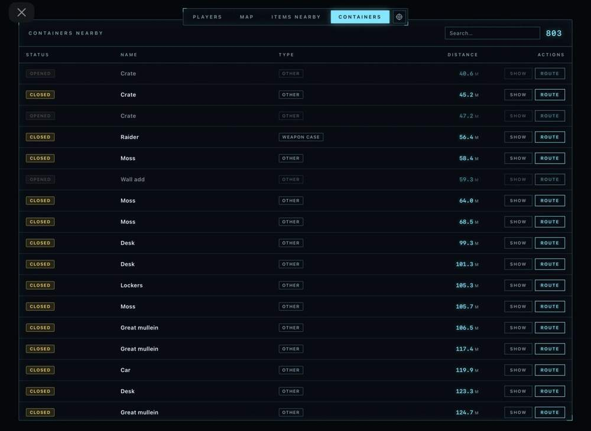
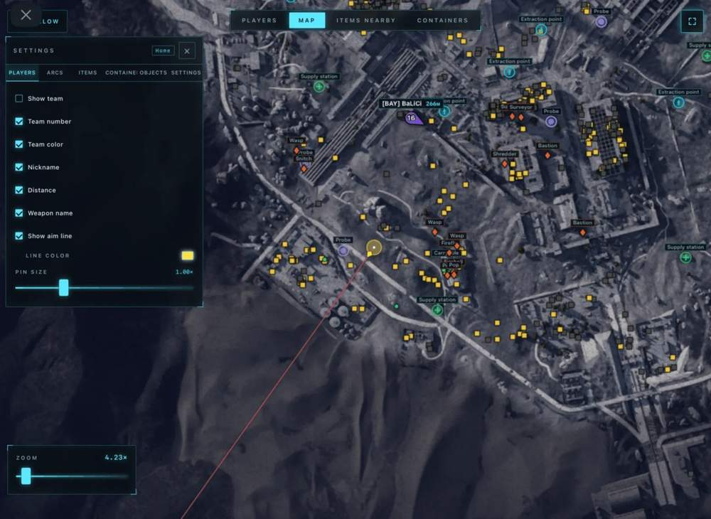
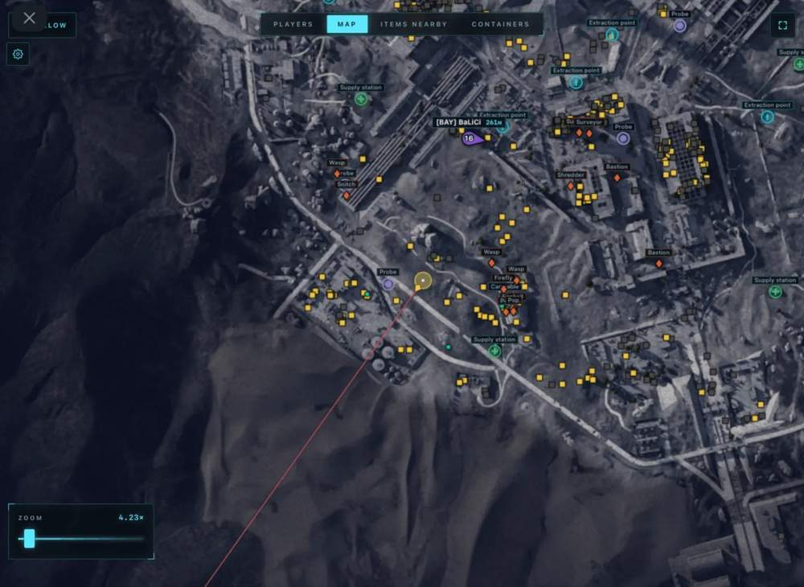

# ARC Raiders – ARC Raiders [ ☢ Arcane Radar ]

## 📸 Скриншоты

  

* ункционал ARC Raiders [ ☢ Arcane Radar ]:

### 👥 Players

* **Show Team** – отображение команды с возможностью показывать всех союзников или только выбранных
* **Team Number** – отображение номера команды
* **Team Color** – отображение цвета команды
* **Nickname** – отображение никнеймов игроков
* **Distance** – отображение дистанции до игроков
* **Weapon Name** – отображение названия оружия
* **Show Aim Line** – отображение направления взгляда
* **Players Size** – настройка размера игроков

### 🔵 ARCs

* **Show ARCs** – отображение ARCs
* **Show Name** – отображение имени
* **Show Distance** – отображение дистанции
* **Font Size** – настройка размера шрифта

### 📦 Items

* **Show Items** – отображение предметов
* **Show Name** – отображение названий предметов
* **Show Distance** – отображение дистанции до предметов
* **Font Size** – настройка размера шрифта
* **Opacity** – настройка прозрачности
* **Category Selector** – выбор категорий предметов

### 🗃 Container

* **Show Containers** – отображение контейнеров
* **Hide Opened** – скрытие уже открытых контейнеров
* **Show Name** – отображение названия контейнера
* **Show Distance** – отображение дистанции до контейнера
* **Font Size** – настройка размера шрифта
* **Opacity** – настройка прозрачности
* **Types Selector** – выбор типа контейнера

### 🧩 Objects

* **Show Name** – отображение названий объектов
* **Show Distance** – отображение дистанции до объектов
* **Font Size** – настройка размера шрифта
* **Opacity** – настройка прозрачности

### 🏷 Types

* **Extraction Points** – отображение точек выхода
* **Supply Call Station** – отображение станций вызова припасов
* **Supply Station** – отображение станций припасов
* **Power Station** – отображение электростанций
* **Probe** – отображение проб
* **Mine** – отображение мин
* **Quest** – отображение квестовых объектов
* **Carryable** – отображение переносимых объектов
* **Grenade** – отображение гранат

### ⚙️ Misc

* **Show Aim Line** – отображение линии взгляда локального игрока
* **Auto** – Scaling - автоматическое увеличение и уменьшение масштаба
* **Follow Local Player** – слежение за локальным игроком
* **Follow Specific Team Member** – возможность следовать за конкретным членом команды

### 📋 Global Player Table

* **Team Number** – отображение номера команды
* **Name** – отображение ника игрока
* **Weapon** – отображение оружия
* **Health** – отображение здоровья
* **Distance** – отображение дистанции
* **Actions** – быстрые действия: показать игрока на карте / построить маршрут к игроку

### 📋 Items Nearby Table

* **Search for Nearby Items** – поиск ближайших предметов
* **Name** – отображение названия предмета
* **Distance** – отображение дистанции
* **Actions** – быстрые действия: показать предмет на карте / построить маршрут к предмету

### 📋 Containers Nearby Table

* **Status** – отображение статуса контейнера: открыт / закрыт
* **Name** – отображение названия контейнера
* **Type** – отображение типа контейнера
* **Distance** – отображение дистанции
* **Actions** – быстрые действия: показать контейнер на карте / построить маршрут к контейнеру