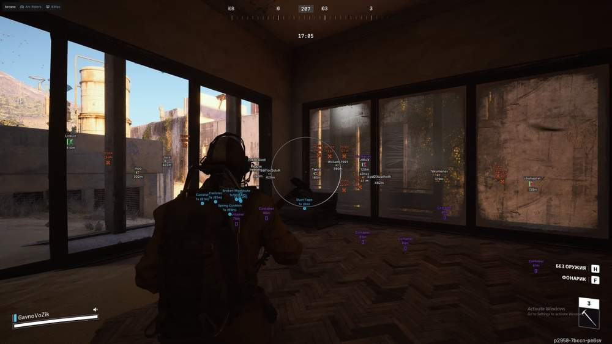
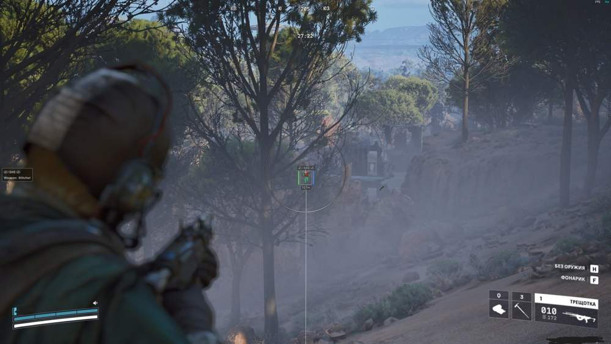
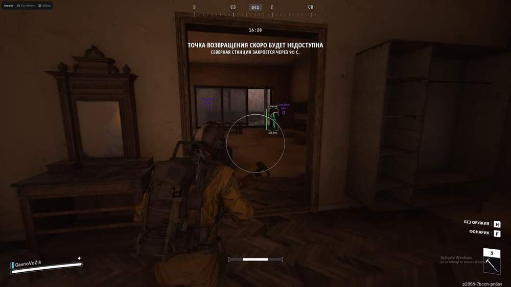
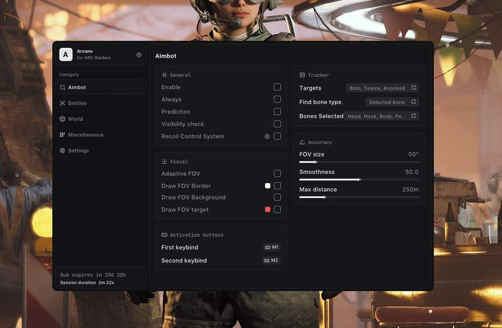
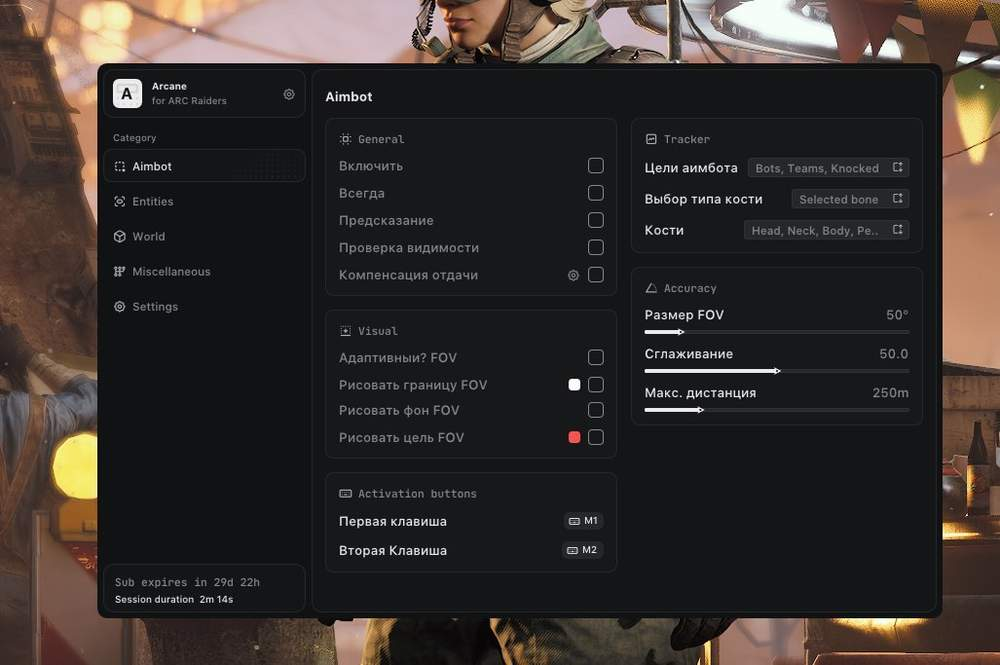
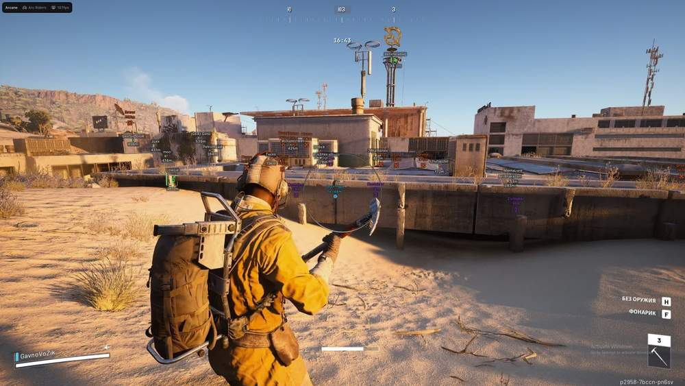

# ARC Raiders – ARC Raiders [ ☢ Arcane ]

## 📸 Скриншоты

     

* Функционал ARC Raiders [ ☢ Arcane ]:

### 🎯 Aim

* **Enable** – активация аимбота
* **Always** – постоянная работа аима
* **Visibility Check** – проверка видимости цели
* **Draw FOV Border** – отображение границы круга FOV
* **Draw FOV Background** – отображение фона круга FOV
* **First Keybind** – первая клавиша активации аима
* **Second Keybind** – вторая клавиша активации аима
* **Targets** – выбор целей: Players / Bots / Team / Knocked
* **Find Bone Type** – тип поиска кости: Selected Bone / Closest Bone / Random Bone
* **Bone** – выбор кости наведения: Head / Neck / Chest / Pelvis
* **FOV Size** – настройка размера круга FOV
* **Smoothness** – настройка плавности наведения
* **Max Distance** – настройка максимальной дистанции работы аима

### 👁 ESP Players

* **Bounding Box** – отображение 2D бокса: Box / Corner
* **Fill Box** – фон бокса: Static / Gradient
* **Skeleton** – отображение скелета с настройкой круга головы и толщины
* **Line to Enemy** – линии к игрокам с настройкой цвета и позиции
* **Health Bar** – полоска здоровья: Static / Health Based / Gradient
* **View Line** – отображение линии взгляда
* **Name** – отображение ника игрока
* **Distance** – отображение дистанции до цели
* **Draw BOTs** – отображение ботов
* **Draw Teammates** – отображение союзников
* **Visibility Check** – проверка видимости цели
* **Bot Transparency** – настройка прозрачности ботов
* **Max Distance** – максимальная дистанция отображения игроков

### 📦 Items ESP

* **Show Count** – отображение количества предметов
* **Show Distance** – отображение дистанции до предметов
* **Drone** – отображение дронов
* **Container** – отображение контейнеров
* **Dropped Item** – отображение выброшенных предметов

### 📡 Radar

* **Enable** – активация радара
* **Show Distance** – отображение дистанции на радаре
* **Zoom** – настройка приближения радара
* **Size** – настройка размера радара по X/Y
* **Distance Transparency** – прозрачность дистанции
* **Color Outline** – настройка цвета обводки
* **Color Background** – настройка цвета фона

### 📍 Radar Entities

* **Show Player** – отображение игроков
* **Show AI** – отображение ботов
* **Show Team** – отображение союзников

### ⚙️ Settings

* **Menu Keybind** – клавиша открытия меню
* **Unload Keybind** – клавиша полной выгрузки меню
* **DPI Scale** – настройка масштаба интерфейса
* **FPS Limit** – лимит кадров в секунду
* **Theme** – выбор темы: Dark / Light
* **Watermark** – включение водяного знака
* **Language** – выбор языка: EN / RU / CN

## 🖥 Системные требования

* **ARC Raiders [ ☢ Arcane ]:** 
* ⚙️ **️ Операционная система:** Windows 10 - 11
* 🔲 **Процессор:** Intel / AMD
* 🔲 **Видеокарта:** Nvidia / AMD
* 🖥 **Режим игры:** Оконный / Полноэкранный в окне
* 🌐 **Поддерживаемые версии игры:** Steam, Xbox Epic Games
* 🤖 **Встроенный спуфер:** Нет