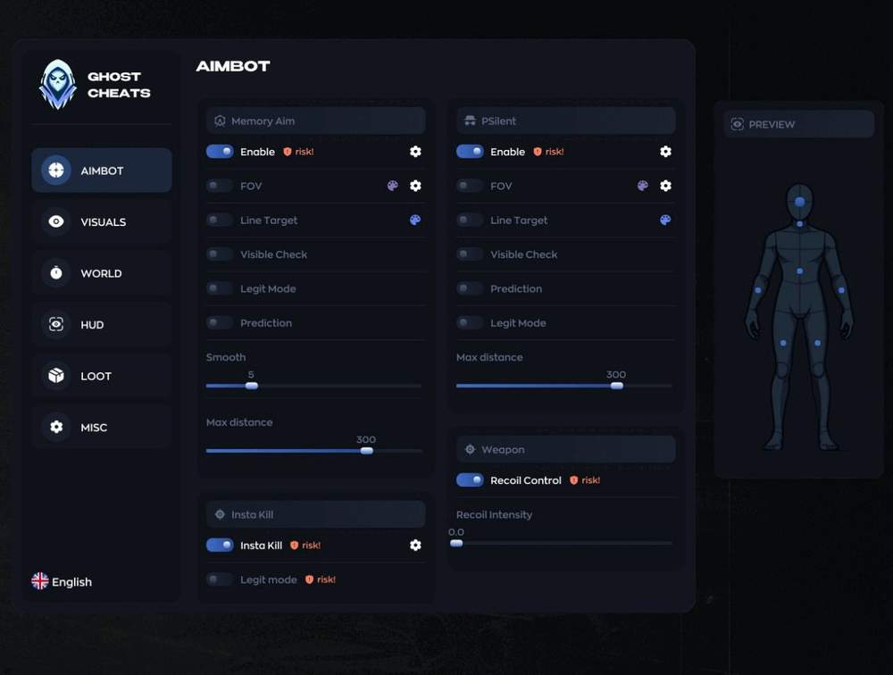
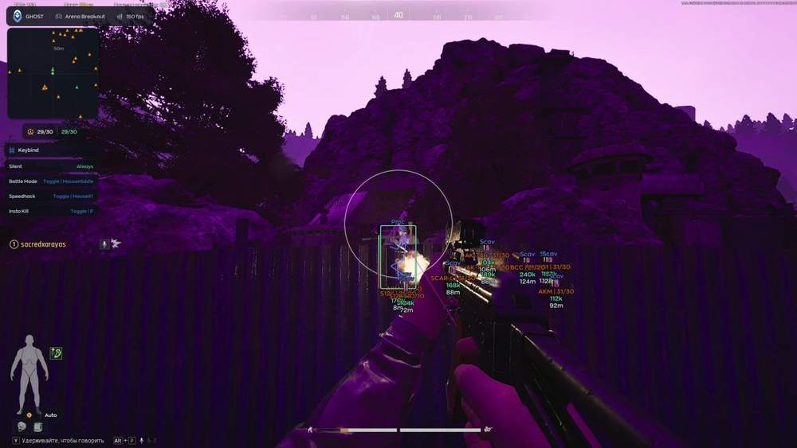
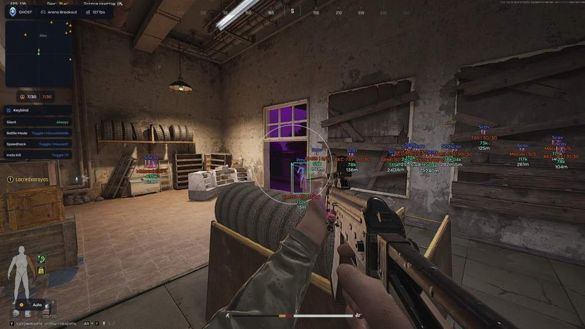
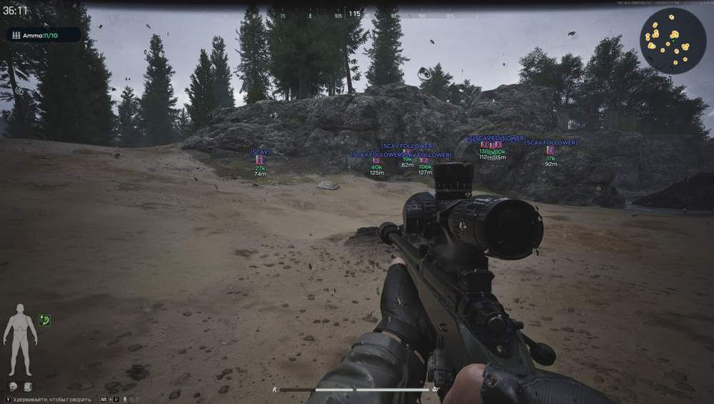

# Arena Breakout Infinite – Arena Breakout Infinite [ ☢ Ghost Full ]

## 📸 Скриншоты

   

* Функцийй
* ункционал Arena Breakout Infinite [ ☢ Ghost Full ]:

### 🎯Aimbot

* **Memory Aim / PSilent** – два режима аима: обычное наведение через память и скрытый PSilent без резких движений камеры
* **Enable / Bind** – включение аимбота и назначение удобной клавиши активации
* **FOV** – включение круга FOV, настройка радиуса от 20 до 360 и выбор цвета
* **Line Target** – линия до текущей цели с настройкой цвета
* **Visible Check** – работа только по видимым целям, без захвата через препятствия
* **Legit Mode** – более аккуратный режим наведения для естественной игры
* **Prediction** – упреждение движения цели для стабильных попаданий
* **Smooth** – плавность наведения от 1 до 20
* **Max Distance** – максимальная дистанция работы аима от 10 до 400 метров
* **Insta Kill** – усиленный режим для быстрого устранения цели
* **Insta Kill Legit Mode** – более мягкий вариант Insta Kill для осторожной игры
* **Recoil Control** – контроль отдачи с настройкой интенсивности от 0.0 до 1.0

### 👤 Visuals

* **Player ESP** – отображение игроков через визуальные элементы на экране
* **AI / Bot ESP** – отдельное отображение ботов и AI-противников
* **Corpse ESP** – подсветка трупов для быстрого поиска лута
* **Grenade ESP** – отображение гранат и опасных предметов
* **ESP Settings** – гибкая настройка ESP: цвет видимых и невидимых целей, тип Normal / Corner / Filled, дистанция, толщина, скругление и другие параметры
* **Radar** – радар с настройкой размера, максимальной дистанции, зума, размера точки и стиля точек
* **Ammo Indicator** – индикатор боеприпасов с подсказкой цены
* **Crosshair** – настраиваемый прицел с выбором цвета
* **Bullet Tracer** – трассеры пуль для контроля направления выстрелов
* **Sky Color** – настройка цвета неба
* **No Fog / No Shadows / No Clouds** – отключение тумана, теней и облаков для лучшей видимости
* **Fullbright** – повышение яркости картинки с настройкой Brightness
* **Watermark** – отображение водяного знака и служебной информации
* **Keybind List** – список активных биндов на экране
* **Menu Key / DPI Scale** – настройка клавиши меню и масштаба интерфейса

### 🔎 Loot

* **Rarity System** – система редкости Common, Rare, Epic, Legendary, Mythic и Exotic с красной подсветкой
* **Dropped Items / Containers** – отображение выброшенных предметов и контейнеров с настройкой цвета
* **Show Container Items** – показ содержимого контейнеров с отдельным биндом
* **Container Types** – multi-dropdown для выбора нужных типов контейнеров
* **Short Name** – компактное отображение названий предметов
* **Armor Level** – показ уровня брони у предметов
* **Item Count** – количество предметов в контейнере или стопке
* **Max Distance** – дистанция отображения лута от 10 до 100 метров
* **Min Price** – фильтр по цене от 100 до 100 000
* **Font Size** – размер шрифта от 8 до 25
* **Battle Mode** – быстрый режим с биндом, который убирает лишний лут во время боя

### 📦Other

* **Config Name / Config List** – поле названия конфига и список сохранённых профилей
* **Create / Delete / Save / Load** – создание, удаление, сохранение и загрузка конфигов
* **Speedhack** – ускорение с отдельным биндом и настройкой скорости от 0 до 5000
* **Fast Search** – быстрый обыск с включением и горячей клавишей
* **Remote Loot** – лут через стены в радиусе до 70 метров с отдельным биндом
* **Anti Flash / No Visor** – отключение ослепления и эффекта визора
* **Auto Mode** – автоматический режим для удобной стрельбы
* **Fast Reload / Fast Magazine** – ускоренная перезарядка и быстрая работа с магазином
* **FOV Changer** – изменение угла обзора с диапазоном от 60 до 120

### 🧩Misc

* **Language Switcher** – переключение языка меню: EN / RU / ZH
* **Hitbox Selector** – выбор хитбоксов: Head, Neck, Body, Arm R/L и Leg R/L
* **Visuals Preview** – предпросмотр визуалов с drag-and-drop настройкой позиций ESP-элементов
* **Player / Bot Preview** – переключение между игроком и ботом в окне предпросмотра

## 🖥 Системные требования

* **Arena Breakout Infinite [ ☢ Ghost Full ]:** 
* ⚙️ **️ Операционная система:** Windows 10 - 11
* 🔲 **Процессор:** Intel / AMD
* 🔲 **Видеокарта:** Nvidia / AMD
* 🖥 **Режим игры:** В окне без рамок / Оконный
* 🌐 **Поддерживаемые версии игры:** Steam / Epic Games / Microsoft Store
* 🤖 **Встроенный спуфер:** Нет