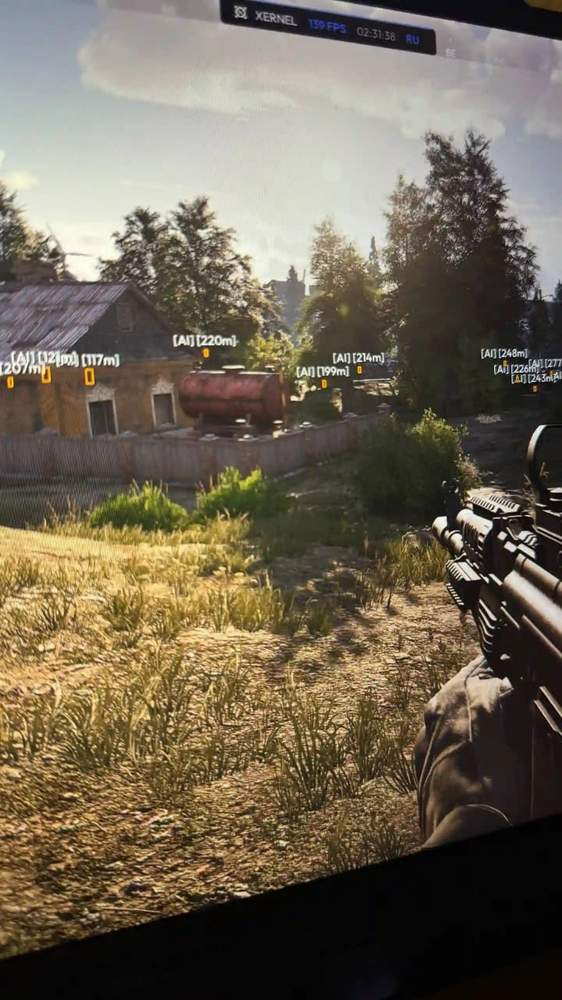
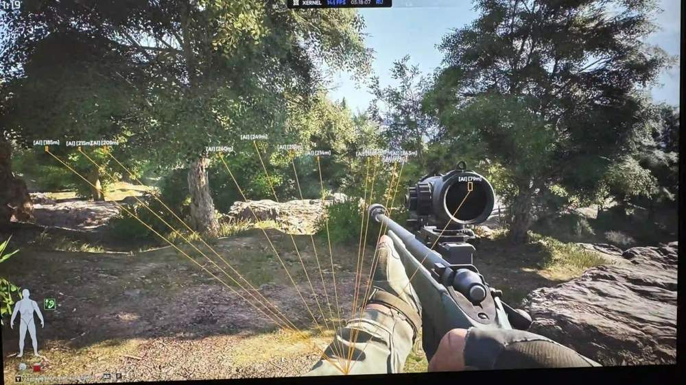
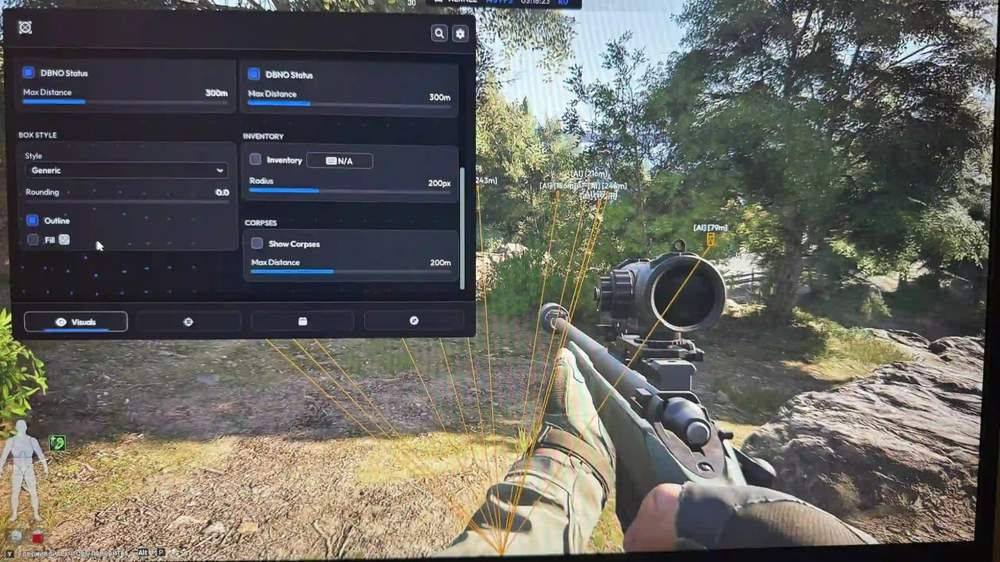
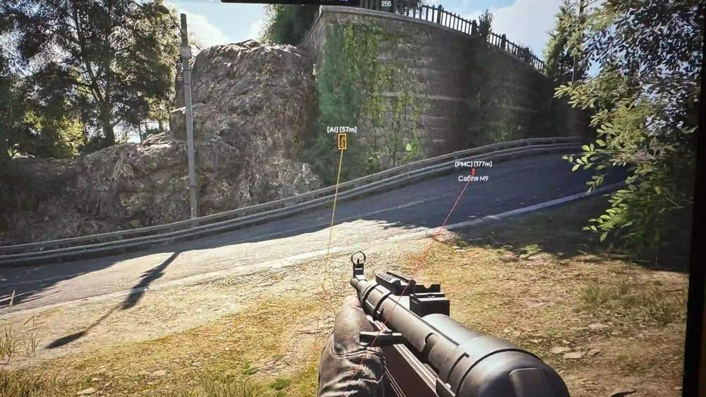
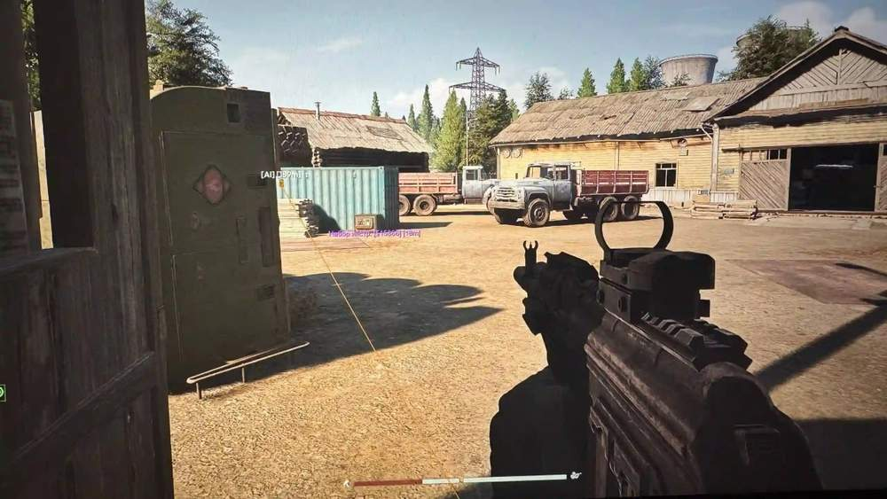
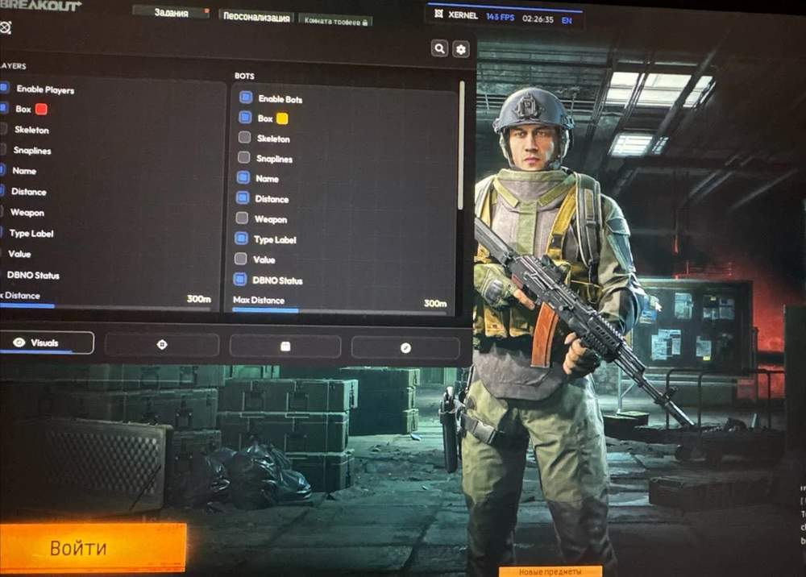
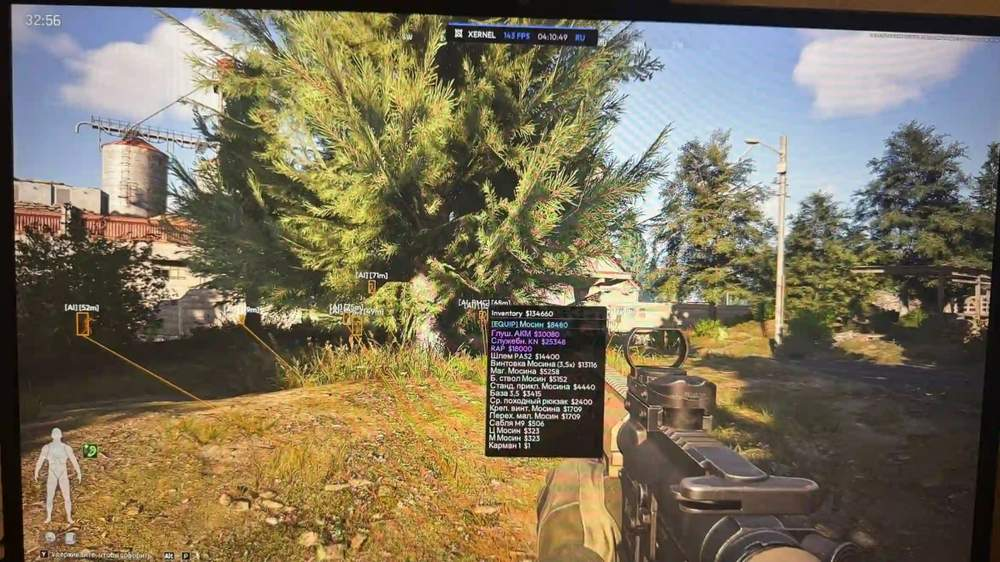
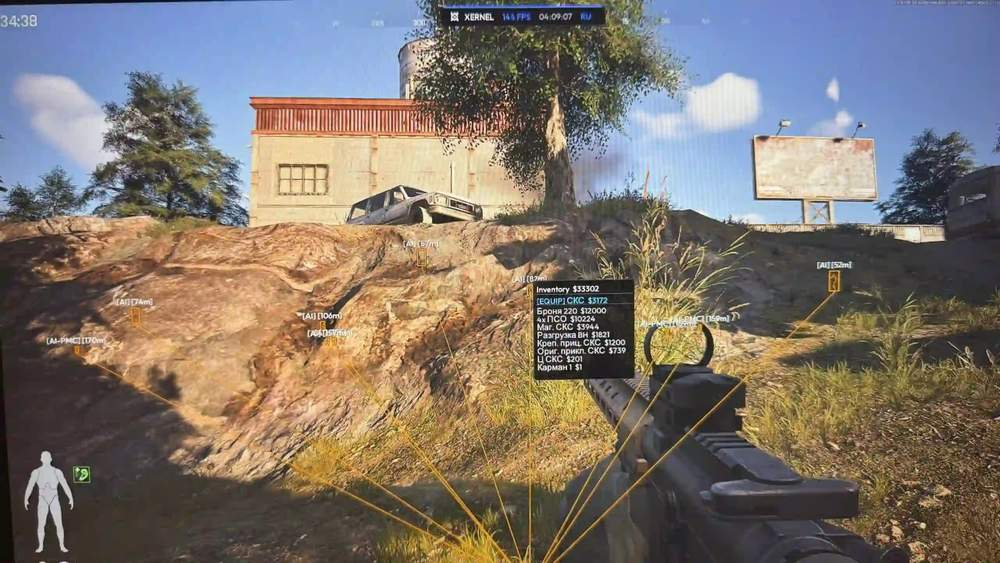

# Arena Breakout Infinite – Arena Breakout Infinite [ ☢ Xernel Full ]

## 📸 Скриншоты

       

* Функционал Arena Breakout Infinite [ ☢ Xernel Full ]:

### 👤Visuals

* **Player ESP** – отображение игроков
* **Bot ESP** – отображение ботов
* **Box ESP** – боксы вокруг объектов
* **Box Style (2D/Corner)** – стиль боксов: 2D или угловой
* **Snaplines** – линии наведения к объектам
* **Player Name** – имя игрока
* **Player Distance** – расстояние до игрока
* **Player Weapon** – оружие игрока
* **Player Status** – статус игрока
* **Inventory Viewer** – просмотр инвентаря
* **Corpse ESP** – отображение трупов

### 🎯Aimbot

* **Target Bone Selection** – выбор кости для наведения
* **Aimbot FOV** – радиус работы аимбота
* **Draw FOV** – отображение радиуса аимбота
* **Aimbot Smooth** – плавность наведения

### 🔎Loot

* **Container ESP** – отображение контейнеров
* **Weapon Cases ESP** – отображение оружейных кейсов
* **Med Bags ESP** – отображение медицинских сумок
* **Safes & Cash Registers ESP** – отображение сейфов и касс
* **Military Loot ESP** – отображение военного лута
* **Household Loot ESP** – отображение бытового лута
* **Custom Loot Colors** – пользовательские цвета лута
* **Smart Loot Filter** – умный фильтр лута

### 🖲Radar

* **2D Radar** – 2D-радар
* **Radar Zoom** – масштаб радара
* **Radar Position & Size** – положение и размер радара
* **Radar Transparency** – прозрачность радара

## 🖥 Системные требования

* **Arena Breakout Infinite [ ☢ Xernel Full ]:** 
* ⚙️ **️ Операционная система:** Windows 10 | 11
* 🔲 **Процессор:** Intel | AMD
* 🔲 **Видеокарта:** Nvidia | AMD
* 🖥 **Режим игры:** В окне | без рамок | Оконный
* 🌐 **Поддерживаемые версии игры:** Steam | Epic Games | Microsoft Store
* 🤖 **Встроенный спуфер:** Нет