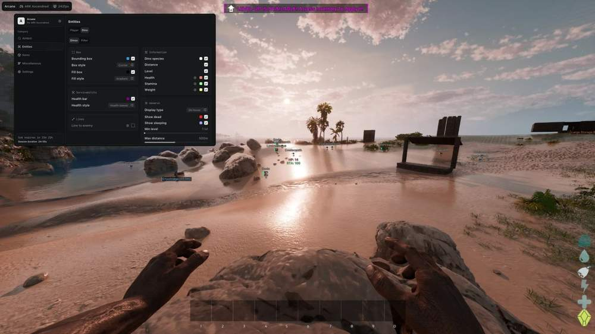
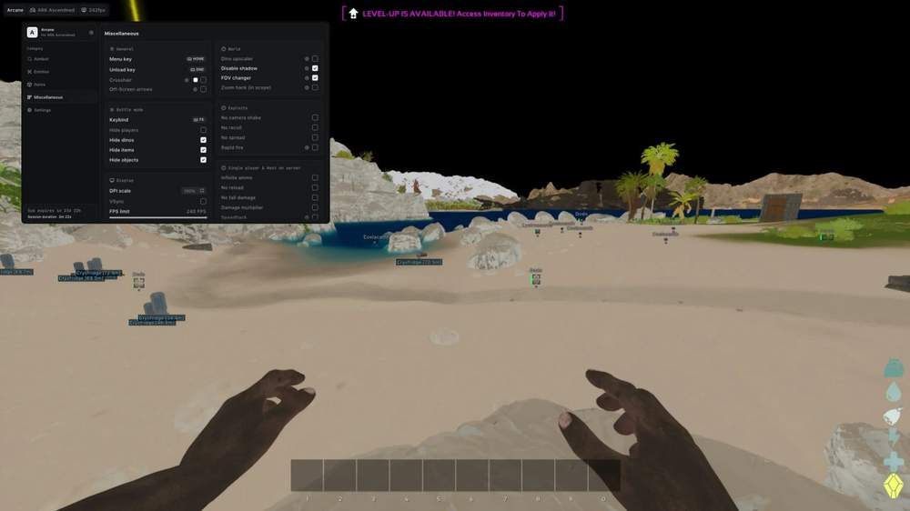
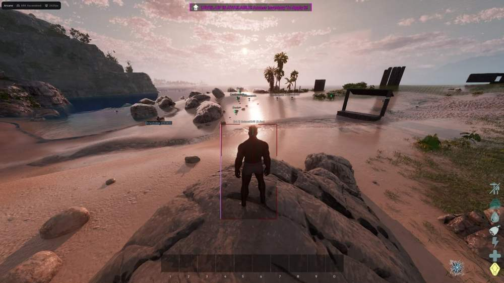

# ARK Ascended – ARK Ascended [ ☢ Arcane ]

## 📸 Скриншоты

  

* Функционал ARK Ascended [ ☢ Arcane ]:

### 🎯 Aimbot

* **Enable** – включение аимбота
* **Target** – выбор целей: Players / Dinosaurs
* **Keybind** – настройка клавиши активации
* **Prediction** – расчёт траектории движения цели
* **Humanize** – настройка покачивания и фактора гуманизации
* **Priority** – выбор приоритета цели: Center Screen / Distance
* **Draw FOV Border** – отображение границы круга FOV
* **Draw FOV Background** – отображение фона круга FOV
* **FOV Size** – настройка размера круга FOV
* **Smoothness** – настройка плавности наведения
* **Max Distance** – настройка максимальной дистанции работы аима

### 👤 Players ESP

* **Bounding Box** – отображение игроков с помощью 2D-боксов: Box / Corner
* **Fill Box** – настройка фона бокса: Static / Gradient
* **Health Bar** – отображение полоски здоровья: Static / Health Based / Gradient
* **Skeleton** – отображение скелетов с настройкой толщины
* **Health Text** – отображение здоровья текстом
* **Item In Hand** – отображение предмета в руках
* **Name** – отображение никнейма игрока
* **Distance** – отображение дистанции до игрока
* **Level** – отображение уровня игрока
* **Show Dead** – отображение мёртвых игроков
* **Show Sleeping** – отображение спящих игроков
* **View Line** – отображение направления взгляда с настройкой цветов
* **Line To Enemy** – отображение линий до игроков: Top / Bottom / Center
* **Max Distance** – настройка максимальной дистанции работы Players ESP

### 🦖 Dino ESP

* **Bounding Box** – отображение динозавров с помощью 2D-боксов: Box / Corner
* **Fill Box** – настройка фона бокса: Static / Gradient
* **Health Bar** – отображение полоски здоровья: Static / Health Based / Gradient
* **Dino Species** – отображение вида динозавра
* **Distance** – отображение дистанции до динозавра
* **Level** – отображение уровня динозавра
* **Health** – отображение здоровья
* **Stamina** – отображение выносливости
* **Weight** – отображение веса
* **Show Dead** – отображение мёртвых динозавров
* **Show Sleeping** – отображение спящих динозавров
* **Display Type** – выбор режима отображения информации: Always / On Hover
* **Line To Enemy** – отображение линий до динозавров: Top / Bottom / Center
* **Min Level** – настройка минимального уровня динозавра
* **Max Distance** – настройка максимальной дистанции работы Dino ESP

### 🔎 Dino Filter

* **Filter Mode** – выбор режима фильтрации: Match All / Match Any
* **Carnivore** – отображение хищников
* **Herbivore** – отображение травоядных
* **Tamable** – отображение приручаемых динозавров
* **Flying** – отображение летающих динозавров
* **Water Ridable** – отображение плавающих динозавров
* **Agro** – отображение агрессивных динозавров

### 📦 Items ESP

* **Distance** – отображение дистанции до предметов
* **Max Distance** – настройка максимальной дистанции работы Items ESP
* **Clothes** – отображение одежды
* **Resources** – отображение ресурсов
* **Weapons** – отображение оружия
* **Structures** – отображение построек
* **Consumables** – отображение расходуемых предметов
* **Ammo** – отображение боеприпасов
* **Artifacts** – отображение артефактов
* **Skins** – отображение скинов

### 🏗 Objects

* **Supply Crate** – отображение воздушных ящиков
* **Sleeping Bag** – отображение спальных мешков
* **Simple Bed** – отображение простых кроватей
* **Tek Bed** – отображение Tek-кроватей
* **Storage Small** – отображение маленьких хранилищ
* **Storage Large** – отображение больших хранилищ
* **Storage Huge** – отображение огромных хранилищ
* **Storage Tek** – отображение Tek-хранилищ
* **Dedicated Storage** – отображение специальных хранилищ
* **Ammo Container** – отображение контейнеров с боеприпасами
* **Tek Generator** – отображение Tek-генераторов
* **Cryo Fridge** – отображение крио-холодильников
* **Turret** – отображение турелей

### ⚙️ Misc

* **Crosshair** – настройка прицела: Style / Size / Thickness
* **Off** – Screen Arrows - отображение стрелок за пределами экрана с настройкой цвета, яркости, размера и расстояния
* ⚔️ Battle Mode
* **Keybind** – настройка клавиши активации
* **Hide Players** – скрытие игроков
* **Hide Dinos** – скрытие динозавров
* **Hide Items** – скрытие предметов
* **Hide Objects** – скрытие объектов

### 🌍 World

* **Dino Size Changer** – изменение размера динозавров
* **Disable Shadow** – отключение теней
* **FOV Changer** – изменение угла обзора
* **Zoom Hack (In Scope)** – дополнительное приближение в прицеле

### 🛠 Exploits

* **No Camera Shake** – отключение тряски камеры
* **No Recoil** – отключение отдачи
* **No Spread** – отключение разброса
* **Rapid Fire** – увеличение скорости стрельбы

### 🎮 Single Player & Host On Server

* **Infinite Ammo** – бесконечные боеприпасы
* **No Reload** – стрельба без перезарядки
* **No Fall Damage** – отключение урона от падения
* **Damage Multiplier** – настройка множителя урона
* **Speedhack** – изменение скорости передвижения

## 🖥 Системные требования

* **ARK Ascended [ ☢ Arcane ]:** 
* ⚙️ **️ Операционная система:** Windows 10 - 11
* 🔲 **Процессор:** AMD / INTEL
* 🔲 **Видеокарта:** AMD / NVIDIA
* 🖥 **Режим игры:** Оконный / Полноэкранный в окне
* 🌐 **Поддерживаемые версии игры:** Steam, Epic Games, Microsoft Store
* 🤖 **Встроенный спуфер:** Да