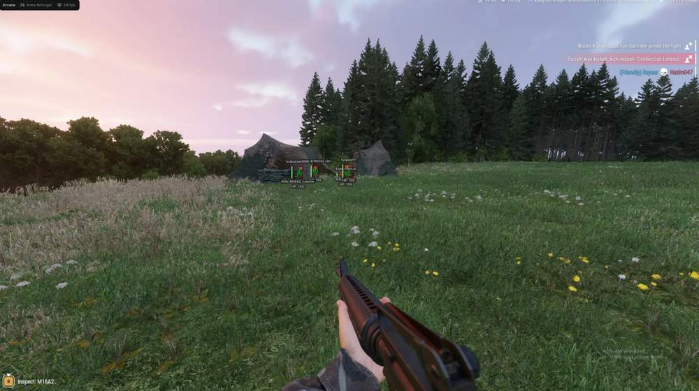
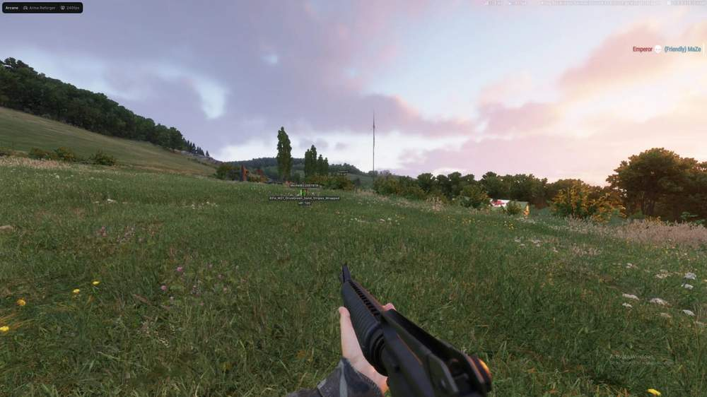
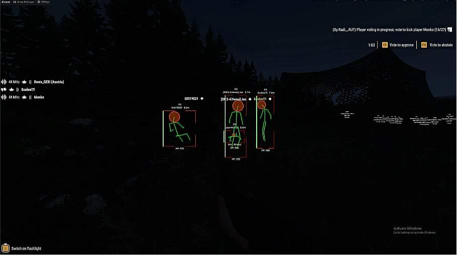
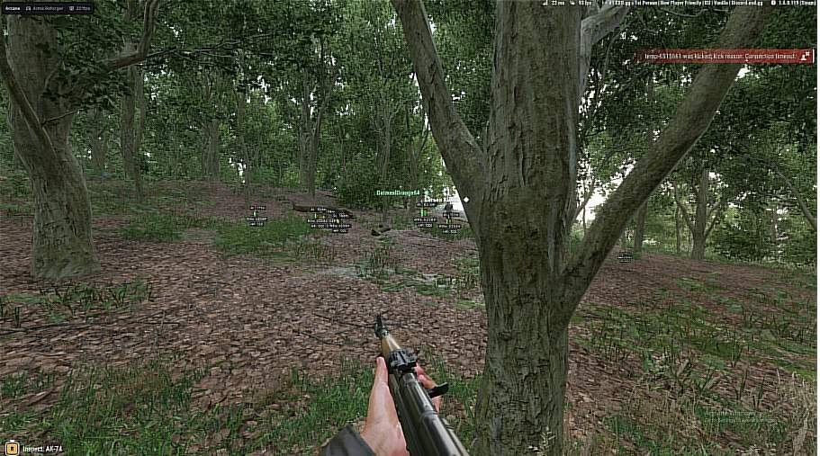

# Arma Reforger – Arma Reforger [ ☢ Arcane ]

## 📸 Скриншоты

   

* Функционал Arma Reforger [ ☢ Arcane ]:

### 🎯 Aimbot

* **Keybind** – настройка клавиши активации
* **Target Bone** – выбор части тела: Head / Neck / Body / Pelvis
* **Type** – выбор режима работы: Hold / Always
* **Adaptive FOV** – автоматическая настройка области FOV
* **Draw FOV Border** – отображение границы круга FOV
* **Draw FOV Background** – отображение фона круга FOV
* **FOV Size** – настройка размера круга FOV
* **Smoothness** – настройка плавности наведения
* **Max Distance** – настройка максимальной дистанции работы аима

### 👤 Players ESP

* **ESP Style** – выбор стиля отображения: With Background / Without Background
* **Bounding Box** – отображение игроков с помощью 2D-боксов: Box / Corner
* **Fill Box** – настройка фона бокса: Static / Gradient
* **Line To Enemy** – отображение линий до игроков с настройкой цвета и позиции
* **Health Bar** – отображение полоски здоровья: Static / Health Based / Gradient
* **Skeleton** – отображение скелета с настройкой толщины и круга головы
* **Name** – отображение никнеймов игроков
* **Current Weapon** – отображение оружия в руках
* **Team Name** – отображение названия команды
* **Distance** – отображение дистанции до игроков
* **Show Team** – отображение членов команды
* **Max Distance** – настройка максимальной дистанции работы ESP

### ⚙️ Settings

* **Menu Keybind** – настройка клавиши открытия меню
* **Unload Keybind** – настройка клавиши полной выгрузки
* **DPI Scale** – настройка размера интерфейса
* **FPS Limit** – настройка ограничения FPS
* **Theme** – выбор темы интерфейса: Dark / Light
* **Watermark** – отображение водяного знака
* **Language** – выбор языка интерфейса: EN / RU / CN

### 📁 Config

* **Create Config** – создание новой конфигурации
* **Load Config** – загрузка сохранённой конфигурации
* **Rename Config** – переименование конфигурации
* **Delete Config** – удаление конфигурации

## 🖥 Системные требования

* **Arma Reforger [ ☢ Arcane ]:** 
* ⚙️ **️ Операционная система:** Windows 10 - 11
* 🔲 **Процессор:** Intel / AMD
* 🔲 **Видеокарта:** Nvidia / AMD
* 🖥 **Режим игры:** В окне без рамок / Оконный
* 🌐 **Поддерживаемые версии игры:** Steam
* 🤖 **Встроенный спуфер:** Нет