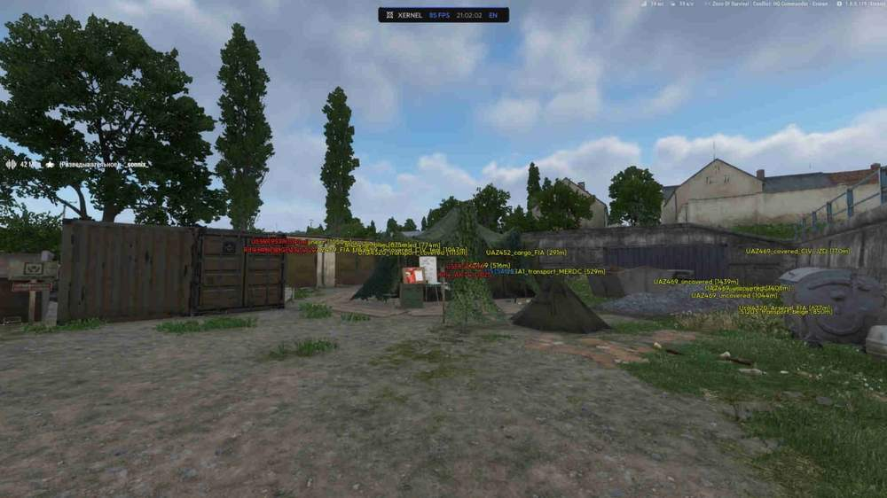
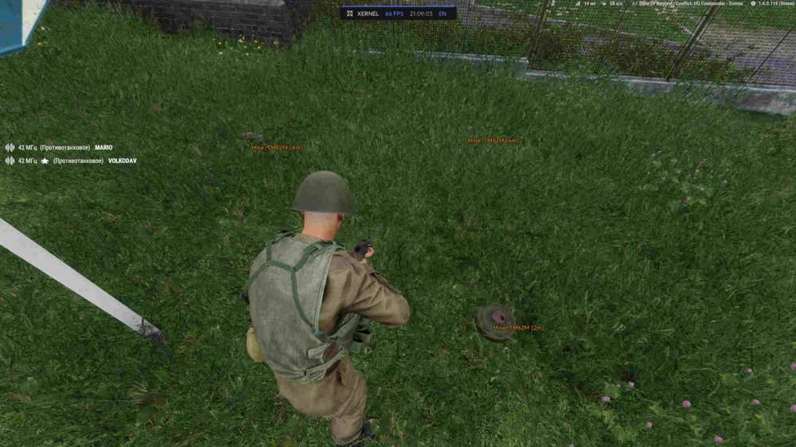
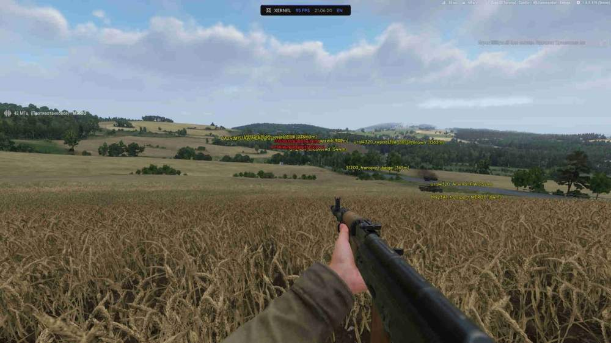
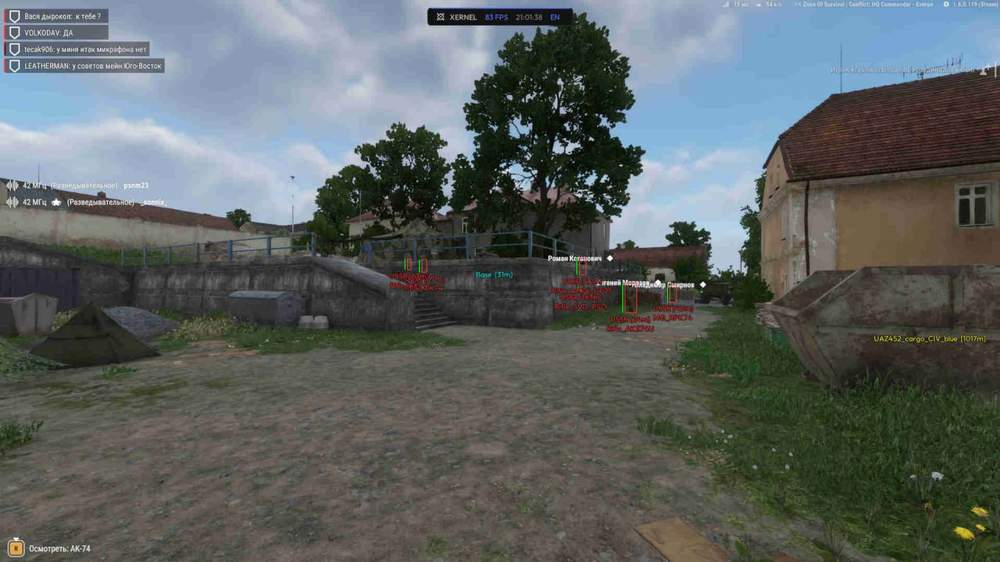

# Arma Reforger – Arma Reforger [ ☢ Xernel ]

## 📸 Скриншоты

   

* Функционал Arma Reforger [ ☢ Xernel ]:

### 👤 ESP игроков

* **USSR / US / FIA Faction** – включает отображение игроков выбранных фракций
* **Draw Box** – рисует рамку вокруг модели игрока
* **Box Fill** – добавляет заливку бокса для более заметной подсветки
* **Distance** – показывает расстояние до игрока
* **Faction Name** – выводит название фракции рядом с целью
* **Weapon** – показывает оружие в руках противника
* **Health Bar** – отображает запас здоровья игрока
* **Dead Body** – подсвечивает тела после боя
* **Skeleton ESP** – показывает скелет модели для удобного чтения позы
* **Max Distance** – ограничивает дальность отображения ESP

### 🚙 ESP техники

* **Vehicle ESP** – подсвечивает доступную технику на карте
* **Vehicle Distance** – показывает дистанцию до транспорта
* **Max Distance** – задаёт максимальную дальность отрисовки техники

### 🌍 Предметы и мир

* **Mines** – помогает заранее видеть мины
* **Bases** – отображает важные базы и точки на локации
* **Show Distance** – добавляет дистанцию к объектам мира
* **Max Distance** – настраивает дальность отображения предметов и объектов

### ⚙️ Misc

* **Infinite Stamina** – убирает ограничение выносливости при передвижении
* **No Recoil** – снижает отдачу оружия для более стабильной стрельбы
* **Fly** – включает свободное перемещение в воздухе

### 🔎 Entity Filter

* **Found in world** – показывает найденные в мире сущности
* **ESP selected** – оставляет ESP только для выбранных объектов
* **Enable ESP** – включает отображение выбранной категории
* **Show Distance** – добавляет дистанцию к выбранным сущностям

## 🖥 Системные требования

* **Arma Reforger [ ☢ Xernel ]:** 
* ⚙️ **️ Операционная система:** Windows 10 | 11
* 🔲 **Процессор:** Intel | AMD
* 🔲 **Видеокарта:** NVIDIA / AMD
* 🖥 **Режим игры:** В окне без рамок | Оконный
* 🌐 **Поддерживаемые версии игры:** Steam
* 🤖 **Встроенный спуфер:** Нет