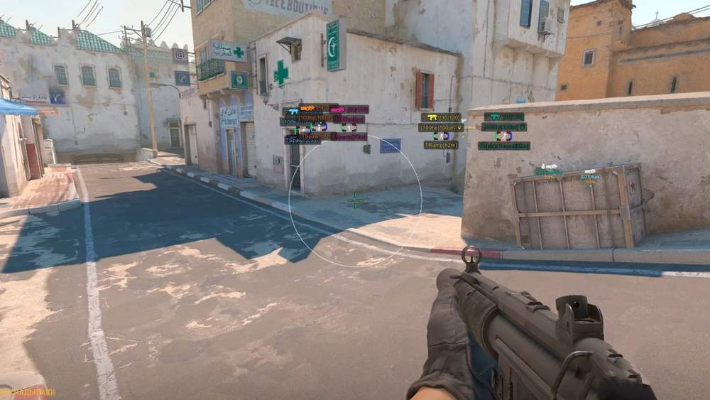
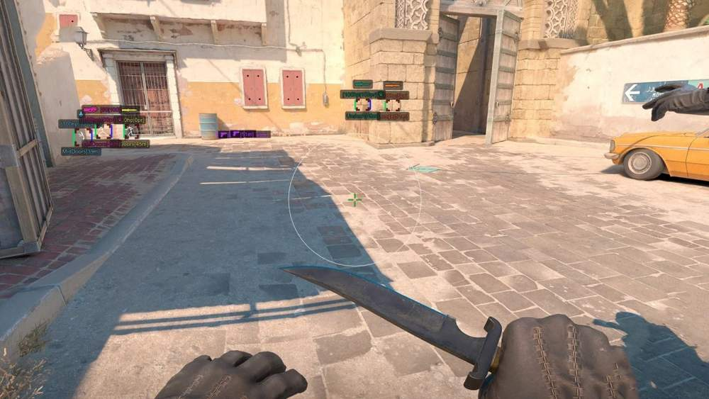

# Counter Strike 2 – Counter Strike 2 [ ☢ Arcane ]

## 📸 Скриншоты

 

### 🎯 Aim

* **Enable** – активация аимбота
* **Aim on Teammate** – наведение на союзников
* **Smooth Factor** – настройка плавности наведения
* **Visible Check** – проверка видимости цели
* **Draw FOV** – отображение круга FOV
* **FOV Radius** – настройка радиуса FOV
* **Aim Always** – постоянная работа аимбота
* **Switch Delay** – задержка переключения между целями
* **Aim Type** – выбор типа наведения: Selected Bone / Closest Bone
* **Bone** – выбор кости: Head / Neck / Chest / Stomach
* **Player Lock** – фиксация на выбранной цели
* **Keybind** – клавиша активации аимбота

### 👁 ESP Players

* **Enable** – активация ESP игроков
* **Box Type** – выбор типа бокса: Box 2D / Box 3D
* **Box Color Type** – разделение цветов: CT/T или Enemy/Teammate
* **Bounding Box Terrorist** – настройка цвета бокса террористов
* **Bounding Box CTerrorist** – настройка цвета бокса спецназа
* **2D Box Type** – выбор типа 2D-бокса: Normal / Corners
* **Box Filling** – заливка бокса: Solid / Gradient
* **Filling Color Type** – настройка цвета заливки
* **Visible Check** – проверка видимости игрока
* **Skeleton** – отображение скелета
* **Joints** – отображение суставов
* **Player Name** – отображение имени игрока
* **Health & Armor Counter** – отображение здоровья и брони числами
* **Health Bar** – полоска здоровья
* **Armor Bar** – полоска брони
* **Position Name** – отображение названия позиции
* **Distance** – отображение расстояния до игрока
* **Teammates Info** – информация о союзниках
* **Snap Lines** – линии до игроков

### 🔫 Players Weapon Settings

* **Show Weapon** – отображение оружия игрока
* **Name Type** – тип отображения: Text / Icon
* **Ammo** – отображение количества патронов

### 📦 Items ESP

* **Enable** – активация ESP предметов
* **On Hovering** – отображение информации при наведении
* **Distance from Center** – расстояние отображения от центра экрана
* **Show Item Visibility Circle** – отображение круга видимости предметов
* **Name Type** – тип отображения названия: Text / Icon

### 🎨 Custom ESP Colors

* **Sniper** – настройка цвета снайперских винтовок
* **Rifle** – настройка цвета автоматических винтовок
* **Shotgun/Machinegun** – настройка цвета дробовиков и пулемётов
* **SMG** – настройка цвета пистолетов-пулемётов
* **Pistol** – настройка цвета пистолетов
* **Grenade** – настройка цвета гранат
* **C4/Taser/Defuser** – настройка цвета C4, электрошокера и набора сапёра
* ⚡️ Triggerbot
* **First Shot Delay** – задержка перед первым выстрелом
* **Shots Delay** – задержка между выстрелами
* **Work on Teammate** – срабатывание на союзниках
* **Only Scoped** – работа только при включённом снайперском прицеле

### 🛠 Misc

* **Bomb Timer** – таймер до взрыва бомбы
* **Anti** – Flash — отключение или уменьшение эффекта ослепления
* **BunnyHop** – автоматические прыжки
* **Radar** – отображение дополнительного радара
* **FPS Limit** – ограничение количества кадров в секунду

### 🎯 Recoil Control

* **Enable** – активация контроля отдачи
* **Return Crosshair** – возврат прицела после стрельбы

### 👁 Visibility Check

* **Type** – метод проверки видимости: Map Ray Tracer / Internal
* **Map Selector** – выбор карты для Map Ray Tracer

### 🔭 Sniper Scope Settings

* **Draw Scope** – отображение пользовательского прицела
* **Scope Type** – тип прицела: Plus / Circle / Dot / X Cross / Hollow Cross / Galactic Compass / Triangle
* **Scope Size** – настройка размера прицела
* **Scope Thickness** – настройка толщины линий

### ⚙️ Config

* **Create** – создание новой конфигурации
* **Save** – сохранение текущих настроек
* **Load** – загрузка сохранённой конфигурации
* **Delete** – удаление выбранной конфигурации

## 🖥 Системные требования

* **Counter Strike 2 [ ☢ Arcane ]:** 
* ⚙️ **️ Операционная система:** Windows 10 - 11
* 🔲 **Процессор:** Intel / AMD
* 🔲 **Видеокарта:** Nvidia / AMD
* 🖥 **Режим игры:** В окне без рамок / Оконный
* 🌐 **Поддерживаемые версии игры:** Steam