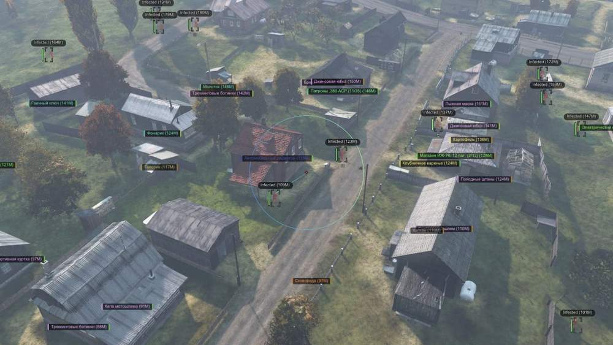
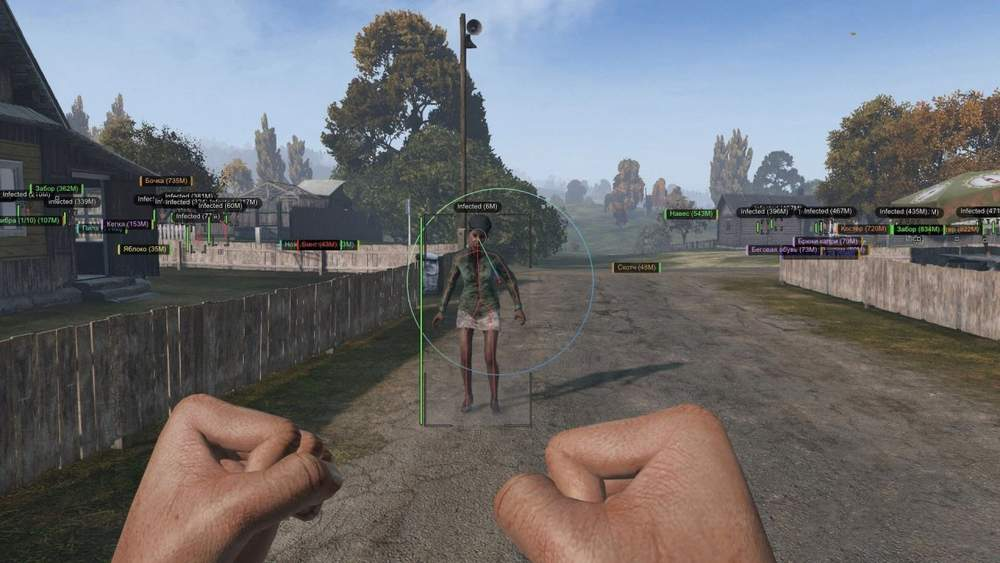
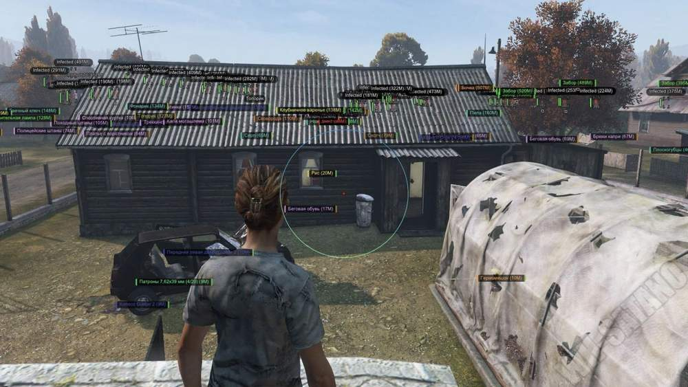
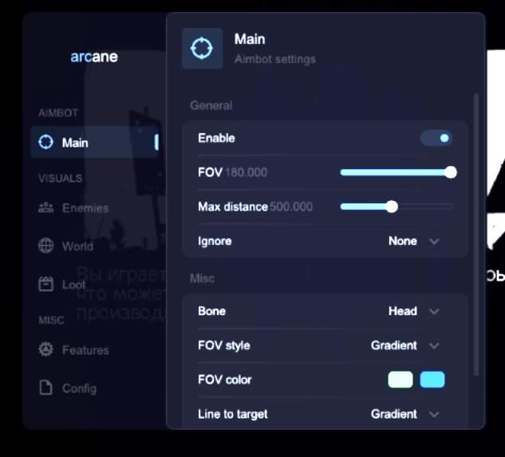

# DayZ – DayZ [ ☢ Arcane ]

## 📸 Скриншоты

   

### 🎯 Aimbot

* **Silent Aimbot** – скрытое наведение без движения прицела и камеры
* **Enabled** – активация и отключение аимбота
* **FOV** – настройка области поиска целей
* **Draw FOV** – отображение области работы аимбота
* **Max Distance** – максимальная дистанция работы наведения
* **Ignore** – исключение отдельных типов целей: зомби, союзники и другие объекты
* **Bone** – выбор части тела для наведения
* **Line To Target** – отображение линии до текущей цели

### 👤 Enemies

* **Players** – отображение игроков
* **Zombies** – отображение заражённых
* **Friends** – отображение или скрытие союзников
* **Box** – настройка рамки вокруг цели: 2D Boxes / Corners / Outline / Filled
* **Head Dot** – отображение точки на голове игрока
* **Skeleton** – отображение скелета
* **Health Bar** – отображение уровня здоровья
* **Distance** – отображение расстояния до цели
* **Name** – отображение имени игрока
* **Inventory** – отображение содержимого инвентаря
* **Item in Hands** – отображение предмета или оружия в руках
* **Tracers** – отображение линий до целей

### 🔎 Loot

* **Loot ESP** – активация отображения лута
* **Name** – отображение названия предмета
* **Distance** – отображение расстояния до лута
* **Items** – отображение предметов на карте
* **Corpses** – отображение трупов и их содержимого
* **Quality** – отображение качества предмета: Text / Bar
* **Filter By Quality** – фильтрация предметов по состоянию: Pristine / Worn / Damaged / Badly Damaged / Ruined
* **Filter By Category** – фильтрация предметов по категориям
* **Max Distance** – настройка максимальной дистанции Loot ESP
* **Hide In Battle Mode** – скрытие лута во время боя
* **Show Only When Hovering** – отображение содержимого контейнера только при наведении

### 📦 Loot Categories

* **Weapons** – отображение огнестрельного оружия
* **Magazines** – отображение магазинов для оружия
* **Ammo** – отображение боеприпасов
* **Explosive** – отображение взрывчатки
* **Suppressors** – отображение глушителей
* **Optics** – отображение прицелов и оптики
* **Attachments** – отображение оружейных модулей
* **Food** – отображение еды
* **Drink** – отображение напитков
* **Cooking** – отображение предметов для приготовления пищи
* **Backpacks** – отображение рюкзаков и сумок
* **Vests** – отображение жилетов
* **Clothing** – отображение одежды
* **Medical** – отображение медицинских предметов
* **Melee** – отображение оружия ближнего боя
* **Vehicle** – отображение деталей и запчастей для транспорта
* **Supplies** – отображение припасов
* **Consumables** – отображение расходных материалов

### 🌐 World

* **Animals** – отображение животных
* **Cars** – отображение транспорта
* **Car Inventory** – отображение содержимого инвентаря транспорта
* **Distance** – отображение расстояния до объектов
* **Name** – отображение названий объектов
* **Max Distance** – максимальная дистанция работы World ESP
* **Helicrash** – отображение мест крушения вертолётов
* **Crosshair** – статичный прицел в центре экрана

### ⚙️ Misc

* **No Clip** – режим свободного перемещения
* **Always Day** – изменение времени суток на дневное
* **Local Position** – отображение текущей позиции на карте
* **Thirdperson Unlock** – разблокировка вида от третьего лица
* **No Grass** – отключение отображения травы
* **Battle Mode** – скрытие всего ESP, кроме игроков, во время боя
* **Custom Colors for ESP** – настройка собственных цветов ESP
* **Weather Changer** – изменение погодных условий

### 💾 Settings

* **Configs** – сохранение и загрузка конфигураций

### ✅ Дополнительно

* **** – Встроенный клинер логов
* **** – Встроенная защита от утечек данных и перехвата трафик

## 🖥 Системные требования

* **DayZ [ ☢ Arcane ]:** 
* ⚙️ **️ Операционная система:** Windows 10 - 11
* 🔲 **Процессор:** Intel / AMD
* 🔲 **Видеокарта:** Nvidia / AMD
* 🖥 **Режим игры:** В окне без рамок / Оконный
* 🌐 **Поддерживаемые версии игры:** Steam
* 🤖 **Встроенный спуфер:** Да