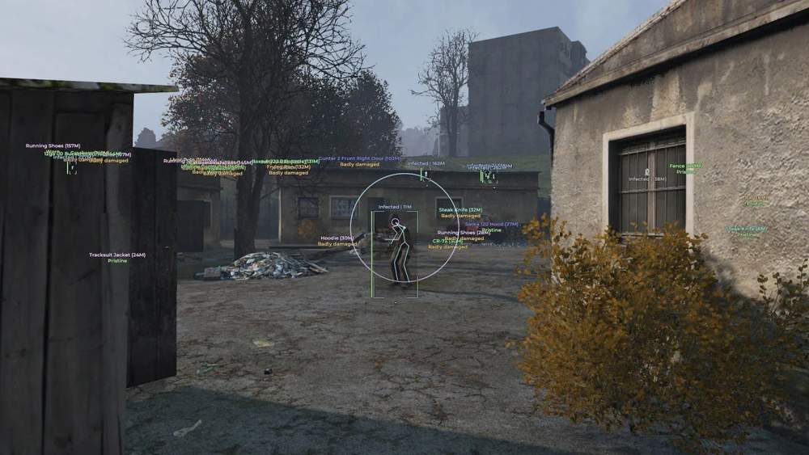
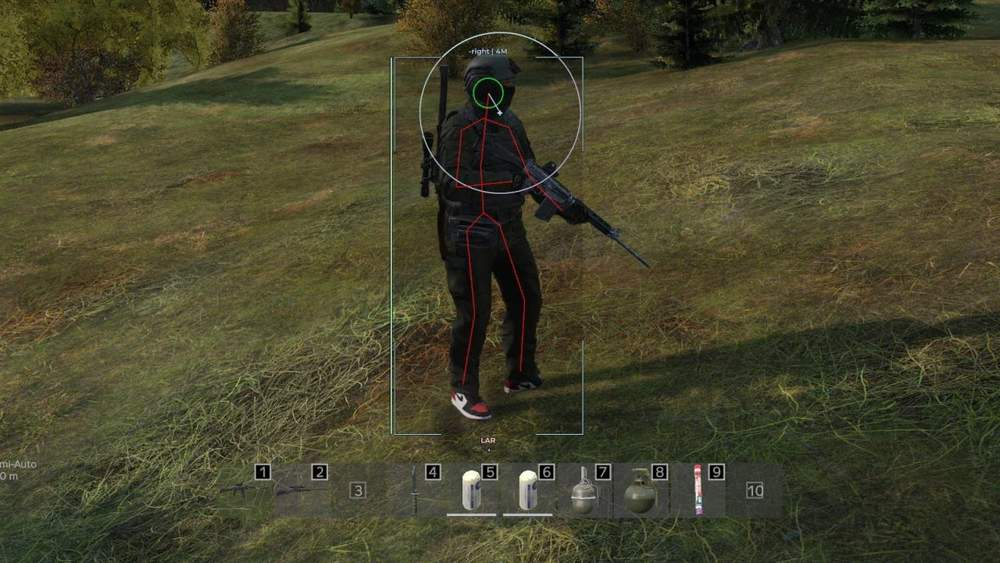

# DayZ – DayZ [ ☢ Medusa Full ]

## 📸 Скриншоты

  

* Функционал DayZ [ ☢ Medusa Full ]:

### 🎯 Aimbot

* **Enable** – включение Aimbot по выбранной клавише
* **FOV** – настройка области захвата цели вокруг прицела
* **Max Distance** – ограничение дистанции работы Aimbot
* **Magic Bullet** – попадание по выбранной цели без стандартной траектории пули
* **Target At** – выбор целей для Aimbot: игроки, заражённые, животные
* **Ignore** – исключение выбранных типов целей из наведения
* **Random Body Part** – случайный выбор точки попадания
* **Body Part** – выбор основной зоны попадания
* **Target Info** – отображение информации о выбранной цели
* **Target Info Color** – настройка цвета информации о цели
* **Line To Target** – линия до выбранной цели
* **Line To Target Color** – настройка цвета линии до цели
* **FOV Style** – настройка стиля FOV-зоны
* **FOV Color** – настройка цвета FOV-зоны
* **Filled FOV Style** – настройка стиля заливки FOV
* **Filled FOV Color** – настройка цвета заливки FOV

### 👤 Visuals / Player

* **Enable** – включение ESP игроков
* **Max Distance** – ограничение дистанции отображения игроков
* **Head Dot** – точка на голове игрока
* **Skeleton** – отображение скелета модели игрока
* **Health Bar Style** – настройка стиля полоски здоровья
* **Health Bar Color** – настройка цвета полоски здоровья
* **Info** – отображение информации об игроке: имя, дистанция и другое
* **Info Color** – настройка цвета информации об игроке
* **Box Style** – настройка стиля бокса вокруг игрока
* **Box Color** – настройка цвета бокса
* **Filled Box Style** – настройка стиля залитого бокса
* **Inventory** – отображение инвентаря игрока
* **Item In Hands** – отображение предмета или оружия в руках
* **Tracers** – линии до игроков
* **Friends** – отдельная отметка друзей, чтобы не путать их с целями

### 🧟 Visuals / Infected

* **Enable** – включение ESP заражённых
* **Max Distance** – ограничение дистанции отображения заражённых
* **Head Dot** – точка на голове заражённого
* **Skeleton** – отображение скелета модели заражённого
* **Health Bar Style** – настройка стиля полоски здоровья
* **Health Bar Color** – настройка цвета полоски здоровья
* **Info** – отображение информации о заражённом
* **Info Color** – настройка цвета информации
* **Box Style** – настройка стиля бокса вокруг заражённого
* **Box Color** – настройка цвета бокса
* **Filled Box Style** – настройка стиля залитого бокса
* **Inventory** – отображение инвентаря заражённого
* **Tracers** – линии до заражённых

### 🐺 Visuals / Animals

* **Enable** – включение ESP животных
* **Max Distance** – ограничение дистанции отображения животных
* **Icon** – отображение животных через иконки
* **Distance** – отображение дистанции до животного
* **Health Bar** – отображение здоровья животного

### 🚗 Visuals / Cars

* **Enable** – включение ESP машин
* **Max Distance** – ограничение дистанции отображения машин
* **Icon** – отображение машин через иконки
* **Distance** – отображение дистанции до машины
* **Inventory** – отображение инвентаря машины
* ☠️ Visuals / Player Corpse
* **Enable** – включение ESP трупов игроков
* **Max Distance** – ограничение дистанции отображения трупов игроков
* **Icon** – отображение трупов игроков через иконки
* **Distance** – отображение дистанции до трупа
* **Inventory** – отображение инвентаря трупа
* **Hide In Battle Mode** – скрытие трупов игроков в боевом режиме
* 🧟‍♂️ Visuals / Infected Corpse
* **Enable** – включение ESP трупов заражённых
* **Max Distance** – ограничение дистанции отображения трупов заражённых
* **Icon** – отображение трупов заражённых через иконки
* **Distance** – отображение дистанции до трупа
* **Inventory** – отображение инвентаря трупа
* **Hide In Battle Mode** – скрытие трупов заражённых в боевом режиме

### 🐾 Visuals / Animal Corpse

* **Enable** – включение ESP трупов животных
* **Max Distance** – ограничение дистанции отображения трупов животных
* **Icon** – отображение трупов животных через иконки
* **Distance** – отображение дистанции до трупа
* **Hide In Battle Mode** – скрытие трупов животных в боевом режиме

### 📌 Visuals / Other

* **Enable** – включение ESP для других объектов
* **Max Distance** – ограничение дистанции отображения других объектов
* **Distance** – отображение дистанции до объекта
* **Hide In Battle Mode** – скрытие лишних маркеров в боевом режиме

### 🧭 Visuals / Misc

* **Helicrash** – отображение мест падения вертолётов
* **Bullet Tracers** – отображение трассеров пуль
* **Crosshair** – кастомный прицел на экране
* **Place Deaths** – отображение мест смертей

### 💀 Place Deaths

* **Icon** – отображение места смерти через иконку
* **Time** – отображение времени смерти
* **Color** – настройка цвета маркера смерти
* **Hide In Battle Mode** – скрытие маркеров смерти в боевом режиме

### 🔎 Loot

* **Enable** – включение Loot ESP
* **Max Distance** – ограничение дистанции отображения лута
* **Draw Style** – выбор формата отображения предметов
* **Only Icon** – отображение предметов только иконками
* **Only Text** – отображение предметов только текстом
* **Icon + Text** – отображение предметов иконкой и текстом
* **Info** – отображение данных предмета: качество, категория, дистанция
* **Quality** – отображение состояния предмета
* **Category** – отображение категории предмета
* **Distance** – отображение дистанции до предмета
* **Categories** – выбор типов предметов для отображения
* **Item Qualities** – фильтрация предметов по состоянию
* **Inventory** – отображение предметов внутри инвентарей и контейнеров
* **Show Only When Hovering** – показывать информацию только при наведении
* **Hide In Battle Mode** – скрытие лута в боевом режиме
* **Show Debug Info** – отображение технических данных предмета
* **Search** – быстрый поиск нужного предмета
* **Name** – поле для названия предмета или поиска
* **Available Item List** – список предметов, доступных для добавления в фильтр
* **Filtered Item List** – список предметов, уже добавленных в фильтр

### 📦 Loot Categories

* **Weapons** – оружие
* **Magazines** – магазины для оружия
* **Ammo** – патроны и боеприпасы
* **Explosives** – взрывчатка
* **Suppressors** – глушители
* **Optics** – прицелы и оптика
* **Attachments** – обвесы и модули оружия
* **Food** – еда
* **Drinks** – напитки
* **Cooking** – предметы для готовки
* **Backpacks** – рюкзаки
* **Vests** – разгрузки и жилеты
* **Clothing** – одежда
* **Medicine** – медицинские предметы
* **Tools** – инструменты
* **Containers** – контейнеры
* **Stashes** – тайники
* **Base Building** – предметы для строительства базы
* **Other** – остальные предметы
* **Melee Weapons** – оружие ближнего боя
* **Vehicle Parts** – запчасти для транспорта
* **Consumables** – расходники
* **Crafting** – предметы для крафта

### 🎨 Loot Quality / Colors

* **Ruined** – отображение сломанных предметов
* **Pristine** – отображение предметов в идеальном состоянии
* **Worn** – отображение изношенных предметов
* **Damaged** – отображение повреждённых предметов
* **Badly Damaged** – отображение сильно повреждённых предметов
* **Cooking Color** – отдельный цвет для предметов готовки
* **Other Color** – отдельный цвет для остальных предметов
* **Vests Color** – отдельный цвет для жилетов
* **Clothing Color** – отдельный цвет для одежды
* **Medicine Color** – отдельный цвет для медицины
* **Melee Weapons Color** – отдельный цвет для оружия ближнего боя
* **Vehicle Parts Color** – отдельный цвет для запчастей транспорта
* **Consumables Color** – отдельный цвет для расходников
* **Crafting Color** – отдельный цвет для крафта
* **Tools Color** – отдельный цвет для инструментов
* **Containers Color** – отдельный цвет для контейнеров
* **Weapons Color** – отдельный цвет для оружия
* **Magazines Color** – отдельный цвет для магазинов
* **Ammo Color** – отдельный цвет для патронов
* **Explosives Color** – отдельный цвет для взрывчатки
* **Suppressors Color** – отдельный цвет для глушителей
* **Optics Color** – отдельный цвет для оптики
* **Attachments Color** – отдельный цвет для обвесов
* **Food Color** – отдельный цвет для еды
* **Drinks Color** – отдельный цвет для напитков
* **Backpacks Color** – отдельный цвет для рюкзаков
* **Stashes Color** – отдельный цвет для тайников
* **Base Building Color** – отдельный цвет для предметов строительства базы

### 👣 Player

* **Loot Through Walls** – взаимодействие с лутом через препятствия
* **Local Position** – отображение текущих координат игрока
* **Open Third** – Person View - включение вида от третьего лица

### 🎥 Camera

* **Free Camera** – свободное управление камерой
* **Noclip** – прохождение камеры через препятствия
* **Camera And Noclip Speed** – настройка скорости камеры и Noclip
* **Night Vision** – включение ночного зрения
* **Full Bright** – отключение темноты и повышение яркости сцены

### 🌍 World

* **Time Changer** – изменение времени суток
* **Disable Grass** – отключение травы для более чистого обзора
* **Fog Changer** – настройка тумана
* **Fog Intensity** – регулировка плотности тумана
* **Rain Changer** – настройка дождя
* **Rain Intensity** – регулировка силы дождя
* **Snowfall Changer** – настройка снегопада
* **Snowfall Intensity** – регулировка силы снегопада
* **Cloudiness Changer** – настройка облачности
* **Cloudiness Intensity** – регулировка плотности облаков

### ⚙️ Misc

* **Keybind List** – список назначенных горячих клавиш
* **Active Hotkeys Only** – отображение только активных биндов
* **Transparent Window** – прозрачное окно биндов, чтобы оно меньше мешало

### 🧩 Config

* **Config List** – список сохранённых конфигов
* **Name** – поле для названия нового конфига
* **Add** – создание нового конфига
* **Save** – сохранение текущих настроек в выбранный профиль
* **Load** – загрузка выбранного конфига
* **Rename** – переименование выбранного профиля
* **Delete** – удаление выбранного конфига
* **Set Default AutoLoad** – выбор конфига для автоматической загрузки
* **Import** – импорт конфига из буфера обмена
* **Export** – копирование выбранного конфига
* **Export All** – экспорт всех сохранённых конфигов
* **Reset To Default** – сброс настроек к стандартным значениям

### ⚙️ Settings

* **Main Color** – изменение основного цвета интерфейса
* **Menu Key** – назначение клавиши открытия меню
* **Panic Key** – клавиша быстрого отключения функций
* **Battle Mode Key** – клавиша включения боевого режима
* **Color Style** – настройка стиля цветов интерфейса
* **Theme Color** – переключение темы интерфейса
* **DPI Scale** – изменение масштаба интерфейса
* **Language** – смена языка меню
* **Save** – сохранение настроек интерфейса
* **Load** – загрузка сохранённых настроек интерфейса

## 🖥 Системные требования

* **DayZ [ ☢ Medusa Full ]:** 
* ⚙️ **️ Операционная система:** Windows 10 - 11 [21H2 / 22H2 / 23H2]
* 🔲 **Процессор:** Intel / AMD
* 🔲 **Видеокарта:** Nvidia / AMD
* 🖥 **Режим игры:** В окне без рамок / Оконный / Полноэкранный
* 🌐 **Поддерживаемые версии игры:** Battlestate Games Launcher (BSG) / Steam
* 🤖 **Встроенный спуфер:** нет