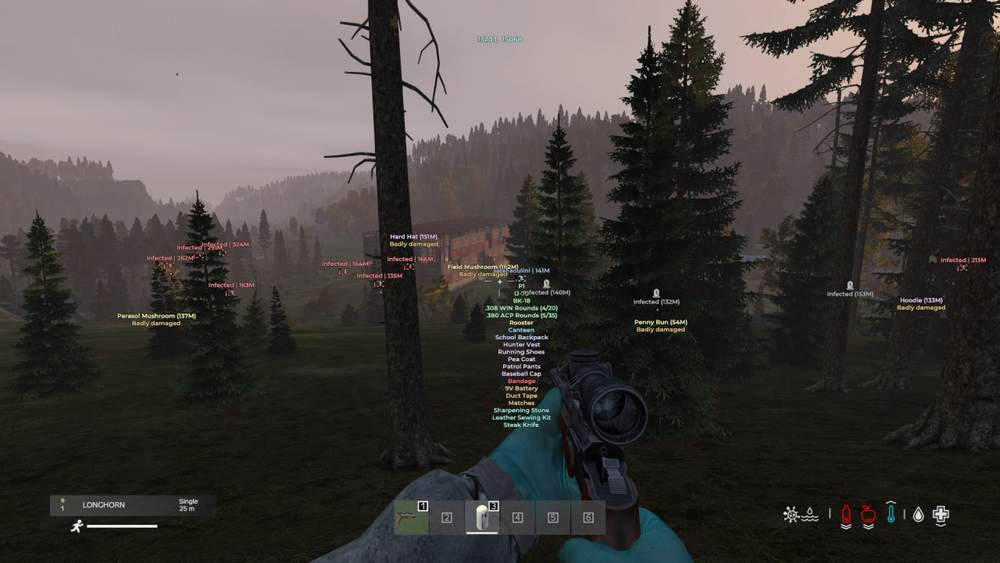
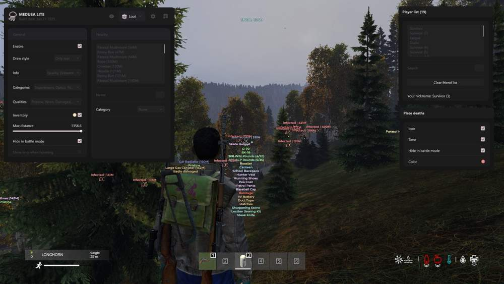
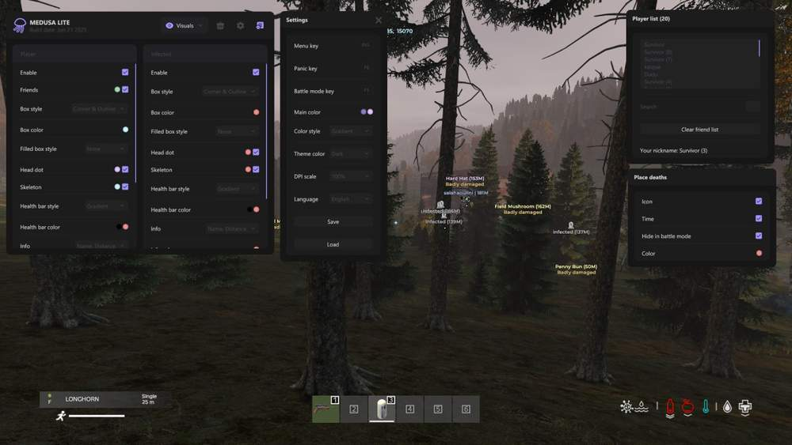

# DayZ – DayZ [ ☢ Medusa Lite ]

## 📸 Скриншоты

  

* **Icon + Text** – отображение предметов иконкой и текстом одновременно
* **Info** – настройка данных предмета: качество, категория и дистанция
* **Inventory** – отображение предметов внутри инвентарей и контейнеров
* **Categories** – выбор типов предметов для отображения
* **Quality** – фильтрация предметов по состоянию
* **Show Only When Hovering** – показ информации только при наведении
* **Hide In Battle Mode** – скрытие лута во время боя

### 📦 Loot / Categories

* **Weapon** – отображение оружия
* **Magazines** – отображение магазинов для оружия
* **Ammo** – отображение патронов и боеприпасов
* **Explosives** – отображение взрывчатки
* **Suppressors** – отображение глушителей
* **Optics** – отображение прицелов и оптики
* **Attachments** – отображение оружейных обвесов
* **Food** – отображение еды
* **Drinks** – отображение напитков
* **Cooking** – отображение предметов для приготовления
* **Backpacks** – отображение рюкзаков
* **Vests** – отображение жилетов
* **Clothing** – отображение одежды
* **Medicine** – отображение медицинских предметов
* **Tools** – отображение инструментов
* **Containers** – отображение контейнеров
* **Stashes** – отображение тайников
* **Base Building** – отображение строительных предметов
* **Other** – отображение остальных предметов
* **Melee Weapons** – отображение холодного оружия
* **Vehicle Parts** – отображение деталей и предметов для транспорта
* **Consumables** – отображение расходных материалов
* **Crafting** – отображение предметов для крафта

### 💎 Loot / Quality

* **Ruined** – отображение уничтоженных предметов
* **Pristine** – отображение предметов в идеальном состоянии
* **Worn** – отображение поношенных предметов
* **Damaged** – отображение повреждённых предметов
* **Badly Damaged** – отображение сильно повреждённых предметов

### 📍 Loot / Nearby

* **Show Debug Info** – отображение технических данных предмета
* **Category** – фильтрация списка по выбранной категории
* **Search** – быстрый поиск нужного предмета
* **Name** – поле для названия или поиска предмета
* **Available Item List** – список предметов, доступных для добавления в фильтр
* **Filtered Item List** – список предметов, уже добавленных в фильтр

### 💀 Place Deaths

* **Icon** – отображение места смерти через иконку
* **Time** – отображение времени смерти
* **Hide In Battle Mode** – скрытие меток смерти во время боя
* **Color** – настройка цвета отображения места смерти

### 🎥 Misc / Camera

* **Free Camera** – свободное управление камерой
* **Camera Speed** – настройка скорости свободной камеры
* **Night Vision** – включение ночного зрения
* **Full Bright** – отключение темноты и повышение яркости сцены

### 👣 Misc / Player

* **Local Position** – отображение текущих координат игрока
* **Open Third** – Person View - включение вида от третьего лица

### 🌍 Misc / World

* **Time Changer** – изменение времени суток
* **Disable Grass** – отключение травы для более чистого обзора
* **Fog Changer** – настройка тумана
* **Fog Intensity** – регулировка плотности тумана
* **Rain Changer** – настройка дождя
* **Rain Intensity** – регулировка силы дождя
* **Snowfall Changer** – настройка снегопада
* **Snowfall Intensity** – регулировка силы снегопада
* **Cloudiness Changer** – настройка облачности
* **Cloudiness Intensity** – регулировка силы облачности

### ⚙️ Misc / Other

* **Keybind List** – отображение списка назначенных горячих клавиш
* **Active Hotkeys Only** – отображение только включённых биндов
* **Transparent Window** – делает окно списка менее заметным

### 👥 Player List

* **List** – отображение игроков на сервере
* **Search** – быстрый поиск нужного игрока
* **Clear Friends List** – очистка списка отмеченных друзей
* **Your Nickname** – отображение текущего никнейма

### 🧩 Config

* **Config List** – список сохранённых профилей настроек
* **Add** – создание новой конфигурации
* **Save** – сохранение текущих настроек в выбранный профиль
* **Load** – загрузка выбранной конфигурации
* **Rename** – переименование выбранного профиля
* **Delete** – удаление выбранной конфигурации
* **Default AutoLoad** – выбор конфига для автозагрузки
* **Export** – копирование выбранной конфигурации
* **Export All** – экспорт всех сохранённых конфигов
* **Import** – загрузка конфигурации из буфера обмена
* **Reset Settings** – сброс настроек к значениям по умолчанию

### ⚙️ Settings

* **Menu Key** – назначение клавиши открытия меню
* **Panic Key** – клавиша быстрого отключения функций
* **Battle Mode Key** – клавиша включения боевого режима
* **Main Color** – настройка основного цвета интерфейса
* **Color Style** – настройка стиля окраски интерфейса
* **Theme Color** – переключение темы оформления
* **DPI Scale** – изменение масштаба интерфейса
* **Language** – переключение языка меню
* **Save** – сохранение настроек интерфейса
* **Load** – загрузка сохранённых настроек интерфейса

## 🖥 Системные требования

* **DayZ [ ☢ Medusa Lite ]:** 
* ⚙️ **️ Операционная система:** Windows 10 - 11 [21H2 / 22H2 / 23H2]
* 🔲 **Процессор:** Intel / AMD
* 🔲 **Видеокарта:** Nvidia / AMD
* 🖥 **Режим игры:** В окне без рамок / Оконный / Полноэкранный
* 🌐 **Поддерживаемые версии игры:** Battlestate Games Launcher (BSG) / Steam
* 🤖 **Встроенный спуфер:** нет