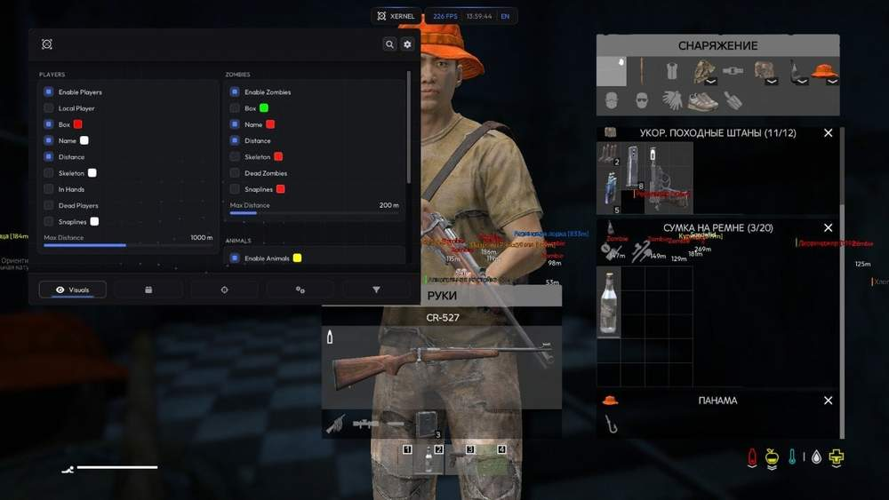
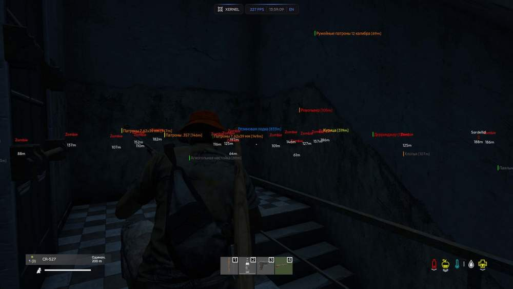
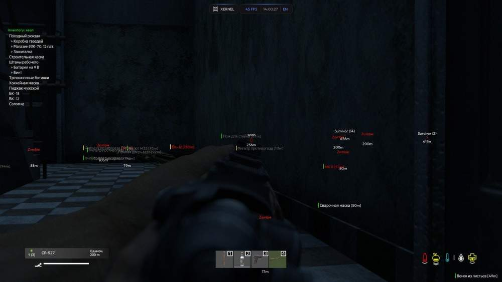
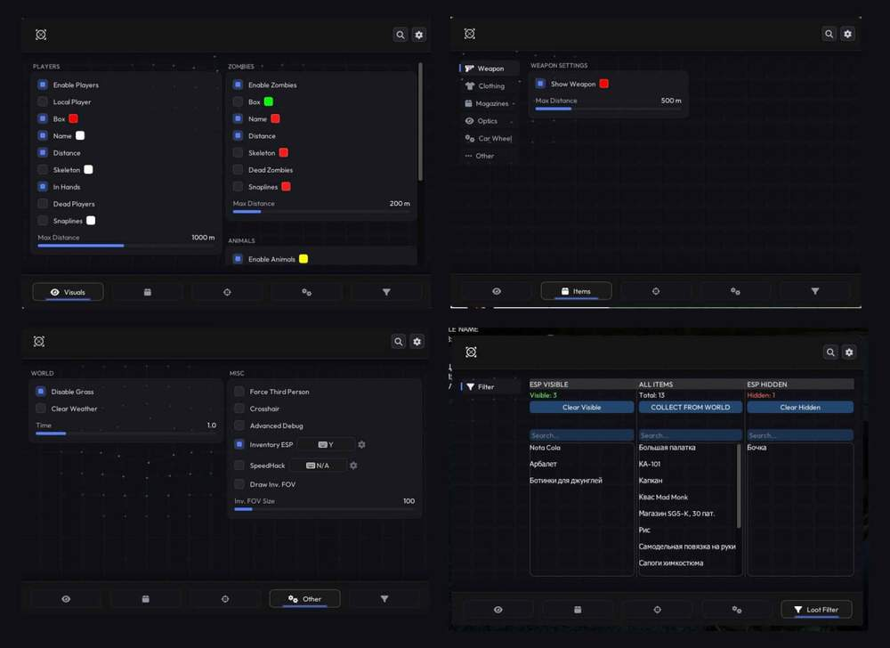

# DayZ – DayZ [ ☢ Xernel ]

## 📸 Скриншоты

   

* Функционал DayZ [ ☢ Xernel ]:

### 🎯 Aimbot

* **Enable Player Aim** – включение аима по игрокам
* **Target Bone Selection** – выбор части тела для наведения
* **Enable Zombie Aim** – включение аима по зомби
* **FOV Setting** – настройка радиуса FOV
* **Draw FOV** – отображение круга FOV

### 👤 Visuals / ESP

* **Enable Players** – отображение игроков
* **Player Box** – рамка вокруг игрока
* **Player Name** – отображение имени игрока
* **Player Distance** – отображение дистанции до игрока
* **Player Skeleton** – отображение скелета игрока
* **Player In Hands** – отображение предмета в руках игрока
* **Dead Players ESP** – отображение мёртвых игроков
* **Player Snaplines** – линии до игроков
* **Enable Zombies** – отображение зомби
* **Zombie Box** – рамка вокруг зомби
* **Zombie Name** – отображение имени зомби
* **Zombie Distance** – отображение дистанции до зомби
* **Zombie Skeleton** – отображение скелета зомби
* **Dead Zombies ESP** – отображение мёртвых зомби
* **Zombie Snaplines** – линии до зомби
* **Enable Animals** – отображение животных
* **Enable Vehicles** – отображение транспорта

### 📦 Items ESP

* **Show Weapon** – отображение оружия
* **Show Clothing** – отображение одежды
* **Show Magazines** – отображение магазинов
* **Show Optics** – отображение оптики
* **Show Car Wheel** – отображение колёс
* **Show Other Items** – отображение других предметов
* **Max Distance Settings** – настройка максимальной дистанции отображения

### ⚙️ Miscellaneous

* **SpeedHack** – ускорение передвижения
* **Force Third Person** – принудительный вид от третьего лица
* **Custom Crosshair** – настраиваемый прицел
* **Time Changer** – изменение времени
* **Bright Night** – улучшенная видимость ночью
* **Disable Grass** – отключение травы
* **Clear Weather** – очистка погоды

## 🖥 Системные требования

* **DayZ [ ☢ Xernel ]:** 
* ⚙️ **️ Операционная система:** Windows 10 | 11
* 🔲 **Процессор:** Intel | AMD
* 🔲 **Видеокарта:** Nvidia | AMD
* 🖥 **Режим игры:** В окне без рамок | Оконный
* 🌐 **Поддерживаемые версии игры:** Steam | Microsoft Store
* 🤖 **Встроенный спуфер:** Нет