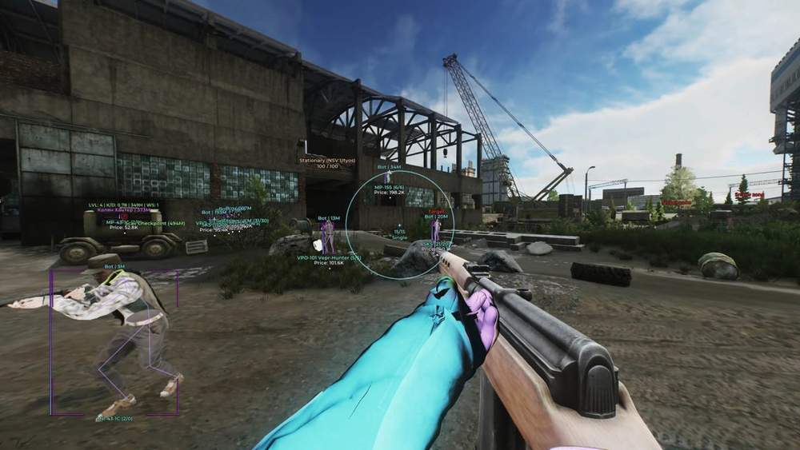
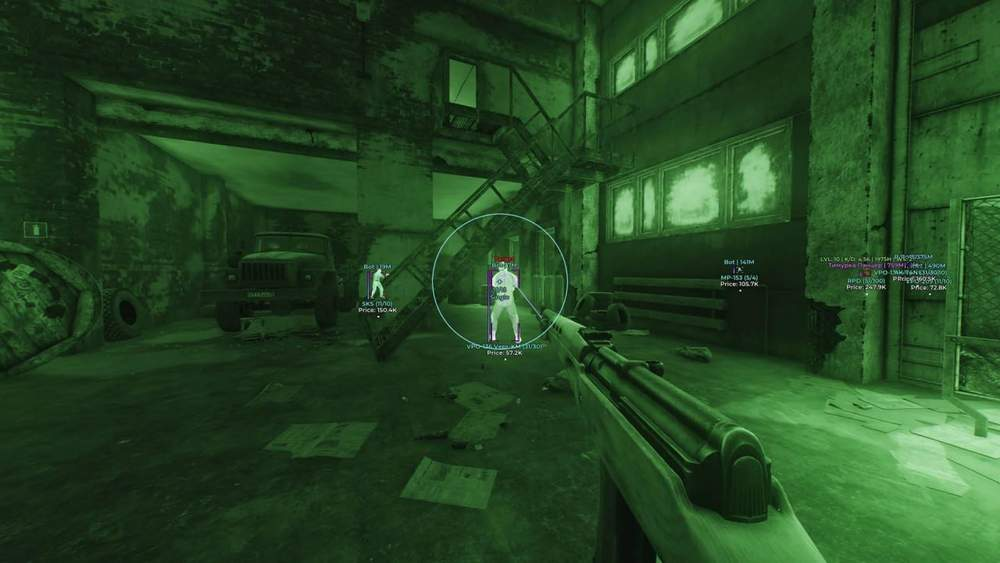
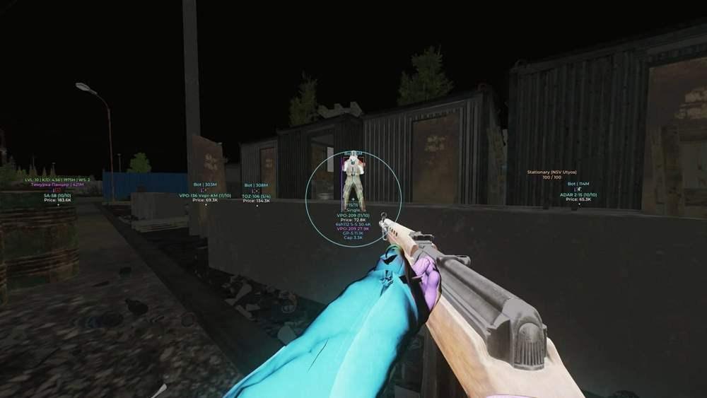
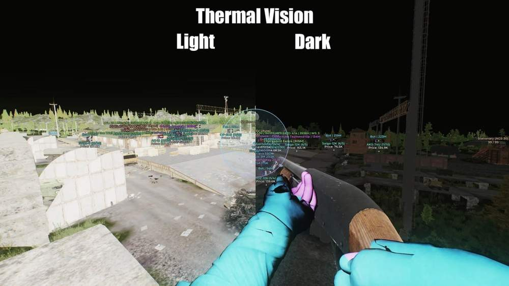
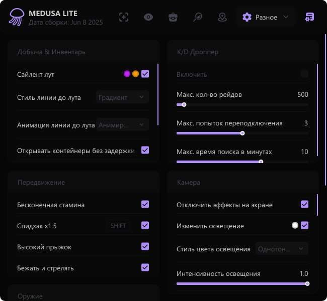
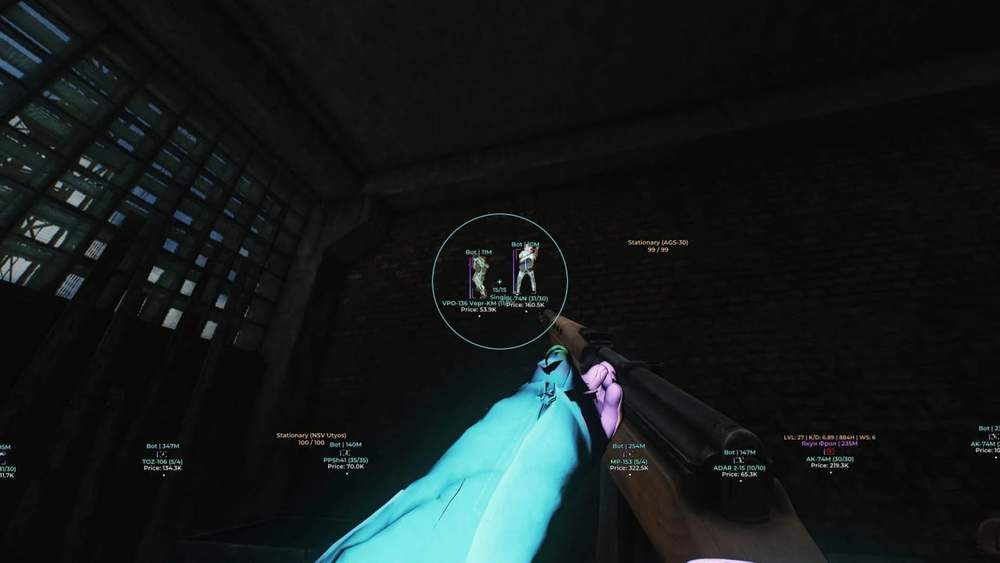

# Escape from Tarkov – Escape from Tarkov [ ☢ Medusa Lite ]

## 📸 Скриншоты

     

* Функционал Escape from Tarkov [ ☢ Medusa Lite ]:

### 🎯 Aimbot

* **Enabled** – включить / выключить Aimbot
* **Silent Aim** – мощный режим аима, при котором выстрелы поражают цель без движения прицела и камеры
* **Aim Key** – выбор клавиши для работы Aimbot
* **Force Body Aim** – отдельный бинд для наведения только в тело
* **Force Legs Aim** – отдельный бинд для наведения только в ноги
* **Instant Hit** – мгновенное попадание пуль в цель
* **FOV** – настройка размера рабочей области Aimbot
* **Only Visible** – наведение только по видимым целям
* **Max Distance** – ограничение дальности работы Aimbot
* **Bone** – выбор хитбоксов для игроков и ботов
* **Nearest Bone** – наведение на ближайшую к прицелу часть тела
* **Ignored Roles** – выбор типов персонажей, которые будут игнорироваться
* **Line To Target** – линия до текущей цели Aimbot
* **Draw FOV** – отображение круга FOV с настройкой заливки, цвета и стиля
* **Target Info** – отображение информации о цели

### 👤 Players ESP

* **Wallhack** – отображение игроков, SCAV, ботов, боссов и других противников
* **Boxes ESP** – отображение целей в виде боксов
* **Box Style** – настройка стиля боксов: углы, обводка, 2D-коробка, заливка
* **Skeleton** – отображение скелета игрока
* **Look Direction** – отображение направления взгляда игрока
* **Chams** – подсветка моделей игроков
* **Chams Style** – выбор стиля подсветки: Latex, Glow, Glass Glow, Xray и другие
* **Chams Settings** – настройка яркости, мощности, интенсивности и цветов подсветки
* **Health** – отображение количества HP у цели
* **Player Info** – имя, дистанция, уровень, K/D, время, серия и фракция
* **Weapon** – отображение оружия в руках игрока
* **Inventory** – отображение инвентаря игрока
* **Inventory Min Price** – минимальная стоимость инвентаря для отображения
* **Max Distance** – настройка дальности работы Wallhack
* **Tracers** – линии от центра экрана до моделей игроков
* **Streamers** – отображение стримеров в рейде и ссылки на их каналы

### 🌐 World ESP

* **Grenades** – отображение гранат: Frag, Flash, Smoke
* **Grenades Settings** – настройка дистанции, таймера, траектории, сферы взрыва и радиуса
* **Trajectory / Radius Style** – настройка визуального стиля траектории и радиуса гранат
* **Danger Zones** – отображение опасных зон: мины, снайперы и растяжки
* **Mounted Weapons** – отображение стационарного оружия
* **Exits** – отображение точек выхода
* **Show Exit Requirements** – отображение требований для эвакуации
* **BTR** – отображение бронетранспортёра
* **Bullet Lines** – отображение траектории выпущенных пуль
* **Hit Marker** – отметка мест попадания пуль
* **Hit Sound** – звуки попаданий
* **Time Changer** – возможность установить любое время суток
* **Map Info** – окно с информацией о карте, луте, игроках, боссах и прочем
* **Local Player Chams** – отображение Chams на вашем персонаже
* **Ammo Count** – отображение остатка патронов в обойме
* **Crosshair** – статичный прицел по центру экрана
* **Radar** – окно радара для отображения игроков и других объектов
* **Transitions** – отображение переходов между локациями

### 🔎 Loot ESP

* **Enable** – включение ESP для предметов
* **Distance** – отображение расстояния до предметов
* **Price** – отображение цены предметов
* **Names** – отображение названий предметов
* **Shorten Names** – сокращение названий предметов
* **Max Distance** – ограничение дистанции работы Loot ESP
* **Font Size** – настройка размера шрифта Loot ESP
* **Hide In Scope** – скрытие лута при использовании прицела
* **Hide In Battle Mode** – скрытие лута в боевом режиме
* **Quest Items** – отображение предметов для заданий
* **Min Price Filter** – фильтр предметов по минимальной цене
* **Custom Loot Filter** – гибкая настройка фильтра лута

### 📦 Loot ESP Categories

* **Weapon** – оружие
* **Ammo** – патроны
* **Ammo Boxes** – ящики с патронами
* **Magazines** – магазины для оружия
* **Sights** – прицелы
* **Suppressors** – глушители
* **Tactical Devices** – тактические устройства
* **Weapon Parts** – детали для оружия
* **Special Equipment** – специальное снаряжение
* **Repair** – предметы для ремонта
* **Keys** – ключи
* **Barter** – предметы для обмена
* **Containers** – контейнеры
* **Maps** – карты
* **Provisions** – еда
* **Gear** – броня
* **Meds** – предметы для лечения
* **Currency** – деньги, рубли, доллары и евро

### ⚙️ Misc

* **Remove Delay To Pickup Item** – моментальный подбор предметов без анимации
* **Fast Loading / Unloading Of Magazines** – быстрая загрузка и разгрузка магазинов
* **Thermal Vision** – режим теплового зрения
* **Night Vision** – режим ночного зрения
* **No Visor** – отключение визуального эффекта забрала шлема
* **Zoom Hack** – приближение камеры без оптики
* **Weather Controller** – полный контроль погодных условий
* **FOV Changer** – изменение поля зрения
* **Aspect Ratio Changer** – изменение соотношения сторон и растяжка изображения
* **Post FX** – изменение цвета изображения игры
* **No Screen Effects** – отключение размытия, тряски камеры, кровавых пятен и других эффектов
* **Remove Inventory Blur Effect** – отключение размытия фона при открытом инвентаре
* **Light Changer** – расширенная настройка визуального стиля игры

### 🎯 Shooting Exploits

* **No Recoil** – отключение отдачи оружия при стрельбе
* **No Sway** – отключение покачивания камеры при стрельбе
* **Instant ADS** – мгновенное открытие прицела без анимации
* **Instant Weapon Change** – быстрое переключение оружия без задержек
* **No Malfunction** – полное отключение поломок оружия
* **Instant Reload** – мгновенная перезарядка оружия

### 🏃 Movement Exploits

* **Speedhack** – увеличение скорости передвижения
* **Run and Shoot** – возможность стрелять во время спринта
* **Perfect Physical Condition** – бег, прыжки и действия без штрафов
* **Infinite Stamina & No Fatigue** – отсутствие усталости при беге и прыжках
* **Free Camera** – свободная камера для просмотра карты
* **High Jump** – увеличенная высота прыжка

### ➕ Другие возможности

* **Menu Key** – настройка клавиши открытия меню
* **Panic Key** – кнопка полного отключения чита
* **Battle Mode Key** – боевой режим с отключением лишнего лута и визуалов
* **Menu Customization** – настройка внешнего вида меню
* **CFG System** – система сохранения и загрузки конфигов
* **Update Item Names / Prices** – обновление названий предметов и цен
* **Icons** – отображение ESP-элементов с иконками
* **K/D Dropper** – бот для снижения K/D
* **Auto Captcha** – автоматическое прохождение капчи внутри игры
* **Streamer Mode** – скрытие никнеймов игроков и автоматическая подмена ID сессии
* **HWID Spoofer** – встроенный Spoofer для обхода HWID-блокировок

## 🖥 Системные требования

* **Escape from Tarkov [ ☢ Medusa Lite ]:** 
* ⚙️ **️ Операционная система:** Windows 10 - 11 [21H2 / 22H2 / 23H2]
* 🔲 **Процессор:** Intel / AMD
* 🔲 **Видеокарта:** Nvidia / AMD
* 🖥 **Режим игры:** В окне без рамок / Оконный / Полноэкранный
* 🌐 **Поддерживаемые версии игры:** Battlestate Games Launcher (BSG) / Steam
* 🤖 **Встроенный спуфер:** Да