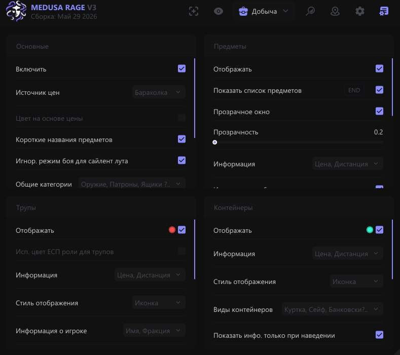
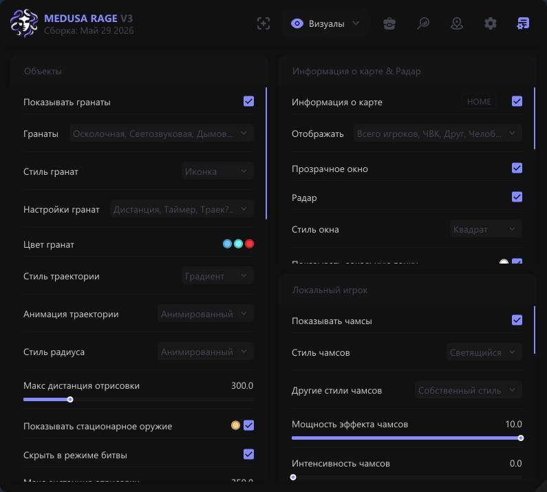
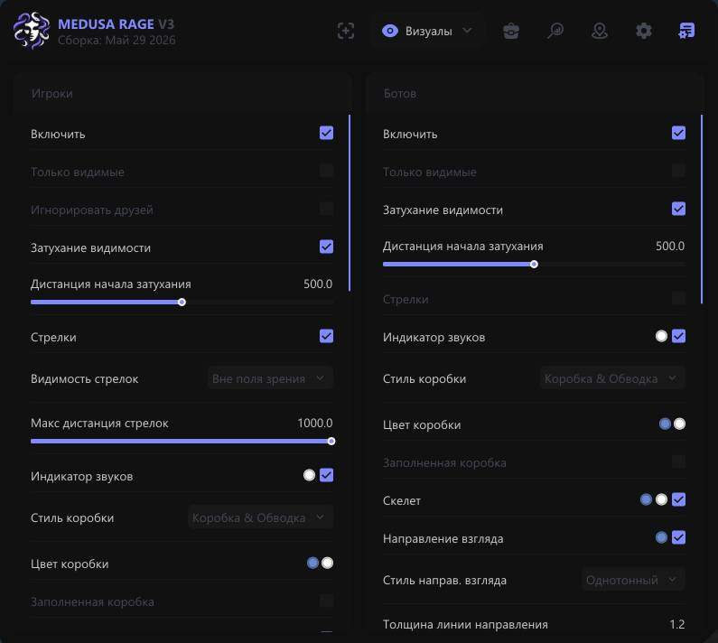
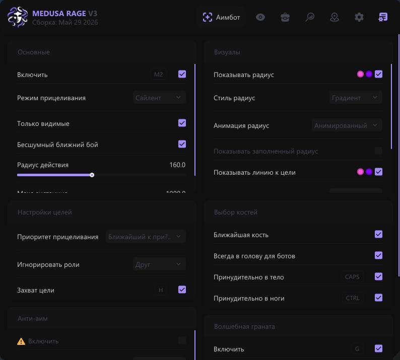
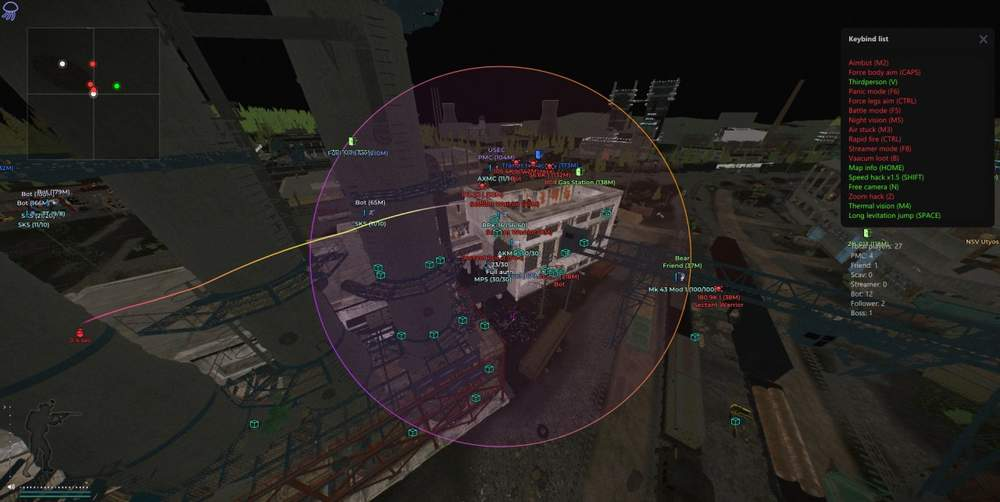
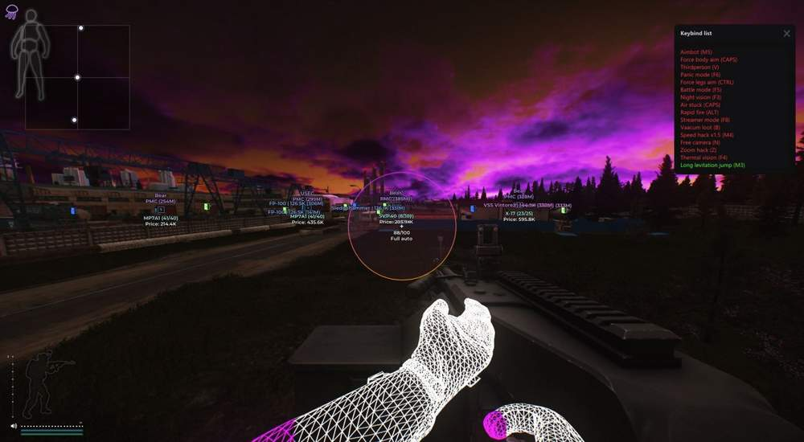
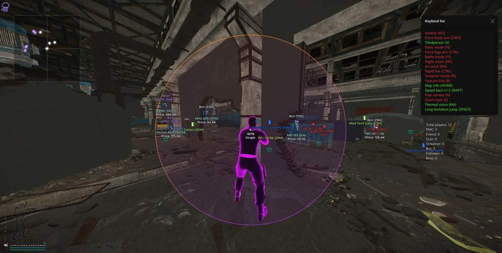
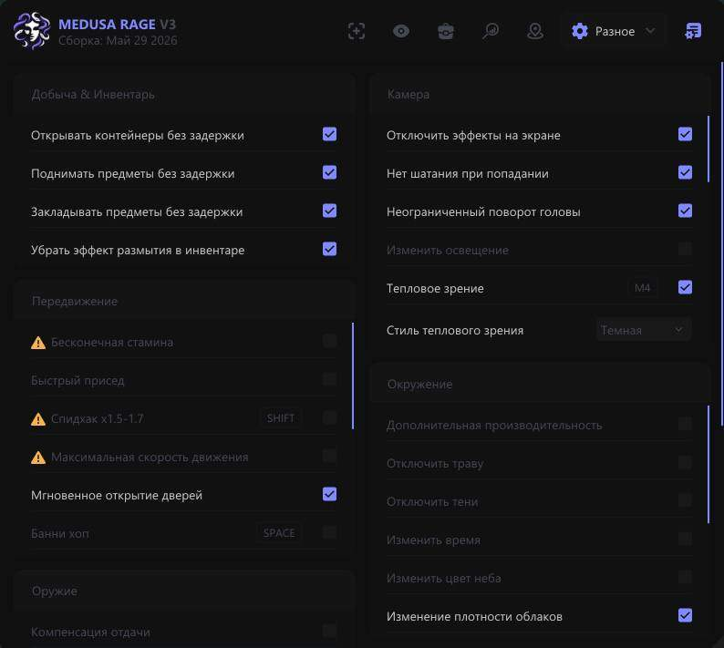
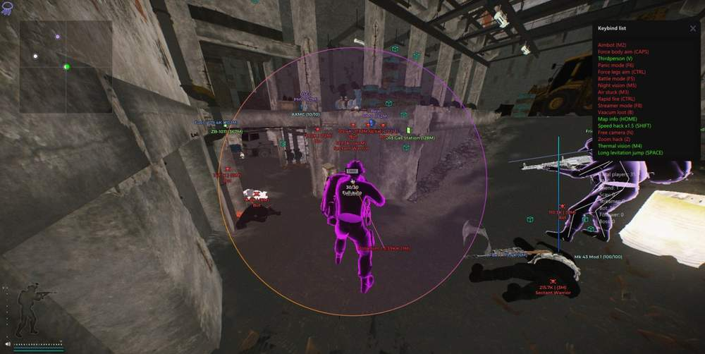
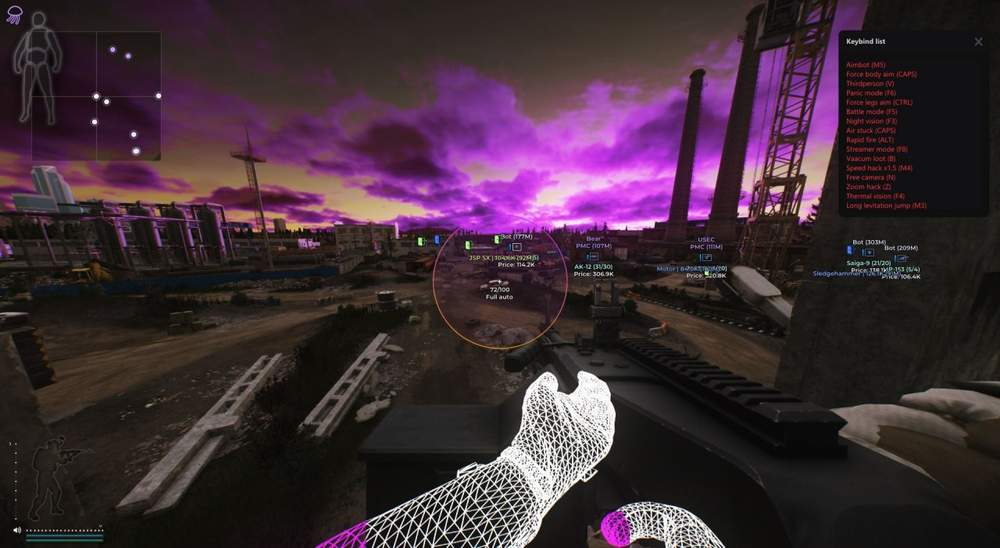

# Escape from Tarkov – Escape from Tarkov [ ☢ Medusa Rage ]

## 📸 Скриншоты

         

* Функционал Escape from Tarkov [ ☢ Medusa Rage ]:

### 🎯 Aimbot

* **Enable** – включить / выключить Aimbot
* **Silent Aim** – мощный режим аима, при котором выстрелы поражают цель без наведения камеры
* **Aim Key** – выбор клавиши для работы Aimbot
* **Force Body Aim** – принудительное наведение в тело
* **Force Legs Aim** – принудительное наведение в ноги
* **Silent Melee** – Silent Aim для оружия ближнего боя
* **Instant Hit** – мгновенное попадание по цели
* **FOV** – настройка размера рабочей области Aimbot
* **Draw FOV** – отображение круга FOV вокруг прицела
* **FOV Style / Color** – настройка стиля и цвета круга FOV
* **Max Distance** – ограничение дистанции работы Aimbot
* **Bone** – выбор хитбоксов для игроков и ботов
* **Nearest Bone** – наведение на ближайшую к прицелу часть тела
* **Ignored Roles** – выбор типов персонажей, которые будут игнорироваться
* **Target Info** – отображение информации о цели
* **Only Visible** – наведение только по видимым целям
* **Line To Target** – линия до текущей цели

### 👤 Players ESP

* **Wallhack** – отображение игроков, SCAV, ботов, боссов и других целей
* **Boxes ESP** – отображение целей в виде боксов
* **Box Style** – настройка стиля боксов: corners, outline, box, filled
* **Skeleton** – отображение скелета игрока
* **Look Direction** – линия направления взгляда игрока
* **Chams** – подсветка моделей игроков
* **Chams Style** – выбор стиля Chams: Latex, Glow, Glass Glow, Xray, Depth и другие
* **Chams Settings** – настройка мощности, яркости, цветов и интенсивности подсветки
* **Health** – отображение количества HP у цели
* **Player Info** – имя, дистанция, уровень, K/D, время, серия, фракция
* **Weapon** – отображение оружия в руках игрока
* **Inventory** – отображение инвентаря игрока
* **Inventory Min Price** – минимальная стоимость инвентаря для отображения
* **Max Distance** – настройка дальности работы Wallhack
* **Tracers** – линии от центра экрана до моделей игроков
* **Streamers** – отображение стримеров в рейде и ссылки на их каналы

### 🌐 World ESP

* **Grenades** – отображение гранат: Frag, Flash, Smoke
* **Grenades Settings** – настройка дистанции, таймера, траектории, сферы взрыва и радиуса
* **Trajectory / Radius Style** – настройка визуального стиля траектории и радиуса гранат
* **Danger Zones** – отображение опасных зон: мины, снайперы, растяжки
* **Mounted Weapons** – отображение стационарного оружия
* **Exits** – отображение точек выхода
* **Show Exit Requirements** – отображение требований для эвакуации
* **BTR** – отображение бронетранспортёра
* **Bullet Lines** – отображение выпущенных пуль
* **Hit Marker** – отметка мест попадания пуль
* **Hit Sound** – звуки попаданий
* **Time Changer** – возможность установить любое время суток
* **Map Info** – окно с информацией о карте, луте, игроках, боссах и прочем
* **Local Player Chams** – отображение Chams на вашем персонаже
* **Ammo Count** – отображение остатка патронов в обойме
* **Crosshair** – статичный прицел по центру экрана
* **Transitions** – отображение переходов между локациями
* **Radar** – окно радара для отображения игроков и других объектов

### 🔎 Loot ESP

* **Enable** – включение ESP для предметов
* **Distance** – отображение расстояния до предметов
* **Price** – отображение цены предметов
* **Names** – отображение названий предметов
* **Shorten Names** – сокращение названий предметов
* **Max Distance** – ограничение дистанции работы Loot ESP
* **Font Size** – настройка размера шрифта для Loot ESP
* **Hide In Scope** – скрытие лута при использовании прицела
* **Hide In Battle Mode** – скрытие лута в боевом режиме
* **Quest Items** – отображение предметов для заданий
* **Min Price Filter** – фильтр предметов по минимальной цене
* **Custom Loot Filter** – гибкая настройка фильтра лута

### 📦 Loot ESP Категории

* **Weapon** – различное оружие
* **Ammo** – боеприпасы
* **Ammo Boxes** – ящики с патронами
* **Magazines** – магазины для оружия
* **Sights** – прицелы
* **Suppressors** – глушители
* **Tactical Devices** – тактические устройства
* **Weapon Parts** – части оружия
* **Special Equipment** – специальное снаряжение
* **Repair** – предметы для ремонта
* **Keys** – ключи
* **Barter** – предметы для бартера
* **Containers** – контейнеры с лутом
* **Maps** – карты
* **Provisions** – еда и предметы питания
* **Gear** – экипировка
* **Meds** – медицина
* **Currency** – рубли, доллары, евро

### ⚙️ Misc

* **Auto Loot** – автоматический подбор ценного лута
* **Remove Delay To Pickup Item** – мгновенный подбор предметов без анимации
* **Fast Loading / Unloading Of Magazines** – быстрая загрузка и разгрузка магазинов
* **Auto Examine & Fast Examine** – быстрое изучение предметов
* **Thermal Vision** – режим теплового зрения
* **Night Vision** – режим ночного зрения
* **No Visor** – отключение визуального эффекта забрала шлема
* **Third Person** – вид от третьего лица
* **FOV Changer** – изменение поля зрения
* **Zoom Hack** – приближение камеры без оптики
* **Aspect Ratio Changer** – изменение соотношения сторон и растяжка изображения
* **Post FX** – изменение цвета изображения игры
* **No Screen Effects** – отключение визуальных эффектов: размытие, тряска камеры, кровавые пятна и прочее
* **Remove Inventory Blur Effect** – отключение размытия фона при открытом инвентаре
* **Light Changer** – расширенная настройка визуального стиля игры
* **Weather Controller** – полный контроль погодных условий

### 🎯 Shooting Exploits

* **No Recoil** – отключение отдачи при стрельбе
* **No Sway** – отключение покачивания камеры
* **Instant ADS** – мгновенное открытие прицела без анимации
* **Rapid Fire** – быстрая стрельба всей обоймой
* **Instant Melee Attack** – мгновенные удары ближнего боя
* **Instant Weapon Change** – быстрое переключение оружия
* **No Malfunction** – отключение поломок оружия
* **Extra Lean** – расширенный наклон персонажа
* **Instant Reload** – быстрая перезарядка оружия

### 🏃 Movement Exploits

* **Speedhack** – увеличение скорости передвижения
* **Run and Shoot** – возможность стрелять во время спринта
* **Perfect Physical Condition** – бег, прыжки и действия без штрафов
* **Infinite Stamina & No Fatigue** – отсутствие усталости при беге и прыжках
* **Free Camera** – свободная камера для просмотра карты
* **High Jump** – увеличенная высота прыжка
* **Long Levitation Jump** – более длинные прыжки с левитацией
* **Air Stuck** – зависание в воздухе
* **No Restrictions In Obstacles** – прохождение через кусты и воду без замедления
* **Always Success Workout** – упрощение прокачки в тренажёрном зале
* **Far Door Open** – открытие дверей с большой дистанции

### ⚙️ Settings

* **Menu Key** – настройка клавиши открытия меню
* **Panic Key** – кнопка полного отключения чита
* **Battle Mode Key** – переход в боевой режим с отключением лишнего лута и визуалов
* **Menu Customization** – настройка внешнего вида меню
* **CFG System** – сохранение и загрузка конфигов
* **Update Item Names / Prices** – обновление названий предметов и их цен
* **Icons** – отображение большинства ESP-элементов с иконками
* **Streamer Mode** – скрытие никнеймов игроков и автоматическая подмена айди сессии
* **Auto Captcha** – автоматическое прохождение капчи внутри игры
* **K/D Dropper** – бот для снижения K/D
* **HWID Spoofer** – встроенный Spoofer для обхода HWID-блокировок

## 🖥 Системные требования

* **Escape from Tarkov [ ☢ Medusa Rage ]:** 
* ⚙️ **️ Операционная система:** Windows 10 - 11 [21H2 / 22H2 / 23H2]
* 🔲 **Процессор:** Intel / AMD
* 🔲 **Видеокарта:** Nvidia / AMD
* 🖥 **Режим игры:** В окне без рамок / Оконный / Полноэкранный
* 🌐 **Поддерживаемые версии игры:** Battlestate Games Launcher (BSG) / Steam
* 🤖 **Встроенный спуфер:** Да