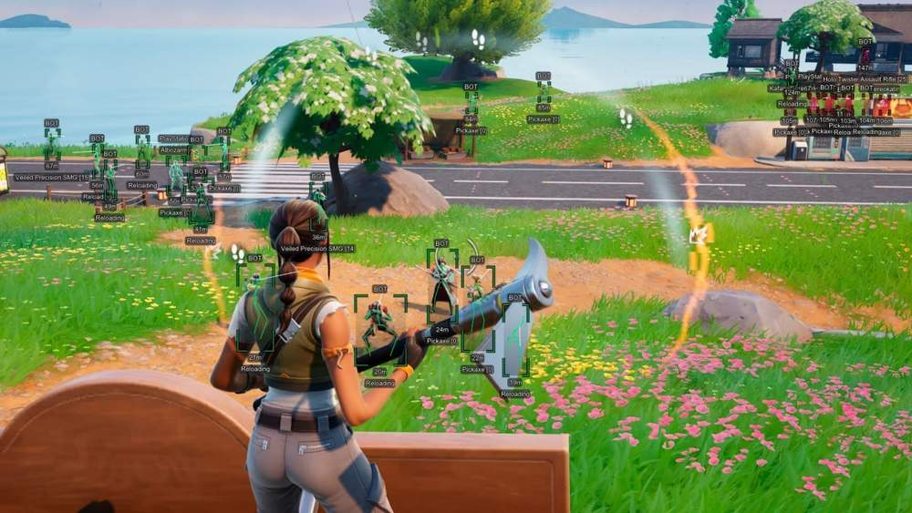
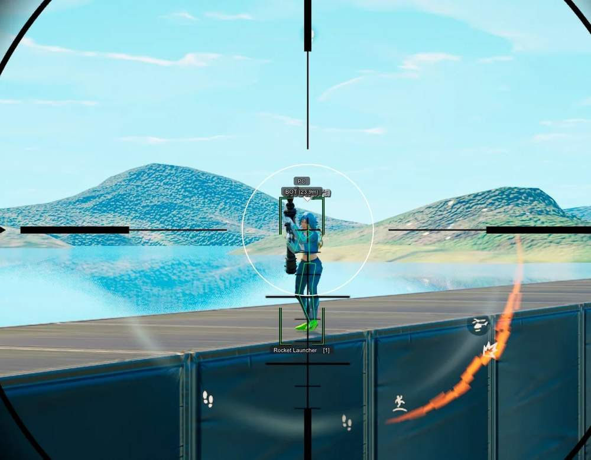
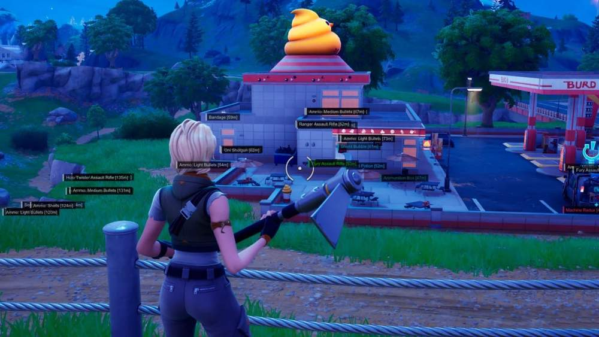
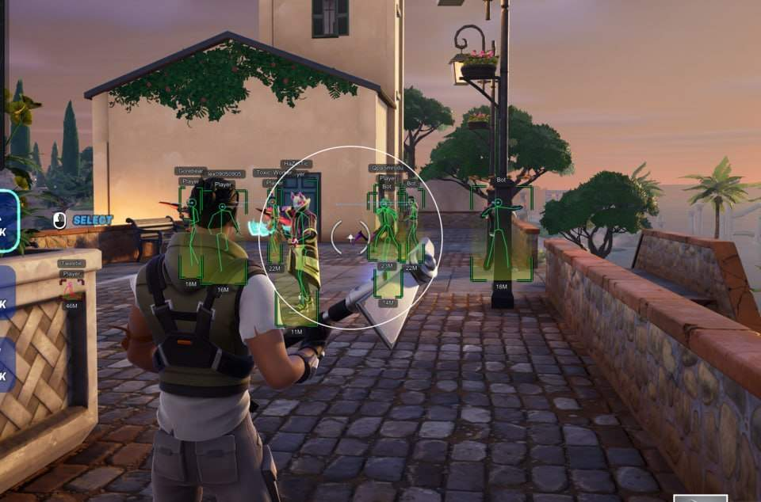

# Fortnite – Fortnite [ ☢ Arcane ]

## 📸 Скриншоты

   

* Функционал Fortnite [ ☢ Arcane ]:

### 🎯 Aimbot

* **Enable Aimbot** – активация аимбота
* **Aim Key** – назначение клавиши активации
* **Weapon Type** – отдельные настройки аима для Pistol / SMG / Rifle / Shotgun / Sniper
* **Targets** – выбор доступных целей: Knocked / BOT / Team
* **Bone** – выбор части тела для наведения: Head / Neck / Body / Legs
* **Smooth** – настройка плавности движения аима
* **FOV** – размер рабочей области аимбота
* **Draw FOV** – отображение рабочей области в виде окружности
* **Distance** – максимальная дистанция работы аимбота
* **No Recoil** – отключение отдачи оружия при стрельбе
* **Visible Check** – наведение только на цели в прямой видимости
* **Prediction** – предугадывание траектории движения противника

### 👤 Visuals

* **Players ESP** – отображение игроков и информации о них
* **2D Boxes** – отображение игроков в виде 2D-рамок
* **Line** – отображение линий до игроков
* **Skeleton** – отображение скелета персонажа
* **Weapon** – отображение оружия в руках противника
* **Distance** – отображение расстояния до цели
* **Nickname** – отображение имени игрока
* **Platform** – отображение платформы игрока: PC / PlayStation / Xbox / Nintendo
* **Team ID** – отображение номера команды игрока
* **Kill Score** – отображение количества убийств
* **View Line** – отображение направления взгляда персонажа
* **Is In Vehicle** – отметка игроков, находящихся в транспорте
* **Knocked** – отображение нокаутированных противников
* **Visible Check** – разные цвета для видимых целей и игроков за препятствиями
* **Hide Bot** – скрытие ИИ-ботов
* **Show Team** – отображение союзников
* **Max Distance** – настройка максимальной дистанции работы ESP

### 🔎 Loot ESP

* **Items ESP** – активация отображения лута
* **Distance** – отображение расстояния до предметов
* **Name** – отображение названий предметов
* **Rarity** – отображение редкости и фильтрация предметов: Common / Uncommon / Rare / Epic / Legendary / Mythic
* **Max Distance** – настройка максимальной дистанции Loot ESP
* **Chests** – отображение сундуков с лутом
* **Ammo Box** – отображение ящиков с боеприпасами
* **Machine Redux** – отображение торговых автоматов
* **Vehicle** – отображение транспортных средств
* **Zipline** – отображение зиплайнов

### ⚙️ Misc

* **Battle Mode** – скрытие всего ESP, кроме игроков, во время боя
* **Crosshair** – статичный прицел в центре экрана с возможностью настройки
* **Arrows** – стрелки, указывающие направление целей за пределами экрана
* **Configs** – сохранение и загрузка конфигураций
* **Language** – выбор языка меню: русский / английский / китайский
* **StreamProof** – скрытие меню и визуальных функций при записи видео, создании скриншотов и трансляции экрана

## 🖥 Системные требования

* **Fortnite [ ☢ Arcane ]:** 
* ⚙️ **️ Операционная система:** Windows 10 - 11
* 🔲 **Процессор:** Intel / AMD
* 🔲 **Видеокарта:** Nvidia / AMD
* 🖥 **Режим игры:** В окне без рамок / Оконный
* 🌐 **Поддерживаемые версии игры:** Epic Games
* 🤖 **Встроенный спуфер:** Да