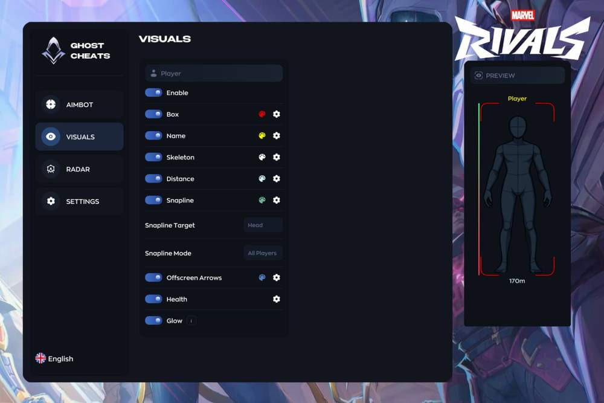
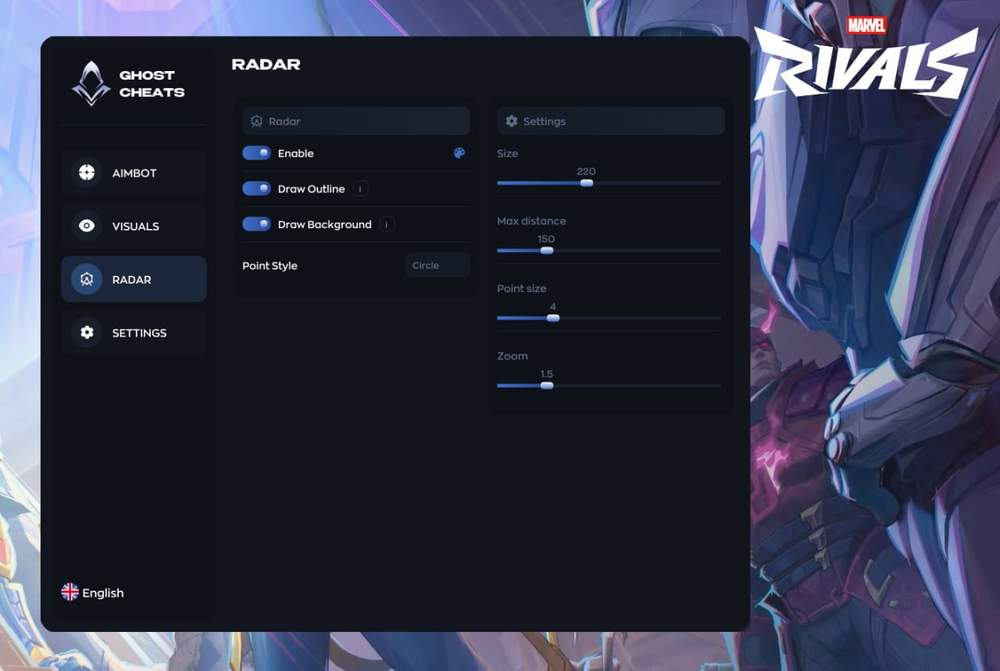
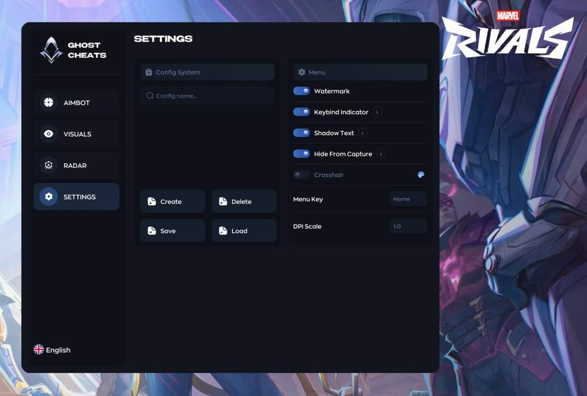
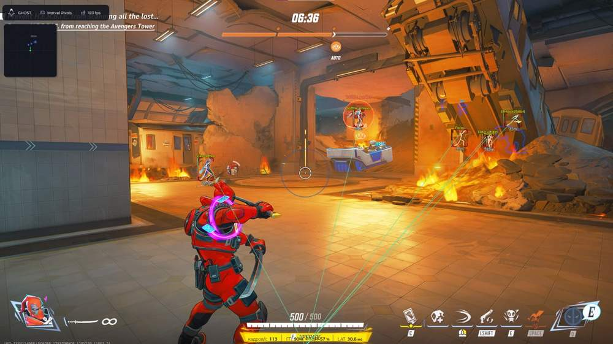
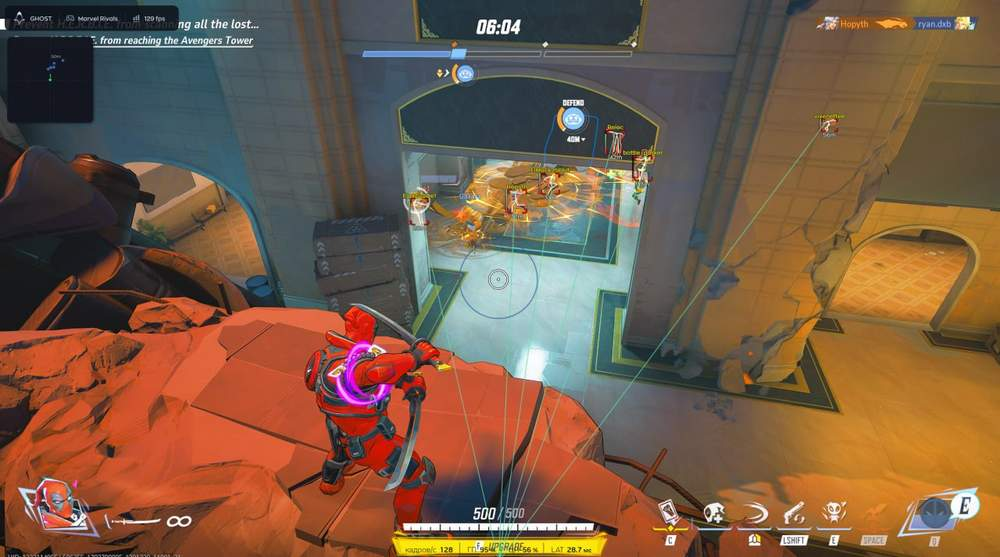

# Marvel Rivals – Marvel Rivals [ ☢ Ghost ]

## 📸 Скриншоты

     

* ункционал Marvel Rivals [ ☢ Ghost ]:

### 🎯 Аимбот

* **Aimbot** – основной режим автоматического наведения
* **Enable** – включение и отключение аимбота
* **FOV** – настройка поля зрения: вкл / угол обзора / цвет
* **Smoothness** – настройка плавности наведения
* **Hitbox** – выбор зоны попадания: Head / Neck / Chest / Pelvis
* **Bones Mode** – выбор режима костей: All / Selected
* **Visible Check** – проверка видимости цели
* **Target Lock** – захват и удержание цели
* **Recoil Control** – контроль отдачи с настройкой силы
* **Max Distance** – настройка максимальной дистанции работы аима
* **Humanization** – блок легитных настроек наведения
* **Jitter** – настройка дрожания при наведении
* **Min Reaction** – настройка минимальной реакции в мс
* **Max Reaction** – настройка максимальной реакции в мс
* **Max Speed** – настройка максимальной скорости наведения
* **Dead Zone** – настройка мёртвой зоны для более естественного аима

### 👁 Визуалы

* **Player ESP** – отображение игроков
* **Enable** – включение и отключение ESP
* **Visible Check** – разделение видимых и невидимых целей
* **Name** – отображение имени игрока: вкл / дистанция / цвет / размер
* **Distance** – отображение дистанции до игрока: вкл / дистанция / цвет / размер
* **Offscreen Arrows** – стрелки на игроков за пределами экрана
* **Glow** – подсветка модели игрока
* **Box** – отображение бокса: Normal / Corner / Filled
* **Box Settings** – настройка цветов видимого и невидимого врага, дистанции, толщины и скругления
* **Skeleton** – отображение скелета игрока
* **Skeleton Settings** – настройка дистанции, цвета и толщины
* **Snapline** – линия привязки к цели
* **Snapline Settings** – настройка дистанции, цвета и толщины
* **Health** – отображение здоровья игрока
* **Health Settings** – настройка дистанции, цвета и ширины полосы

### 📡 Радар

* **Radar** – встроенный радар для отслеживания целей
* **Enable** – включение и отключение радара
* **Outline** – отображение контура радара
* **Background** – включение фона радара
* **Dot Style** – стиль точки: Circle / Cross / Arrow
* **Max Distance** – настройка максимальной дистанции отображения
* **Scale** – масштаб радара
* **Size** – настройка размера радара
* **Dot Size** – настройка размера точки на радаре

### ⚙️ Настройки

* **Config System** – система конфигов
* **Config Name** – ввод названия конфига
* **Create Config** – создание нового конфига
* **Save Config** – сохранение конфига
* **Load Config** – загрузка конфига
* **Delete Config** – удаление конфига
* **Menu Indicator** – индикатор нажатых клавиш
* **Stream Proof** – скрытие от захвата / записи экрана
* **Menu Key** – настройка клавиши открытия меню
* **Watermark** – включение водяного знака
* **Text Shadow** – включение тени текста
* **Crosshair** – настройка прицела: вкл / цвет
* **DPI Scale** – настройка масштаба интерфейса

## 🖥 Системные требования

* **Marvel Rivals [ ☢ Ghost ]:** 
* ⚙️ **️ Операционная система:** Windows 10 | 11 (1903-25h2)
* 🔲 **Процессор:** Intel / AMD
* 🔲 **Видеокарта:** Nvidia / AMD
* 🖥 **Режим игры:** Оконный | Безрамочный
* 🌐 **Поддерживаемые версии игры:** Steam
* 🤖 **Встроенный спуфер:** Нет