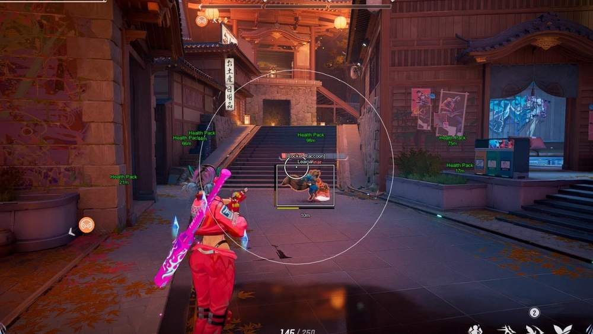
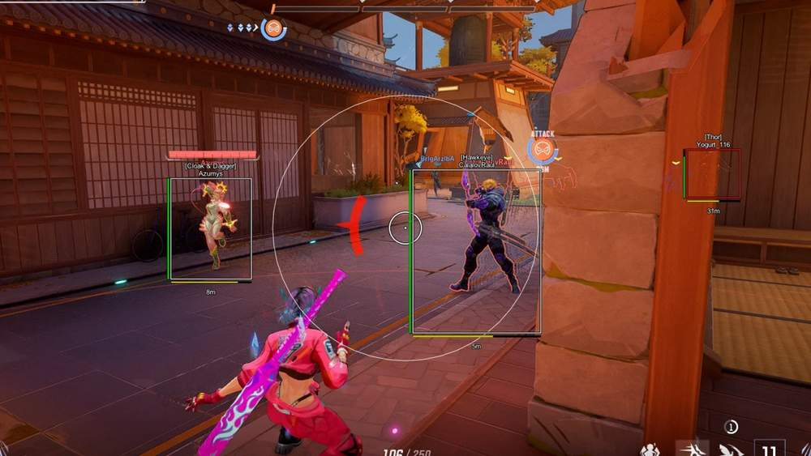
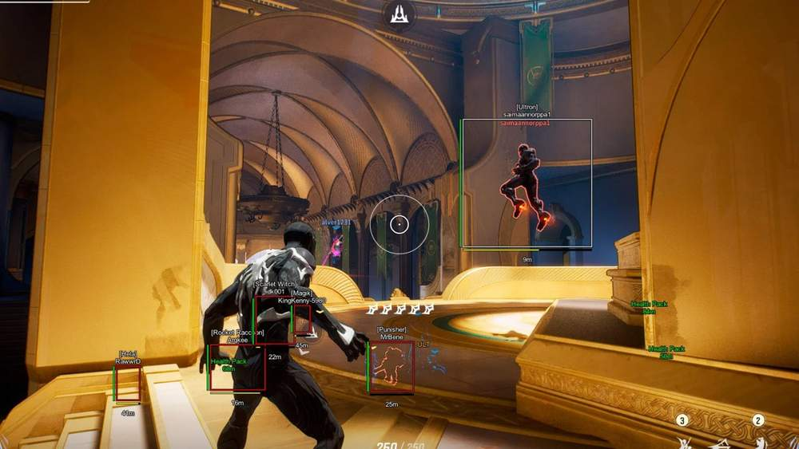
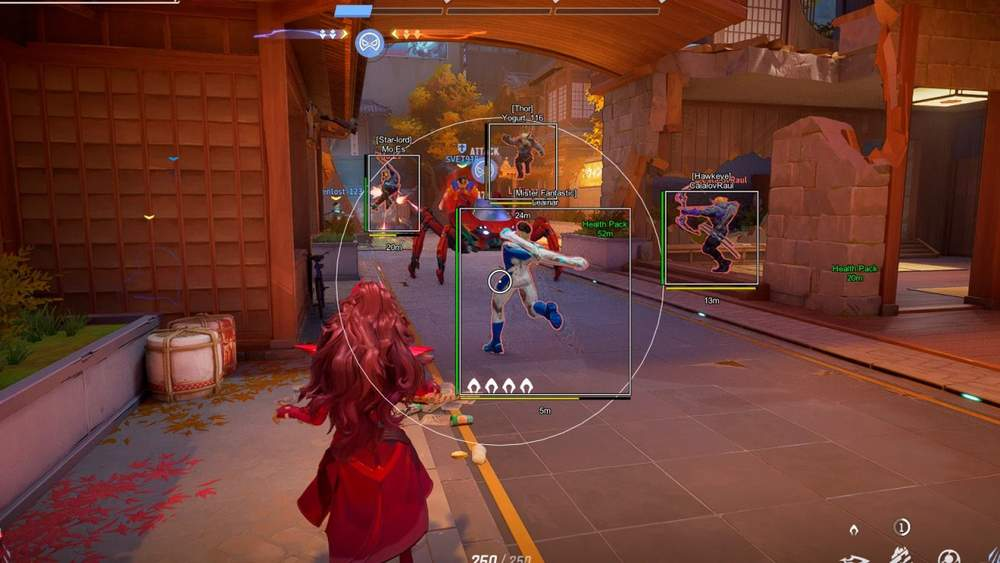

# Marvel Rivals – Marvel Rivals [ ☢ Phoenix ]

## 📸 Скриншоты

   

* Функционал Marvel Rivals [ ☢ Phoenix ]:

### 🎯 Aimbot

* **Enable** – включение / выключение Aimbot
* **Vector Aimbot** – легитное наведение на игроков
* **Silent Aimbot** – попадание по цели в радиусе Aim без движения прицела
* **Aim Keys** – настройка клавиш для Aim / Triggerbot
* **Aim Mode** – режим работы Aim и Triggerbot: always, toggle, hold key
* **Humanizer** – имитация человеческих движений для легитной игры
* **FOV** – настройка радиуса зоны Aimbot
* **Show FOV** – отображение круга FOV
* **FOV Color** – настройка цвета круга FOV
* **Smooth** – настройка плавности наведения
* **Only Body** – наведение только в тело
* **Through Wall** – работа по целям через стены
* **Visible Check** – проверка видимости цели
* **Ignore Teammate** – игнорирование союзников
* **Triggerbot** – автоматический выстрел при наведении на врага
* **Spinbot** – rage-режим с несколькими вариантами вращения
* **Magic Bullet** – попадание по цели через препятствия

### 👁 Visuals

* **Players ESP** – отображение игроков
* **Box** – боксы вокруг игроков
* **Hero Name** – отображение имени героя
* **Name** – отображение никнейма игрока
* **Glow** – подсветка моделей игроков
* **Health** – отображение HP в виде полосы
* **Ultimate** – отображение статуса ультимейта героя
* **Distance** – отображение дистанции до игроков
* **Health Packs** – отображение аптечек, кд и дистанции
* **Strange Portals** – отображение порталов и дистанции до них
* **Portals Warning** – предупреждение об открытых порталах

### ⚙️ Other

* **Scripts** – загрузка пользовательских .lua скриптов для героев
* **SkinChanger** – бесплатные скины для любых героев
* **BunnyHop** – автоматический прыжок
* **Configs** – система конфигов: save, load, update, reset, open config folder
* **Menu Key** – настройка клавиши открытия меню
* **Safe Mode** – безопасный режим для рискованных функций
* **Custom Scale** – настройка размера меню
* **Custom Colors** – настройка цветов ESP-элементов
* **HWID Spoofer** – встроенный Spoofer в Phoenix Marvel для обхода HWID-блокировок

## 🖥 Системные требования

* **Marvel Rivals [ ☢ Phoenix ]:** 
* ⚙️ **️ Операционная система:** Windows 10 - 11 (21H2  -  25H2)
* 🔲 **Процессор:** Intel | AMD
* 🔲 **Видеокарта:** Nvidia | AMD
* 🌐 **Поддерживаемые версии игры:** Steam, NetEase Launcher (Loading Bay)
* 🤖 **Встроенный спуфер:** да