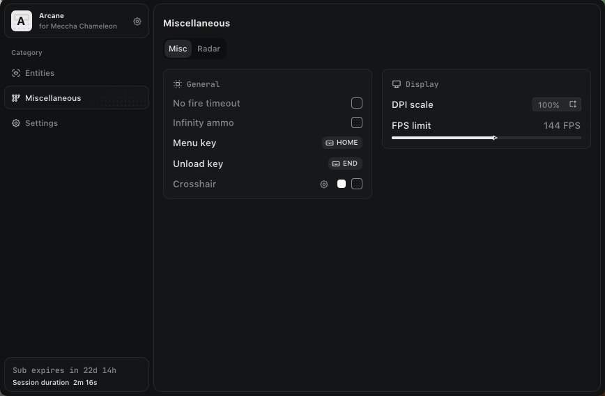
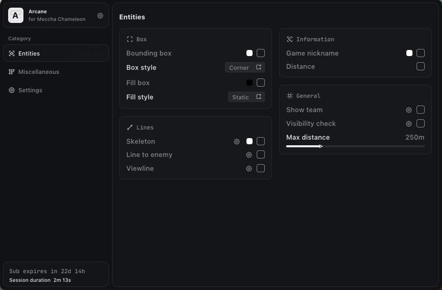
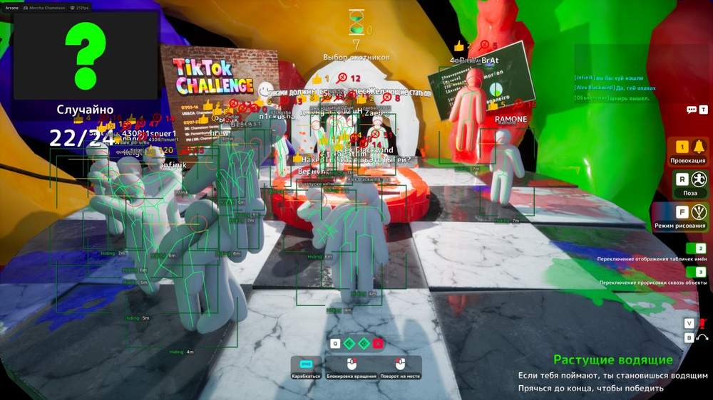
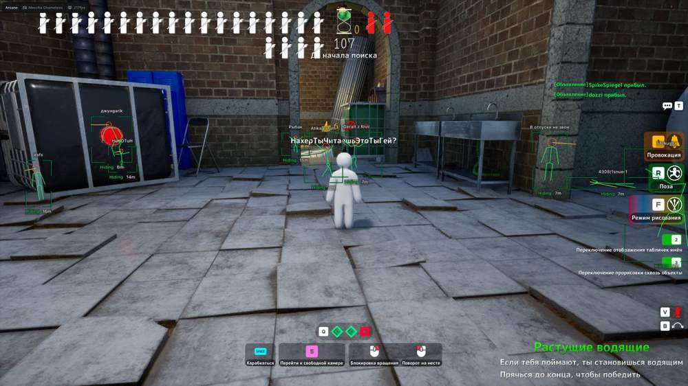
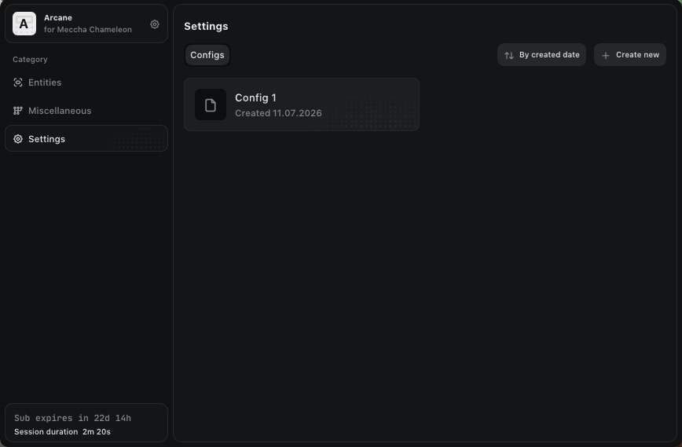
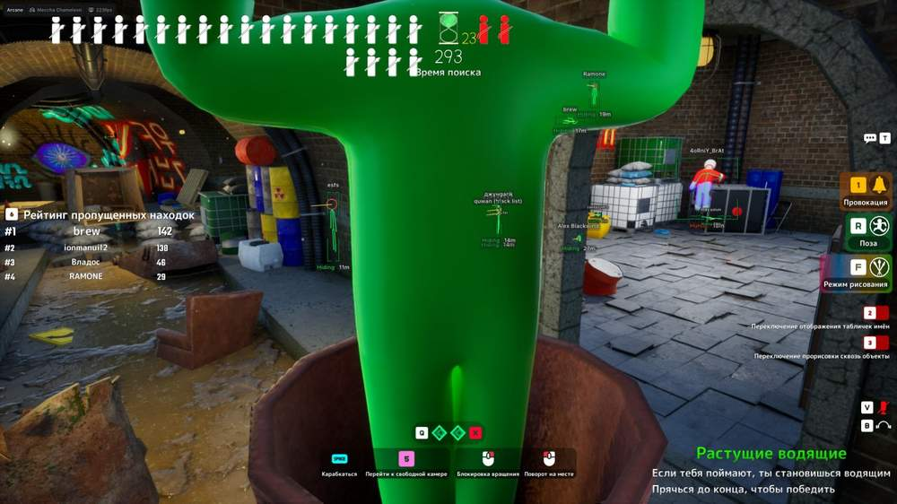

# Meccha Chameleon – Meccha Chameleon [ ☢ Arcane ]

## 📸 Скриншоты

     

* Функционал Meccha Chameleon [ ☢ Arcane ]:

### 👁 Entities ESP

* **Bounding Box** – отображение целей в виде 2D-бокса: Box / Corners
* **Fill Box** – заливка бокса: Static / Gradient
* **View Line** – отображение направления взгляда с настройкой начального и конечного цвета
* **Line to Enemy** – отображение линий до игроков с настройкой цвета и позиции
* **Skeleton** – отображение скелета с настройкой толщины линий и круга головы
* **Name** – отображение имён игроков
* **Distance** – отображение расстояния до целей
* **Show Team** – отображение членов команды
* **Visibility Check** – проверка видимости целей
* **Max Distance** – настройка максимальной дистанции работы ESP

### 🛠 Misc

* **No Gun Cooldown** – отключение задержки между выстрелами
* **Infinity Ammo** – бесконечный запас боеприпасов

### ⚙️ Settings

* **Menu Keybind** – назначение клавиши открытия меню
* **Unload Keybind** – назначение клавиши выгрузки продукта
* **DPI Scale** – настройка размера интерфейса
* **FPS Limit** – установка ограничения кадров в секунду
* **Theme** – выбор темы интерфейса: Dark / Light
* **Watermark** – отображение водяного знака
* **Language** – выбор языка меню: EN / RU / CN

### 💾 Config

* **Create Config** – создание новой конфигурации
* **Load Config** – загрузка сохранённой конфигурации
* **Rename Config** – переименование выбранной конфигурации
* **Delete Config** – удаление выбранной конфигурации

## 🖥 Системные требования

* **Meccha Chameleon [ ☢ Arcane ]:** 
* ⚙️ **️ Операционная система:** Windows 10 - 11
* 🔲 **Процессор:** Intel / AMD
* 🔲 **Видеокарта:** Nvidia / AMD
* 🖥 **Режим игры:** В окне без рамок / Оконный
* 🌐 **Поддерживаемые версии игры:** Steam, Epic Games, Xbox
* 🤖 **Встроенный спуфер:** Нет