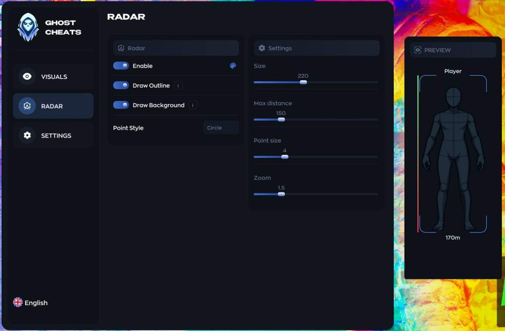
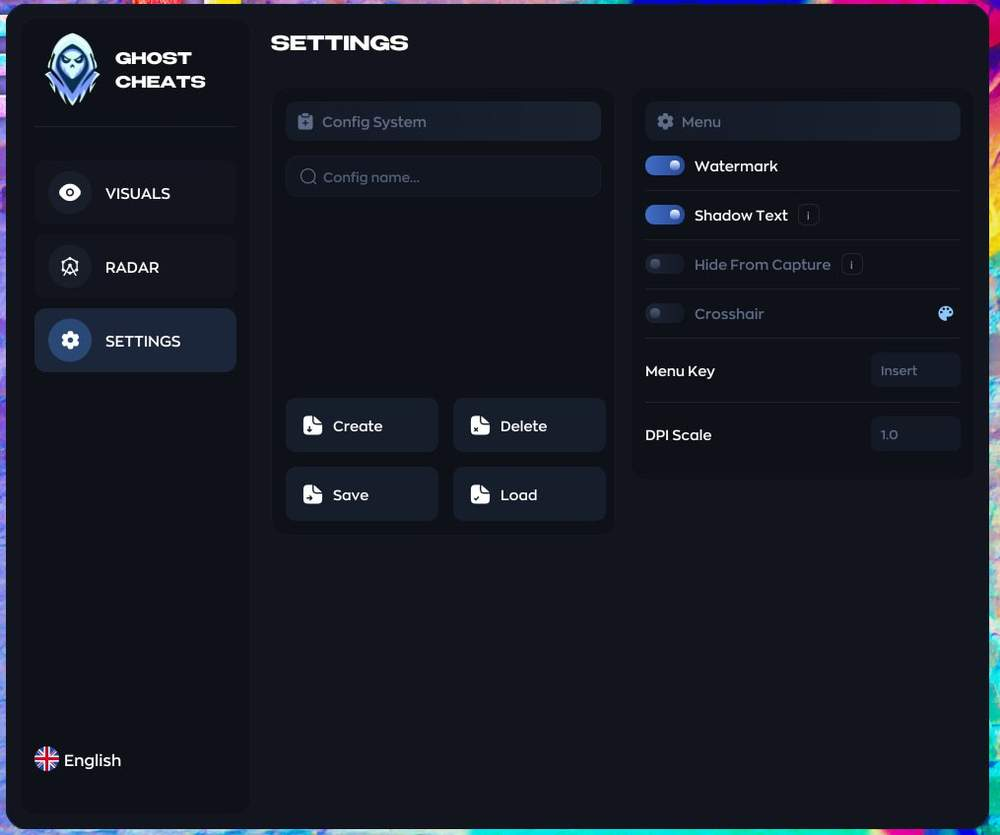
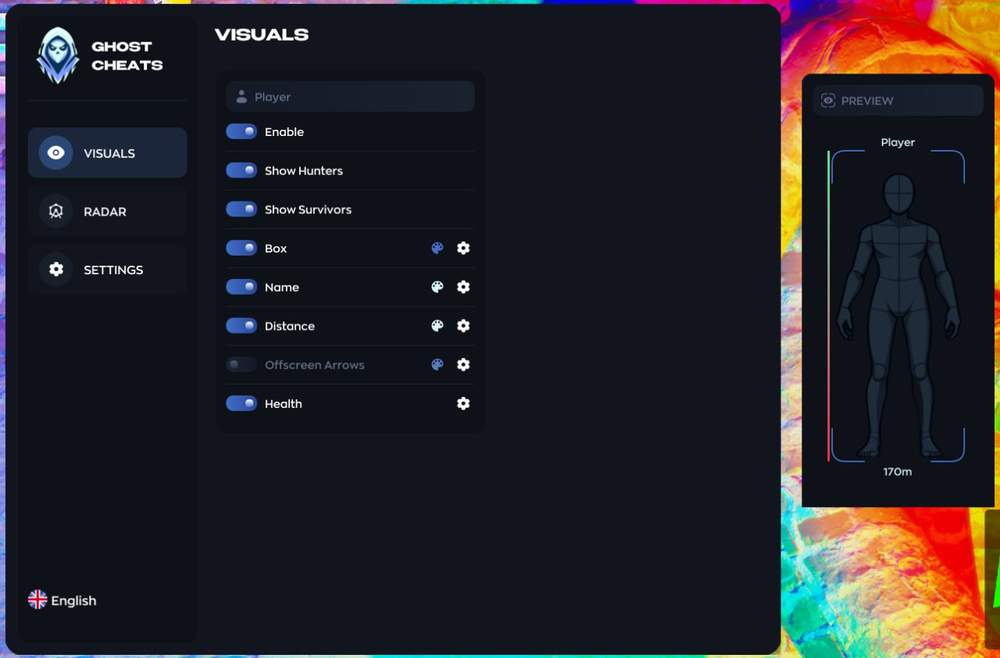

# Meccha Chameleon – Meccha Chameleon [ ☢ Ghost ]

## 📸 Скриншоты

  

### 👤 Visuals / Player

* **Show Hunters / Show Survivors** – раздельное отображение
* **Box** – отображение бокса
* **Name** – отображение имени
* **Distance** – отображение дистанции
* **Health** – отображение здоровья
* **Offscreen Arrows** – отображение врагов за пределами экрана
* **Colors** – настройка цветов для каждого элемента

### 🎯 Radar

* **Built** – in Radar — встроенный радар
* **Size / Zoom / Distance** – настройка размера, зума и дистанции
* **Draw Outline / Draw Background** – отображение контура и фона
* **Dot Style / Dot Size** – настройка стиля и размера точек

### 🛠 Settings

* **Config System** – создание / удаление / сохранение / загрузка конфигов
* **Hide From Capture** – скрытие от записи экрана и стримов
* **Crosshair** – прицел
* **Watermark / Shadow Text** – отображение watermark и shadow text
* **Menu Key (Insert)** – клавиша открытия меню
* **DPI Scale** – настройка масштаба интерфейса

## 🖥 Системные требования

* **Meccha Chameleon [ ☢ Ghost ]:** 
* ⚙️ **️ Операционная система:** Windows 10 | 11 (1903 - 26h1)
* 🔲 **Процессор:** INTEL | AMD
* 🔲 **Видеокарта:** Nvidia / AMD
* 🖥 **Режим игры:** Оконный | Безрамочный
* 🌐 **Поддерживаемые версии игры:** Steam
* 🤖 **Встроенный спуфер:** Нет