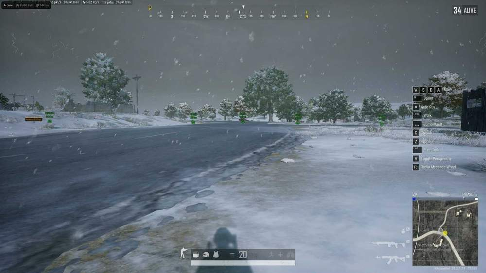
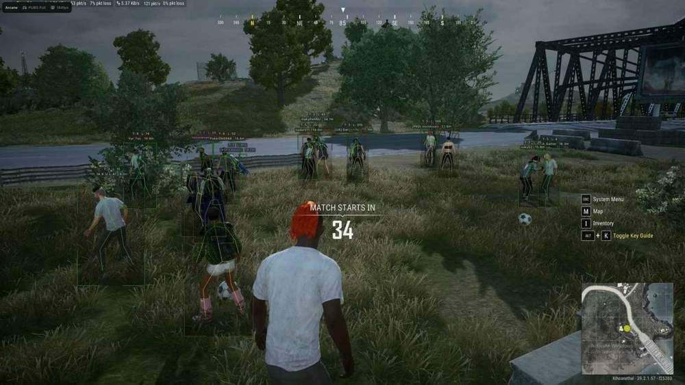
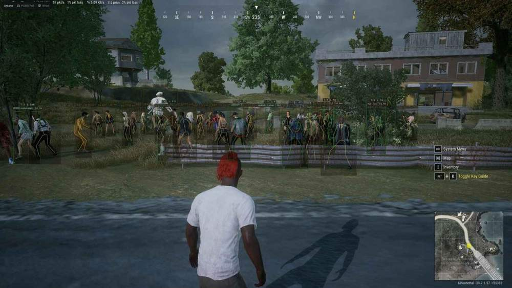

# Pubg – Pubg [ ☢ Arcane ESP ]

## 📸 Скриншоты

  

* Функционал Pubg [ ☢ Arcane ESP ]:

### 👁 ESP Players

* **2D Player Box** – отображение игроков в виде рамки: Box / Corners
* **Box Fill** – заливка рамки: Static / Gradient
* **Health Bar** – отображение полосы здоровья: Static / Health Based / Gradient
* **ESP Style** – выбор оформления информации: No Background / With Background
* **Health Text** – отображение здоровья числом
* **Nickname** – отображение имени игрока
* **Weapon in Hands** – отображение оружия в руках
* **Level** – отображение уровня игрока
* **Show Knocked** – отображение нокаутированных противников
* **Spectator Count** – отображение количества наблюдателей
* **Kill Count** – отображение количества убийств
* **Team ID** – отображение номера команды
* **Team Colors** – разделение игроков по цветам команд
* **Skeleton** – отображение скелета с настройкой толщины и затухания по дистанции
* **Visibility Check** – разделение видимых и скрытых целей
* **Player Lines** – отображение линий до игроков
* **Render Distance** – настройка максимальной дистанции отображения

### 📦 Items ESP

* **Enable** – активация отображения предметов
* **Show Distance** – отображение расстояния до предметов
* **Battle Mode** – скрытие Item ESP во время боя по назначенной клавише
* **Render Distance** – настройка максимальной дистанции отображения лута

### 🔎 Items Categories

* **Assault Rifle** – отображение штурмовых винтовок
* **Marksman Rifle** – отображение марксманских винтовок
* **Submachine Gun** – отображение пистолетов-пулемётов
* **Light Machine Gun** – отображение лёгких пулемётов
* **Sniper Rifle** – отображение снайперских винтовок
* **Shotgun** – отображение дробовиков
* **Pistol** – отображение пистолетов
* **Melee** – отображение оружия ближнего боя
* **Helmet** – отображение шлемов
* **Vest** – отображение бронежилетов
* **Backpack** – отображение рюкзаков
* **Medkits** – отображение аптечек
* **Boosters** – отображение усилителей
* **Ammo** – отображение боеприпасов
* **Throwables** – отображение метательных предметов
* **Attachments** – отображение модулей и обвесов
* **Misc** – отображение прочих предметов

### 🚗 Others ESP

* **Show Distance** – отображение расстояния до транспорта
* **Show Land Vehicle** – отображение наземного транспорта
* **Show Water Vehicle** – отображение водного транспорта
* **Show Air Vehicle** – отображение воздушного транспорта
* **Render Distance** – настройка максимальной дистанции отображения
* 🪂 Drops ESP
* **Show AirDrop** – отображение аирдропов
* **Show Death Crates** – отображение ящиков погибших игроков
* **Show Drop Contents** – отображение содержимого дропа
* **Show All Items** – отображение всех предметов внутри
* **Style** – выбор режима отображения: Always / On Hover
* **Render Distance** – настройка максимальной дистанции отображения

### 🛠 Misc

* **No Recoil** – отключение отдачи оружия
* **Crosshair** – отображение статичного прицела в центре экрана
* **Spectator Count** – отображение количества наблюдателей
* **Off** – Screen Arrows — стрелки, указывающие направление игроков за пределами экрана

### ⚙️ Settings

* **Enable Particles** – включение частиц в интерфейсе
* **Accent Color** – настройка акцентного цвета меню
* **Theme** – выбор темы интерфейса: Light / Dark
* **Language** – выбор языка меню: RUS / ENG / CHN
* **VSync** – включение вертикальной синхронизации
* **Show FPS** – отображение количества FPS
* **DPI Scale** – настройка масштаба интерфейса
* **Watermark Position** – настройка положения водяного знака
* **Notify Position** – настройка положения уведомлений

### 💾 Config

* **Create Config** – создание новой конфигурации
* **Delete Config** – удаление выбранной конфигурации
* **Save Config** – сохранение текущих настроек
* **Load Config** – загрузка сохранённой конфигурации

## 🖥 Системные требования

* **Pubg [ ☢ Arcane ESP ]:** 
* ⚙️ **️ Операционная система:** Windows 10 - 11
* 🔲 **Процессор:** Intel | AMD
* 🔲 **Видеокарта:** Nvidia | AMD
* 🌐 **Поддерживаемые версии игры:** Steam
* 🤖 **Встроенный спуфер:** Да