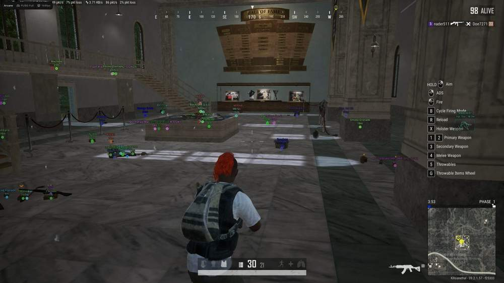
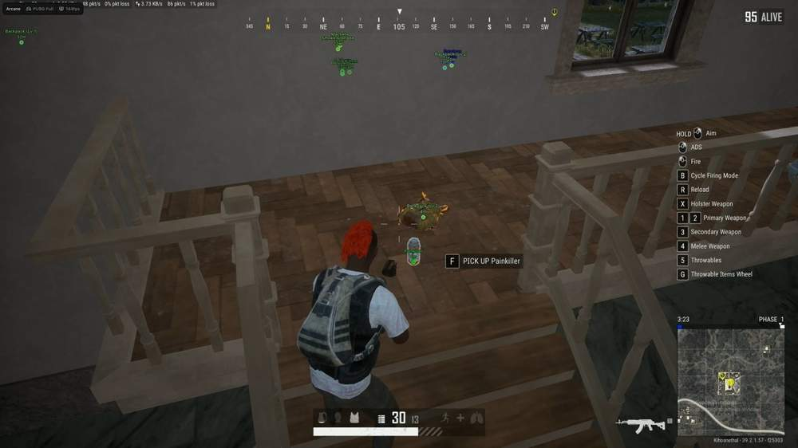
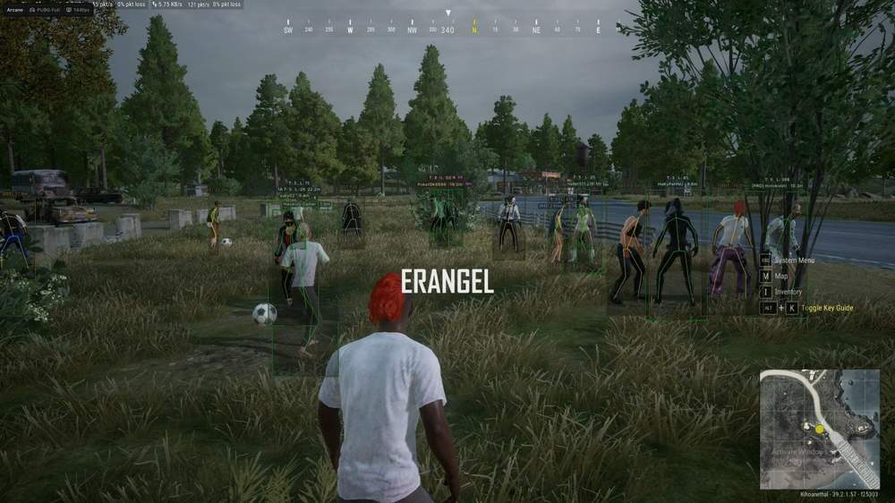
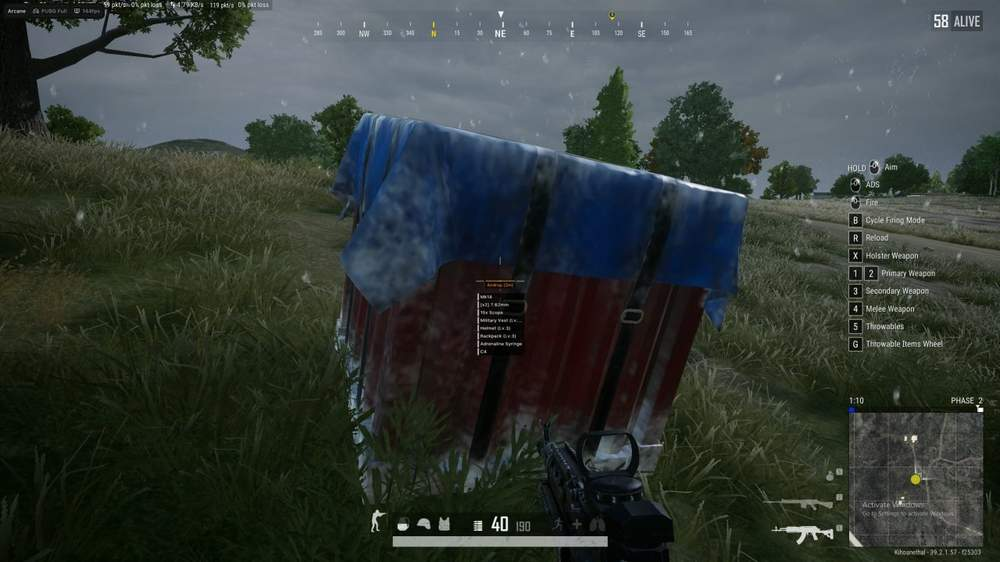
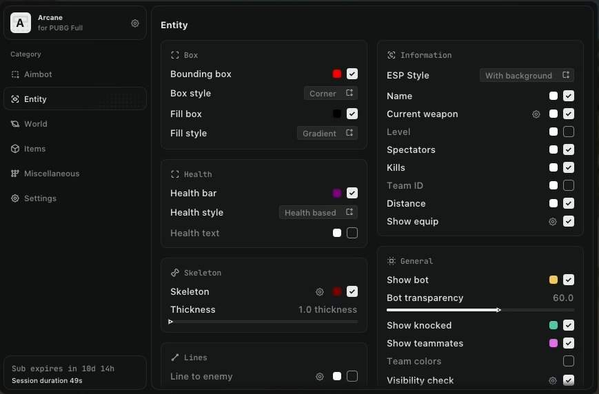
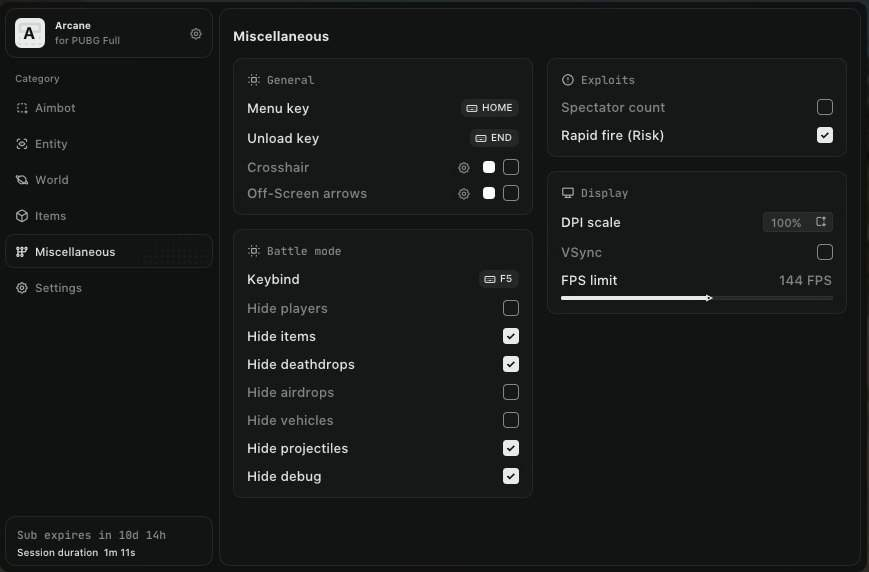
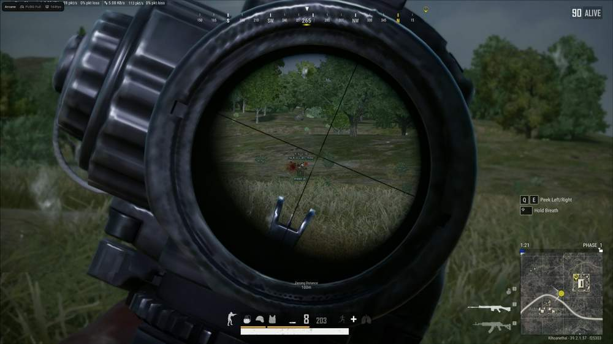

# Pubg – Pubg [ ☢ Arcane Full ]

## 📸 Скриншоты

      

* Функционал Pubg [ ☢ Arcane Full ]:

### 🎯 Aimbot

* **Keybind** – назначение клавиши активации аимбота
* **Mode** – выбор режима работы: Hold / Toggle
* **Prediction** – предугадывание траектории движения цели
* **Lock Target** – фиксация аимбота на выбранной цели
* **Recoil Compensation System** – автоматическая компенсация отдачи
* **No Sway** – отключение раскачки оружия во время прицеливания
* **Aim Knocked** – возможность наведения на нокаутированных противников
* **Prediction Cross** – отображение точки рассчитанного упреждения
* **Draw FOV Circle** – отображение рабочей области аимбота
* **Visibility Check** – наведение только на видимые цели
* **Bone** – выбор части тела для наведения: Head / Neck / Body / Pelvis
* **FOV Radius** – настройка радиуса рабочей области
* **Smooth** – настройка плавности наведения
* **Distance** – настройка максимальной дистанции работы аимбота

### 👁 ESP Players

* **2D Player Box** – отображение игроков в виде рамки: Box / Corners
* **Box Fill** – заливка рамки: Static / Gradient
* **Health Bar** – полоса здоровья: Static / Health Based / Gradient
* **ESP Style** – выбор оформления информации: No Background / With Background
* **Health Text** – отображение здоровья числом
* **Nickname** – отображение имени игрока
* **Weapon in Hands** – отображение оружия в руках
* **Ammo Count** – отображение количества патронов
* **Level** – отображение уровня игрока
* **Show Knocked** – отображение нокаутированных противников
* **Spectator Count** – отображение количества наблюдателей
* **Kill Count** – отображение количества убийств
* **Team ID** – отображение номера команды
* **Team Colors** – разделение игроков по цветам команд
* **Skeleton** – отображение скелета с настройкой толщины и затухания по дистанции
* **Show Equipment** – отображение экипировки: Always / On Hover
* **Distance** – отображение расстояния до игрока
* **Visibility Check** – разделение видимых и скрытых целей
* **Player Lines** – отображение линий до игроков: Middle Top / Center / Middle Down
* **Render Distance** – настройка максимальной дистанции отображения

### 📦 Items ESP

* **Show Distance** – отображение расстояния до предметов
* **Battle Mode** – скрытие предметов во время боя по назначенной клавише
* **Render Distance** – настройка максимальной дистанции отображения лута

### 🔎 Items Categories

* **Assault Rifle** – отображение штурмовых винтовок
* **Marksman Rifle** – отображение марксманских винтовок
* **Submachine Gun** – отображение пистолетов-пулемётов
* **Light Machine Gun** – отображение лёгких пулемётов
* **Sniper Rifle** – отображение снайперских винтовок
* **Shotgun** – отображение дробовиков
* **Pistol** – отображение пистолетов
* **Melee** – отображение оружия ближнего боя
* **Helmet** – отображение шлемов
* **Vest** – отображение бронежилетов
* **Backpack** – отображение рюкзаков
* **Medkits** – отображение аптечек
* **Boosters** – отображение усилителей
* **Ammo** – отображение боеприпасов
* **Throwables** – отображение метательных предметов
* **Attachments** – отображение модулей и обвесов
* **Misc** – отображение прочих предметов

### 🎛 Items Filter

* **Selected Items** – возможность отображать только выбранные категории и предметы

### 🚗 Vehicle ESP

* **Show Distance** – отображение расстояния до транспорта
* **Show Fuel** – отображение количества топлива
* **Show Health** – отображение прочности транспорта
* **Show Ground Vehicle** – отображение наземного транспорта
* **Show Water Vehicle** – отображение водного транспорта
* **Show Air Vehicle** – отображение воздушного транспорта
* **Render Distance** – настройка максимальной дистанции отображения
* 🪂 Drops ESP
* **Show AirDrop** – отображение аирдропов
* **Show Death Crates** – отображение ящиков погибших игроков
* **Show Drop Contents** – отображение содержимого дропа
* **Show All Items** – отображение всех предметов внутри
* **Style** – выбор режима показа: Always / On Hover
* **Render Distance** – настройка максимальной дистанции отображения

### 💣 Throwable ESP

* **Show Name** – отображение названия метательного предмета
* **Show Distance** – отображение расстояния до него
* **Show Time to Explosion** – отображение времени до взрыва
* **Show Sphere** – отображение области действия
* **Sphere Radius** – настройка радиуса области действия
* **Grenade Color** – настройка цвета осколочной гранаты
* **Flash Color** – настройка цвета светошумовой гранаты
* **Molotov Color** – настройка цвета коктейля Молотова
* **Smoke Color** – настройка цвета дымовой гранаты
* **Render Distance** – настройка максимальной дистанции отображения

## 🖥 Системные требования

* **Pubg [ ☢ Arcane Full ]:** 
* ⚙️ **️ Операционная система:** Windows 10 - 11
* 🔲 **Процессор:** Intel | AMD
* 🔲 **Видеокарта:** Nvidia | AMD
* 🌐 **Поддерживаемые версии игры:** Steam
* 🤖 **Встроенный спуфер:** Да