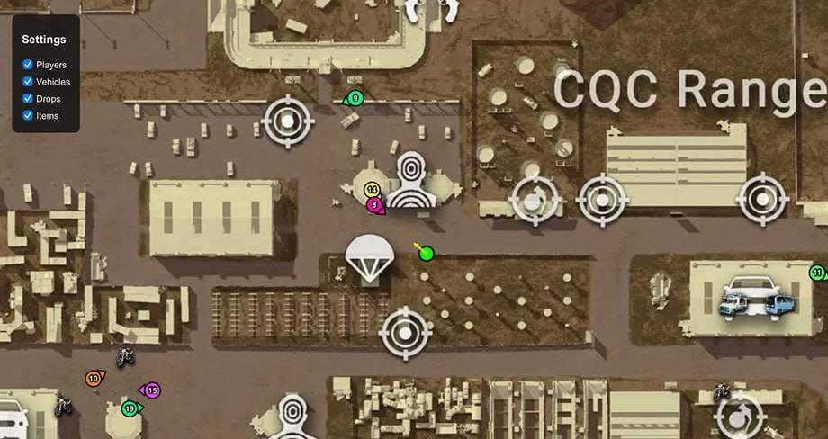
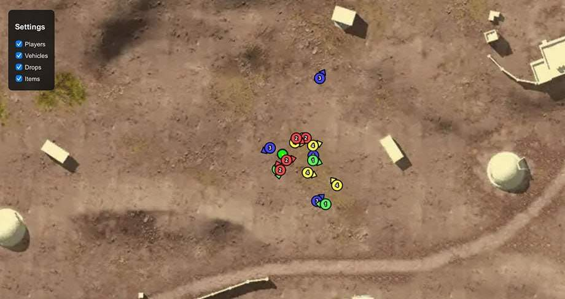
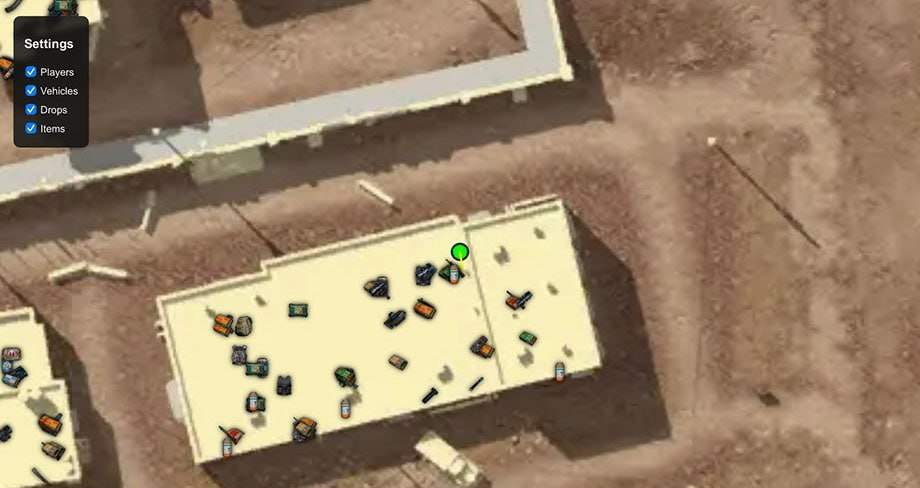
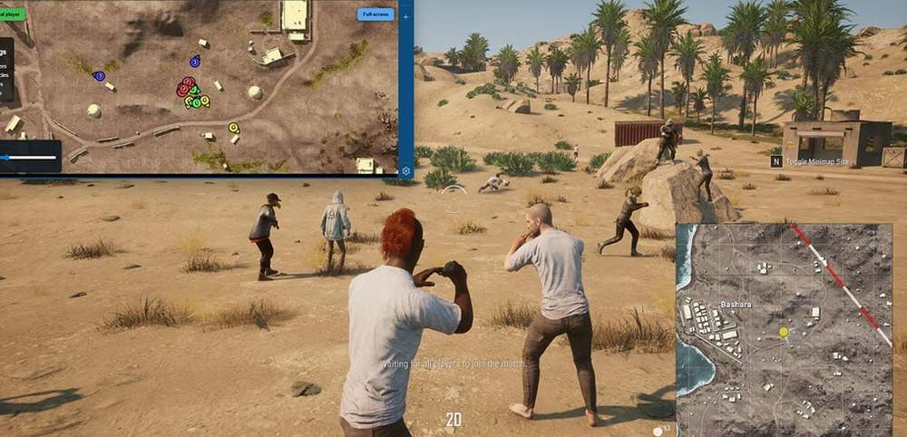
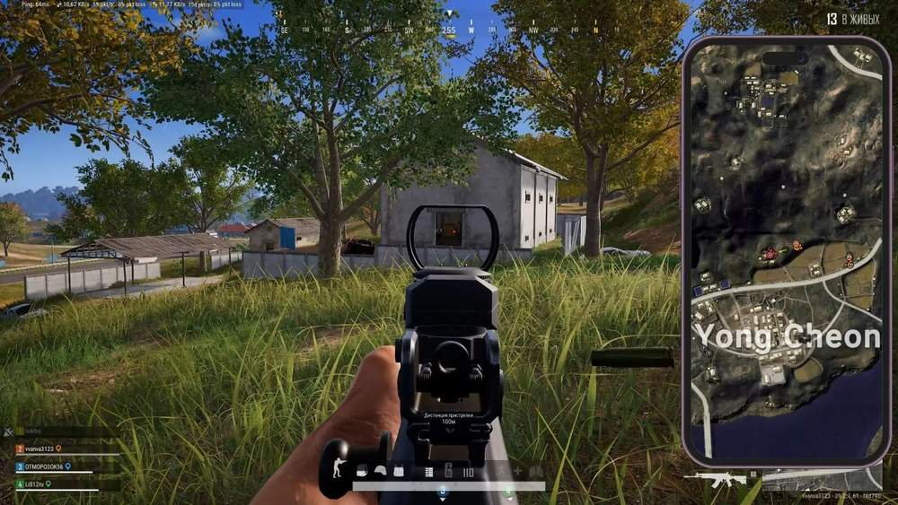
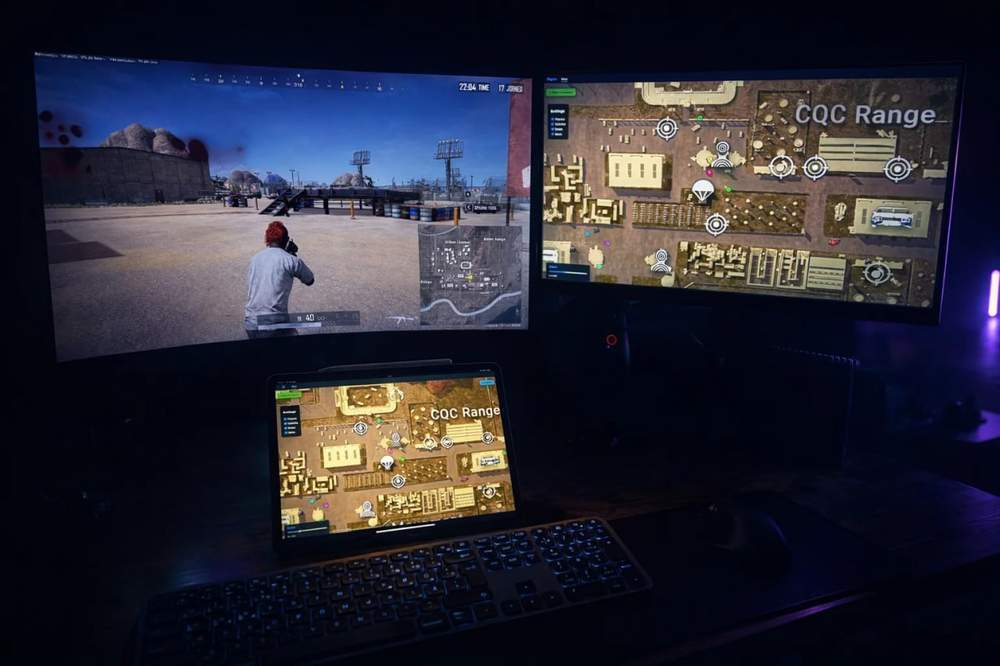

# Pubg – Pubg [ ☢ Arcane Radar ]

## 📸 Скриншоты

     

* Функционал Pubg [ ☢ Arcane Radar ]:

### 📡 Radar

* **Any Device** – возможность открыть радар на любом устройстве: втором мониторе, ноутбуке, планшете или смартфоне
* **Show Players** – отображение всех игроков на карте с обновлением их позиций в реальном времени
* **Show Vehicles** – отображение транспортных средств на карте
* **Show Drops** – отображение местоположения аирдропов
* **Show Items** – отображение предметов и лута на карте

### 👤 Player List

* **Team ID** – отображение номера команды игрока
* **Nickname** – отображение никнейма игрока
* **Weapon** – отображение оружия, находящегося в руках игрока
* **Ammo Count** – отображение текущего количества боеприпасов
* **Distance** – отображение расстояния до игрока

### ⚙️ Misc

* **Share Radar Link** – создание ссылки для передачи доступа к радару другому пользователю
* **Browser Access** – открытие радара напрямую через браузер
* **Second Monitor Support** – использование радара на дополнительном мониторе
* **Mobile Access** – доступ к радару со смартфона
* **Tablet Access** – доступ к радару с планшета
* **Steam Overlay Support** – открытие радара через Steam Overlay во время игры
* **Cross** – Device Access — использование радара с любого устройства, подключённого к интернету

## 🖥 Системные требования

* **Pubg [ ☢ Arcane Radar ]:** 
* ⚙️ **️ Операционная система:** Windows 10 - 11
* 🔲 **Процессор:** Intel / AMD
* 🔲 **Видеокарта:** Nvidia / AMD
* 🖥 **Режим игры:** В окне без рамок / Оконный
* 🌐 **Поддерживаемые версии игры:** Steam, Kakao
* 🤖 **Встроенный спуфер:** Нет