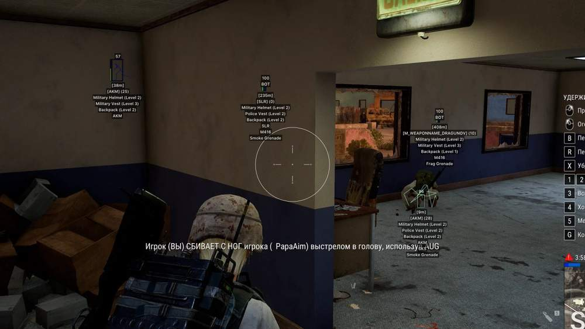
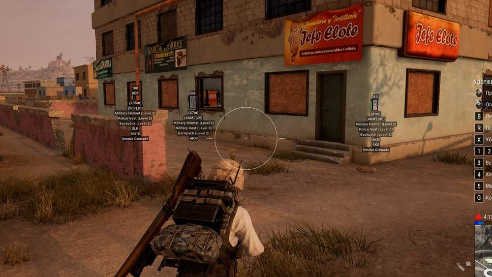
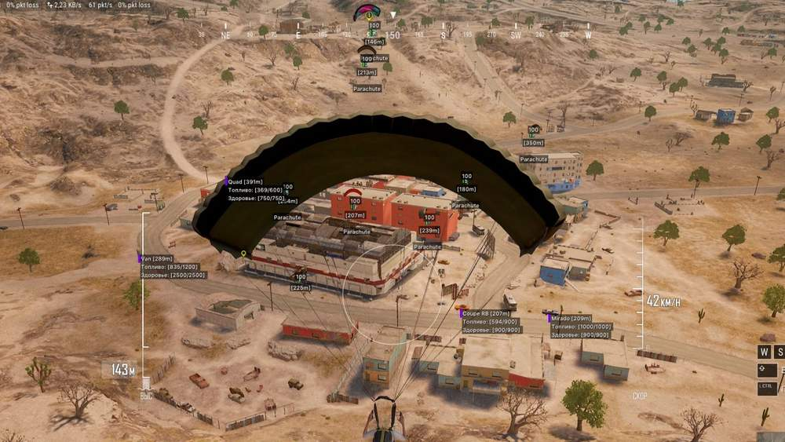
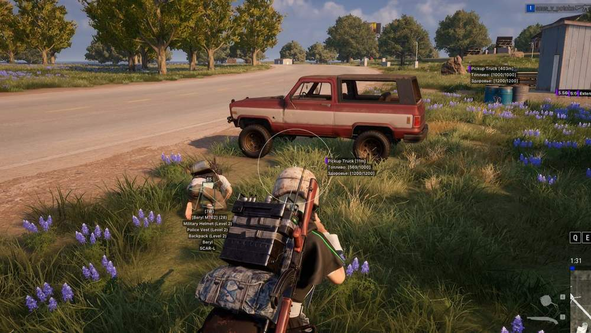
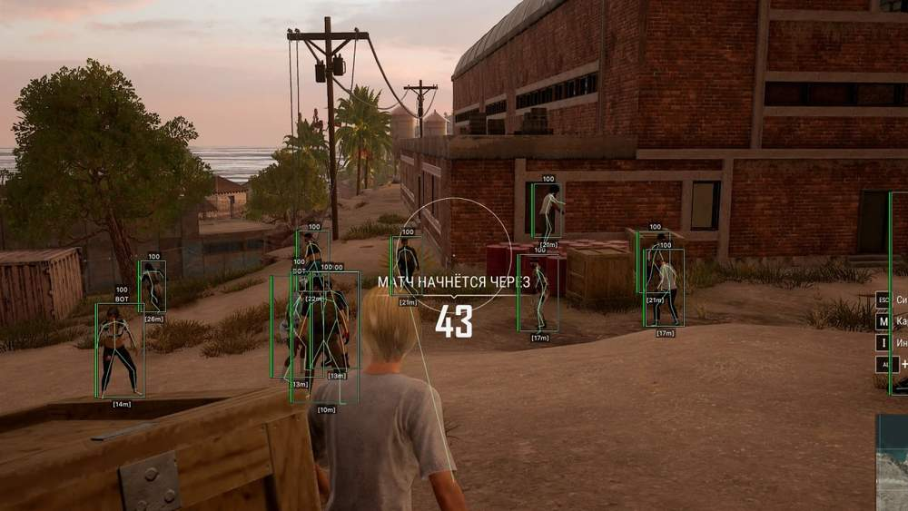

# Pubg – Pubg [ ☢ Phoenix Full ]

## 📸 Скриншоты

    

* Функционал Pubg [ ☢ Phoenix Full ]:

### 📦 Loot ESP

* **Loot ESP** – отображение различного лута, лежащего на земле
* **Loot Filter** – гибкая фильтрация отображаемого лута по категориям
* **Armor 1 LVL** – отображение брони первого уровня: бронежилеты, шлемы, рюкзаки
* **Armor 2 LVL** – отображение брони второго уровня: бронежилеты, шлемы, рюкзаки
* **Armor 3 LVL** – отображение брони третьего уровня: бронежилеты, шлемы, рюкзаки
* **Blade** – подсветка холодного оружия
* **Pistols** – отображение пистолетов
* **Submachine** – отображение пистолетов-пулемётов
* **Shotguns** – отображение дробовиков
* **Rifles** – отображение штурмовых винтовок
* **Snipers** – отображение снайперского оружия
* **Scopes** – отображение прицелов и оптики
* **Medicine** – отображение аптечек, бинтов, болеутоляющих, энергетиков и адреналина
* **Attachments** – отображение модификаций для оружия
* **Grenades** – отображение гранат и другого метательного оружия
* **Distance** – отображение расстояния до лута в метрах
* **Max Distance** – ограничение дальности отображения лута

### 👥 Players ESP

* **Players ESP** – отображение информации о противниках
* **Visible Check** – подсветка видимых врагов и врагов за стенами разными цветами
* **Show Bots (AI)** – отображение ботов отдельно от игроков
* **Boxes** – подсветка игроков за стенами с помощью боксов
* **Box Style** – настройка визуального стиля боксов: 2D, Corners, Filled
* **Health (Text, Bar)** – отображение здоровья игроков текстом и полосой
* **Skeleton** – отображение скелета поверх модели игрока
* **Knocked** – отображение сбитых игроков, которые ещё могут быть подняты
* **Equipment** – отображение текущего снаряжения игроков
* **Weapon** – отображение оружия в руках противника
* **Ammo** – отображение количества патронов в обойме и запасе
* **Snaplines** – линии от вашей модели до моделей противников
* **Kill Score** – отображение количества убийств у игроков
* **Level** – отображение уровня игроков
* **Distance** – отображение расстояния до игроков в метрах
* **Max Distance** – ограничение дальности работы ESP
* **Enemy Only** – отображение функций только против вражеских игроков
* **Icons Status** – отображение текущего статуса игрока: нокнутый, перезарядка, в транспорте, в прицеле, парашют, падение, реанимация
* **Player Stats** – отображение информации об игроках: пинг, нанесённый урон

### 🎯Vector Aim

* **Enabled** – включение и отключение аимбота
* **Vector Aimbot** – векторный аимбот, который помогает целиться движением курсора
* **Field of View (FOV)** – размер области работы аимбота
* **Show FOV** – отображение рабочей области аима вокруг прицела
* **Aim Key** – выбор клавиши для активации аимбота
* **Smooth** – сглаживание движений аимбота по целям
* **RCS** – контроль отдачи оружия при стрельбе с использованием аимбота

### 🌍 World ESP

* **Vehicles** – отображение транспорта с помощью WH
* **Vehicles Info (Health, Fuel)** – информация о прочности транспорта и запасе топлива
* **Airdrop** – отображение расположения аирдропов
* **Airdrop Content** – отображение списка лута внутри аирдропа
* **Corpses** – отображение ящиков мёртвых игроков
* **Corpse Content** – отображение содержимого инвентаря у трупов игроков
* **Name** – отображение названий объектов
* **Distance** – отображение расстояния до объектов в метрах
* **Max Distance** – настройка дальности отображения ESP для разных объектов
* **Show Grenades** – отображение брошенных гранат и времени до взрыва

### ⚙️ Other

* **Crosshair** – статичный прицел по центру экрана
* **Spectators** – отображение количества игроков, наблюдающих за вашей игрой
* **Combat Mode** – отключение всех PUBG ESP-функций, кроме WH на игроков
* **Combat Filter** – фильтр отображаемых объектов в Combat Mode
* **Colors** – настройка цветов визуальных функций
* **Language** – поддержка двух языков меню: русский и английский
* **HWID** – Spoofer — встроенный спуфер для обхода блокировок
* **Match Stats** – статистика текущего матча: живые игроки, команды, длительность матча, расстояние до белой/синей зоны
* **Radar** – отображение игроков, зон и типов гранат

## 🖥 Системные требования

* **Pubg [ ☢ Phoenix Full ]:** 
* ⚙️ **️ Операционная система:** Windows 10 - 11 (21H2  -  25H2)
* 🔲 **Процессор:** Intel | AMD
* 🔲 **Видеокарта:** Nvidia | AMD
* 🌐 **Поддерживаемые версии игры:** Steam
* 🤖 **Встроенный спуфер:** Нет