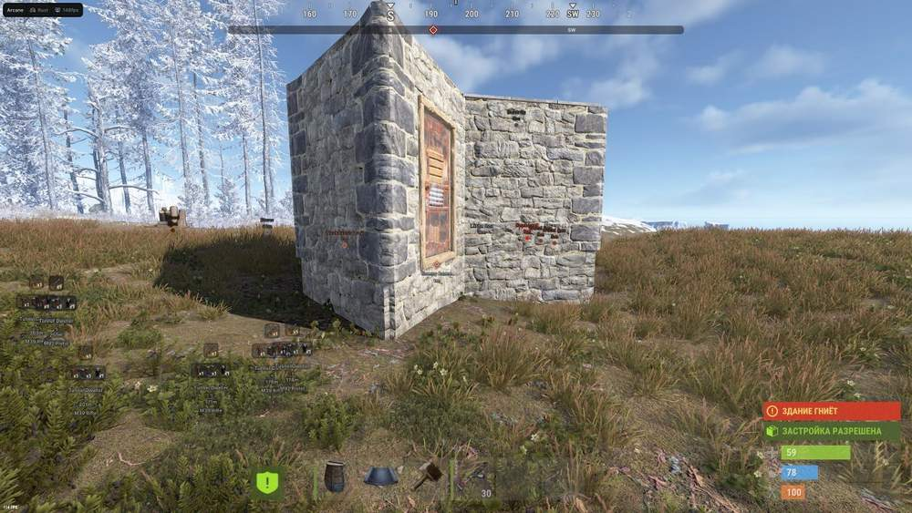
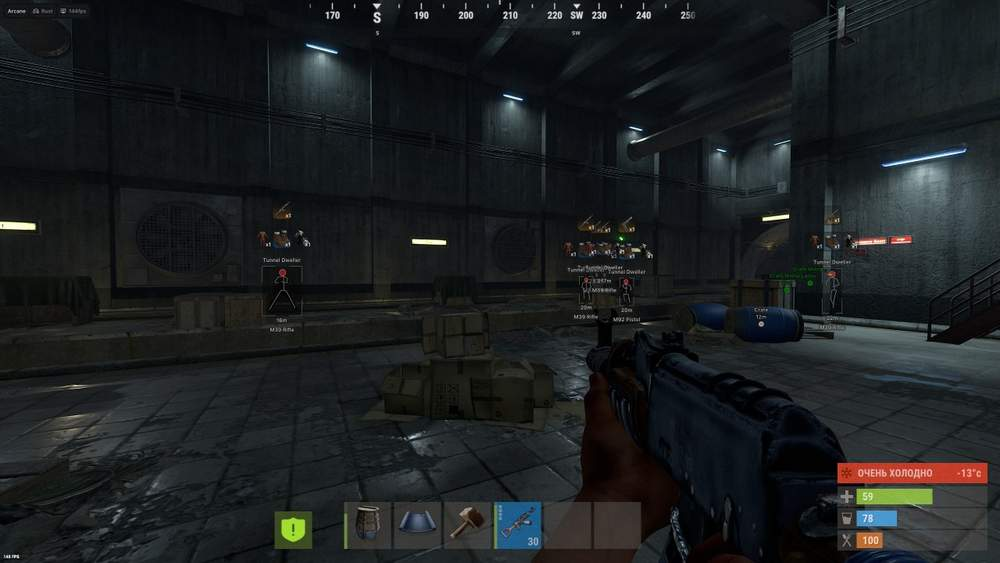
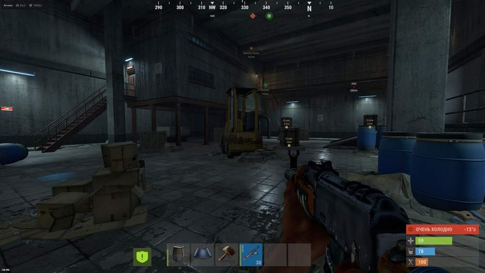
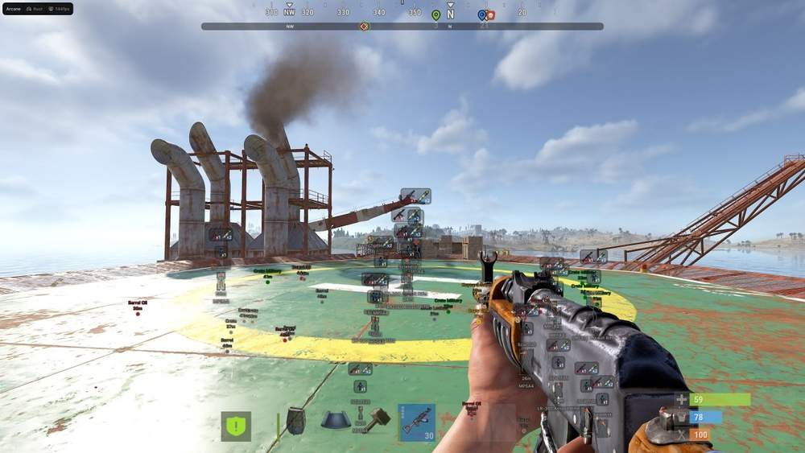
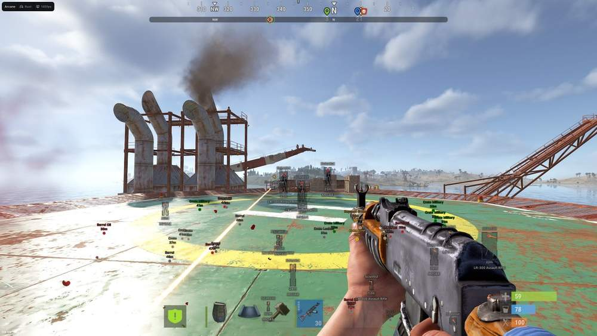
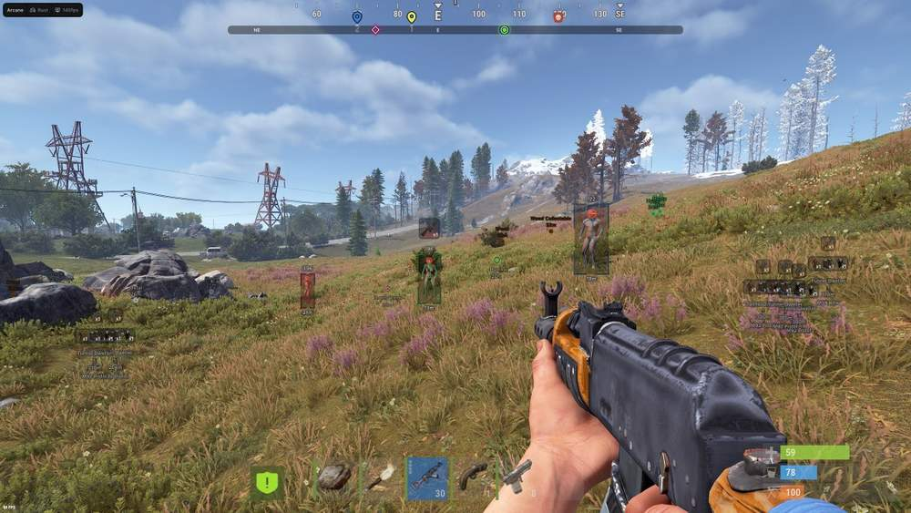

# rust – Rust [ ☢ Arcane ]

## 📸 Скриншоты

     

* Функционал Rust [ ☢ Arcane ]:

### 🎯 Aimbot

* **Aimbot Type** – выбор типа наведения: Vector / Silent
* **Target** – выбор доступных целей: Players / BOTs / Teams / Knocked
* **Mode** – режим работы аимбота: Always / On Hold
* **Bone Selection** – выбор алгоритма наведения: Selected Bone / Closest Bone / Random Bone
* **Bones** – выбор части тела: Head / Neck / Body / Pelvis
* **Prediction** – предугадывание траектории движения цели
* **Draw FOV Border** – отображение границы рабочей области аимбота
* **Draw FOV Background** – отображение фона внутри области FOV
* **Draw FOV Target** – отображение выбранной цели в области FOV
* **FOV Radius** – настройка радиуса рабочей области
* **Hit Chance** – настройка вероятности попадания
* **Smoothness** – настройка плавности наведения
* **First Keybind** – назначение первой клавиши активации
* **Second Keybind** – назначение второй клавиши активации
* **Switch Delay** – задержка переключения между целями
* **Visibility Check** – наведение только на видимые цели
* **Max Distance** – настройка максимальной дистанции работы аимбота

### 👁 ESP Players

* **Bounding Box** – отображение игроков в виде рамки: Box / Corner
* **Fill Box** – заливка рамки: Static / Gradient
* **View Line** – отображение направления взгляда с настройкой начального и конечного цвета
* **Line to Enemy** – отображение линий до противников с настройкой цвета и позиции
* **Draw Teams** – отображение союзников
* **Draw Bots** – отображение ботов
* **Draw Knocked** – отображение нокаутированных игроков
* **Draw Sleeping** – отображение спящих игроков
* **Nickname** – отображение имени игрока
* **Weapon in Hands** – отображение оружия или предмета в руках
* **Distance** – отображение расстояния до цели
* **Bot Transparency** – настройка прозрачности ESP ботов
* **Text Transparency** – настройка прозрачности текста
* **Visibility Check** – разделение видимых и скрытых целей
* **Max Distance** – настройка максимальной дистанции отображения

### 🎒 Inventory

* **Style Position** – выбор расположения инвентаря: Desktop / Player
* **Draw Count** – отображение количества предметов
* **Draw Rarity** – отображение редкости предметов
* **Draw Fast Slots** – отображение панели быстрых слотов
* **Draw Cloth Slots** – отображение экипированной одежды
* **Size** – настройка размера окна инвентаря
* **Transparency** – настройка прозрачности окна

### 📦 Items ESP

* **Show Distance** – отображение расстояния до предметов
* **Background Transparency** – настройка прозрачности фона
* **Filter** – фильтрация отображаемых объектов: Weapon / Construction / Items / Resources / Attire / Tool / Medical и другие категории

### 🌐 Objects ESP

* **Resource** – отображение ресурсов: Wood / Stone / Metal и другие
* **Eat** – отображение еды: Mushroom / Corn / Pumpkin и другие
* **Animals** – отображение животных: Bear / Wolf / Boar и другие
* **Vehicles** – отображение транспорта: Bradley / Bike / Boat и другие
* **Chests** – отображение контейнеров: Box Wood / Crate / Stash и другие
* **Corpse** – отображение выпавших предметов, тел игроков и рюкзаков
* **Traps** – отображение ловушек: Tin Can / Bear Trap / Land Mine и другие
* **Home** – отображение объектов базы: Bed / Cupboard / Workbench
* **World Objects** – отображение объектов мира: Recycler / Airdrop / Drone и другие
* **Middle Ages** – отображение осадных объектов: Catapult / Ballista / Siege Tower и другие

### 📍 Waypoints

* **Create Waypoint** – создание пользовательской точки
* **Draw Name** – отображение названия точки
* **Draw Distance** – отображение расстояния до точки
* **Enable Compass** – включение встроенного компаса

### 👥 Friends & Entities

* **Teamcheck Game Party** – разделение союзников и противников разными цветами
* **Add Friend** – добавление выбранного игрока в список друзей
* **Add Enemy** – добавление выбранного игрока в список противников

### 🛠 Misc

* **Battle Mode** – быстрое скрытие лишних визуальных функций во время боя
* **No Recoil** – отключение отдачи оружия
* **No Sway** – отключение раскачивания оружия
* **No Spread** – отключение разброса пуль
* **Spiderman** – возможность карабкаться по стенам и поверхностям
* **Instant Eoka** – мгновенный выстрел из Eoka без длительного срабатывания
* **Force Automatic** – автоматический режим стрельбы для поддерживаемого оружия
* **Fullbright** – повышение яркости тёмных участков и ночного времени
* **Shoot Anywhere** – возможность стрелять в нестандартных положениях
* **FOV Changer** – настройка угла обзора
* **Super Zoom Scope** – усиленное приближение при прицеливании
* **Thick Bullet** – увеличение эффективной области попадания пули

### ⚙️ Settings

* **Menu Keybind** – назначение клавиши открытия меню
* **Unload Keybind** – назначение клавиши выгрузки продукта
* **DPI Scale** – настройка масштаба интерфейса
* **FPS Limit** – установка ограничения кадров в секунду
* **Theme** – выбор темы меню: Murky / Sunny
* **Watermark** – отображение водяного знака
* **Language** – выбор языка интерфейса: EN / RU / CN

### 💾 Config

* **Create Config** – создание новой конфигурации
* **Load Config** – загрузка сохранённой конфигурации
* **Rename Config** – переименование выбранной конфигурации
* **Delete Config** – удаление выбранной конфигурации

## 🖥 Системные требования

* **Rust [ ☢ Arcane ]:** 
* ⚙️ **️ Операционная система:** Windows 10 - 11
* 🔲 **Процессор:** Intel | AMD
* 🔲 **Видеокарта:** Nvidia | AMD
* 🖥 **Режим игры:** В окне без рамок | Оконный
* 🌐 **Поддерживаемые версии игры:** Steam
* 🤖 **Встроенный спуфер:** Нет