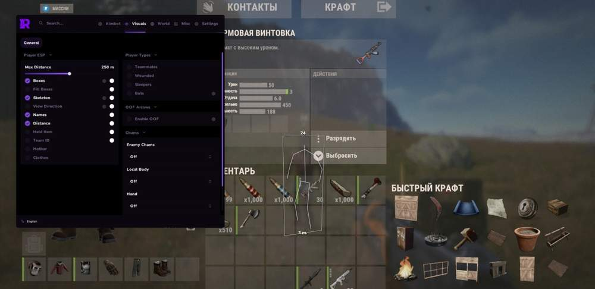
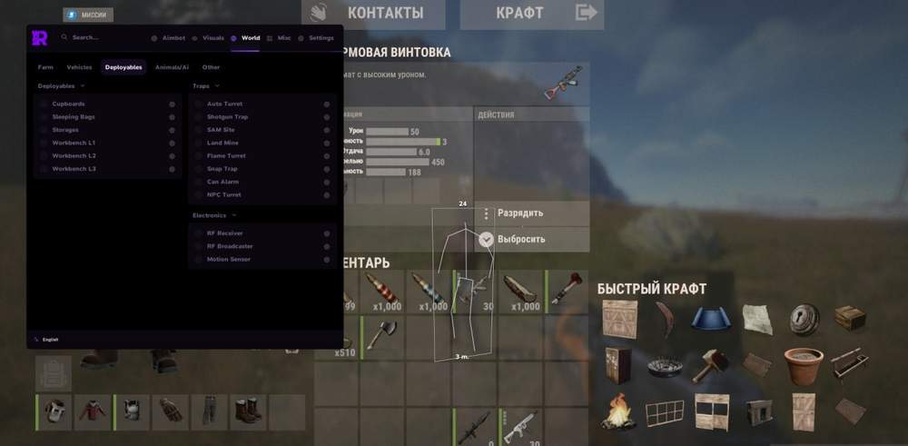
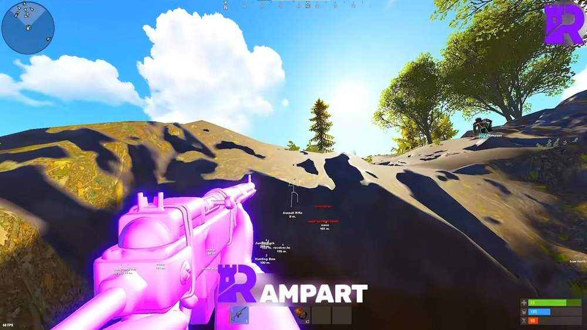
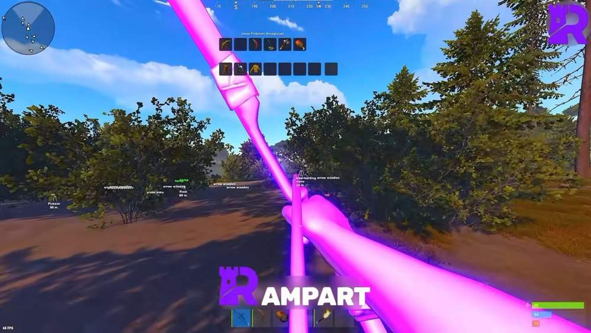
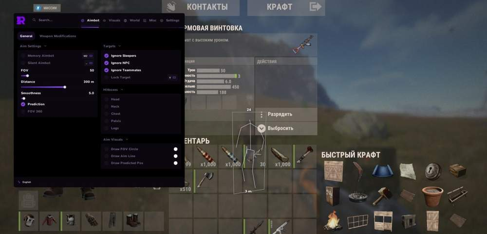

# rust – Rust [ ☢ Rampart Full ]

## 📸 Скриншоты

    

* Функционал Rust [ ☢ Rampart Full ]:

### 🎯 Aim

* **Aimbot** – основной режим аима
* **Silent Aim** – скрытое наведение без резких движений камеры
* **Silent On Key toggle** – включение Silent Aim по выбранной клавише
* **Prediction** – упреждение движения цели для стабильных попаданий
* **Prediction On/Off toggle** – включение и выключение Prediction
* **Lock Target** – захват цели при удержании клавиши
* **Custom Aim Key bind** – настройка собственной клавиши аима
* **Adjustable FOV** – настройка радиуса FOV
* **Adjustable Smoothness** – настройка плавности наведения
* **Adjustable Max Distance** – настройка максимальной дистанции работы аима
* **Hitbox** – выбор зоны попадания: Head / Chest / Pelvis / Legs
* **Filters** – игнорирование Sleepers / NPC / Teammates

### 👁 Aim Visuals

* **FOV Circle** – отображение круга FOV на экране
* **Aiming Line** – линия наведения до цели
* **Predicted Position Marker** – маркер предсказанной позиции цели

### 🔫 Weapon

* **No Recoil** – отключение отдачи
* **No Spread** – отключение разброса
* **Always Shoot** – возможность стрелять без стандартных ограничений
* **Auto Semi** – автоматизация полуавтоматического оружия
* **Instant Bow** – мгновенное натяжение Bow
* **Instant Compound Bow** – мгновенное натяжение Compound Bow
* **Instant Eoka** – мгновенное срабатывание Eoka

### 👤 Player ESP

* **Boxes** – отображение игроков в 2D / 3D / Corner боксах
* **Skeleton** – отображение скелета игрока
* **View Direction Line** – линия направления взгляда
* **Name** – отображение имени игрока
* **Distance** – отображение дистанции до игрока
* **Held Item** – отображение предмета в руках
* **Team ID** – отображение ID команды
* **Belt Items** – отображение предметов на поясе
* **Clothing Items** – отображение надетой одежды
* **Chams** – подсветка модели игрока
* **Separate colors** – отдельные цвета для Teammates / Wounded / Sleepers / Bots
* **Separate bot distance** – отдельная дистанция отображения для ботов

### 🧭 Radar

* **Minimap** – круглая или квадратная мини-карта
* **Adjustable** – настройка размера, масштаба и позиции
* **Background color** – настройка цвета фона
* **Player dots** – настройка цвета и размера точек игроков
* **View Zone cone** – настройка цвета конуса обзора
* **Grid Lines** – настройка толщины, прозрачности и цвета сетки
* **Tick Marks** – настройка толщины, прозрачности и цвета отметок
* **Show** – отображение Teammates / NPCs / Distance / Names
* **Show on radar** – отображение World Items / Farm / AI на радаре

### 🌍 World ESP

* **Tool Cupboard** – отображение шкафа с upkeep
* **Sleeping Bags** – отображение спальных мешков
* **Workbench** – отображение верстаков Tier 1 / 2 / 3
* **Dropped Items** – фильтр предметов: Weapons / Tools / Food / Resources / Ammo / Clothing / Components / Other
* **Corpses** – отображение трупов
* **Backpacks** – отображение рюкзаков
* **Storage Boxes** – отображение ящиков хранения
* **RF Receiver / Broadcaster** – отображение RF-устройств
* **Motion Sensor** – отображение датчиков движения
* **Raid ESP** – отображение рейда с таймером
* **Individual distance** – отдельная дистанция по каждой категории

### ⚠️ Traps ESP

* **Auto Turret** – отображение авто-турелей
* **Shotgun Trap** – отображение дробовых ловушек
* **SAM Site** – отображение SAM Site
* **Landmine** – отображение мин
* **Flame Turret** – отображение огненных турелей
* **Snap Trap / Bear Trap** – отображение капканов
* **Can Alarm** – отображение Can Alarm
* **NPC Turret** – отображение NPC-турелей
* **Trap Status / Health** – отображение статуса и здоровья ловушек
* **Individual distance** – отдельная дистанция для каждого типа ловушек

### 🚗 Vehicle ESP

* **Minicopter / Scrap Heli / Attack Heli** – отображение воздушного транспорта
* **Bicycle / Motorbike / Snowmobile** – отображение наземного транспорта
* **Modular Car / Horse** – отображение машин и лошадей
* **Rowboat / RHIB / Tugboat** – отображение водного транспорта
* **Submarine / Diver Propulsion** – отображение подводного транспорта
* **Drone** – отображение дронов
* **Individual distance + color** – отдельная дистанция и цвет для каждого транспорта

### ⛏️ Farm ESP

* **Ores** – отображение Sulfur / Metal / Stone
* **Trees / Wood** – отображение деревьев и древесины
* **Collectibles** – отображение Hemp / Metal / Stone / Wood / Sulfur
* **Diesel Barrels / Berries / Roses** – отображение дополнительных ресурсов
* **Crates** – отображение Elite / Military / Tools / Normal / Barrels
* **Food** – отображение Corn / Mushroom / Pumpkin / Potato / Food Crate
* **Airdrop** – отображение аирдропа
* **Chinook Crate** – отображение Chinook Crate с таймером блокировки
* **Individual distance + color** – отдельная дистанция и цвет для каждого предмета

### 🐻 Animals ESP

* **Horse** – отображение лошадей
* **Bear** – отображение медведей
* **Polar Bear** – отображение белых медведей
* **Boar** – отображение кабанов
* **Stag** – отображение оленей
* **Wolf** – отображение волков
* **Shark** – отображение акул
* **Chicken** – отображение куриц

### 🎨 Visual

* **Custom Crosshair** – несколько видов прицела с настройкой цвета
* **Hotbar Widget** – виджет хотбара на экране
* **Armor Widget** – виджет брони на экране
* **No Weapon Animation** – отключение анимации оружия
* **Bright Night / Ambient** – яркая ночь и настройка освещения
* **Local Player Chams** – подсветка локального игрока
* **Remove Layers** – отключение слоёв по выбранной клавише

### ⚙️ Misc

* **Fast Loot** – быстрый лут
* **Spider** – передвижение по поверхностям без урона от падения
* **Third Person** – режим третьего лица по клавише
* **Admin Camera** – админ-камера по клавише

### 🛠 Settings

* **Config Save / Load** – сохранение и загрузка конфигов
* **Menu toggle** – открытие меню по клавише
* **Watermark** – отображение FPS и времени
* **Custom ESP font** – настройка собственного шрифта ESP

## 🖥 Системные требования

* **Rust [ ☢ Rampart Full ]:** 
* ⚙️ **️ Операционная система:** Windows 10 - 11
* 🔲 **Процессор:** Intel | AMD
* 🔲 **Видеокарта:** Nvidia | AMD
* 🖥 **Режим игры:** В окне без рамок | Оконный
* 🌐 **Поддерживаемые версии игры:** Steam
* 🤖 **Встроенный спуфер:** Нет