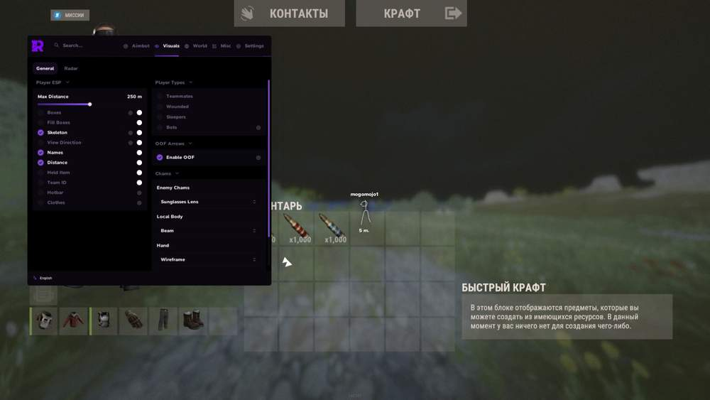
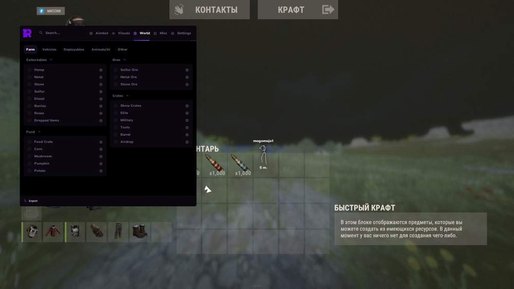
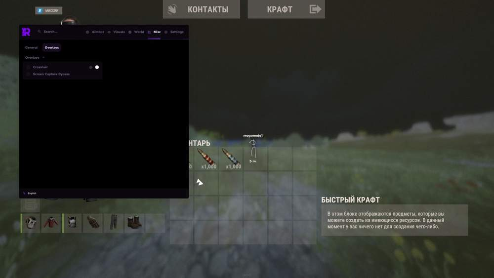
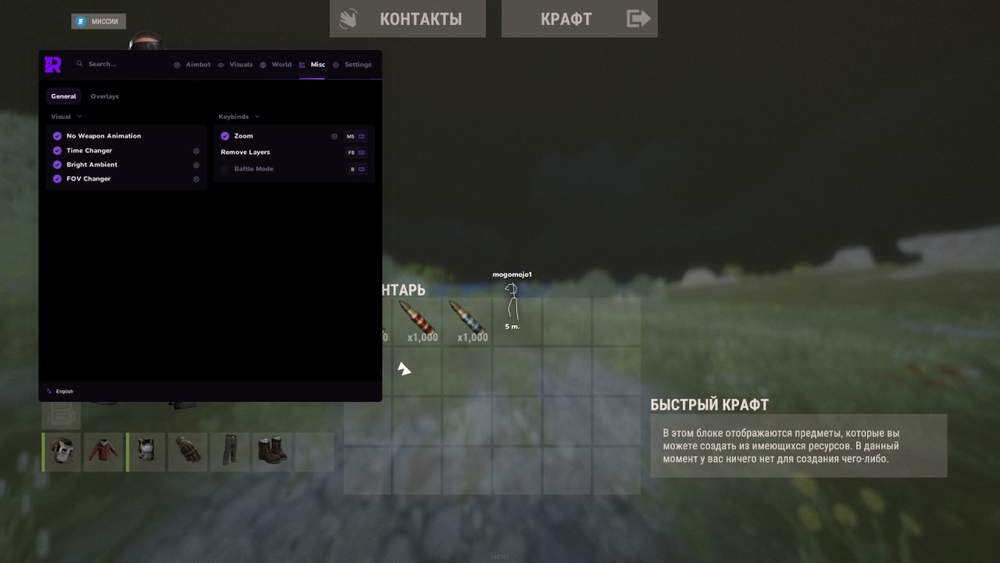

# rust – Rust [ ☢ Rampart Lite ]

## 📸 Скриншоты

   

* Функционал Rust [ ☢ Rampart Lite ]:

### 🎯 Aim

* **Silent Aim** – скрытое наведение
* **NO PREDICT** – без предикта
* **Aim Key bind** – настройка клавиши аима
* **Adjustable FOV** – настройка FOV
* **Adjustable Max Distance** – настройка максимальной дистанции
* **Hitbox: Head / Chest** – выбор зоны попадания: голова / грудь
* **Filters: Ignore Sleepers / NPC / Teammates** – игнорирование Sleepers / NPC / Teammates

### 👁 Aim Visuals

* **Draw FOV** – отображение FOV

### 👤 Player ESP

* **Boxes: 2D / 3D / Corner** – отображение боксов 2D / 3D / Corner
* **Filled Boxes** – заполненные боксы
* **Skeleton** – скелет
* **Name** – имя
* **Distance** – дистанция
* **Held Item** – предмет в руках
* **Team ID** – ID команды
* **Hotbar Widget / Above Head** – хотбар на экране или над головой
* **Clothing Items** – надетая одежда
* **Local Player Chams** – подсветка рук и оружия локального игрока
* **Enemy Chams** – подсветка противников
* **Separate colors** – отдельные цвета для Teammates / Wounded / Sleepers / Bots
* **Separate bot distance** – отдельная дистанция отображения для ботов

### 🌍 World ESP

* **Tool Cupboard** – отображение шкафа
* **Sleeping Bags** – отображение спальных мешков
* **Workbench Tier 1 / 2 / 3** – отображение верстаков Tier 1 / 2 / 3
* **Dropped Items** – фильтр предметов: Weapons / Tools / Food / Resources / Ammo / Clothing / Components / Other
* **Storage Boxes** – отображение ящиков хранения
* **RF Receiver / Broadcaster** – отображение RF-устройств
* **Motion Sensor** – отображение датчиков движения
* **Individual distance** – отдельная дистанция для каждой категории

### ⚠️ Traps ESP

* **Auto Turret** – отображение авто-турелей
* **Shotgun Trap** – отображение дробовых ловушек
* **SAM Site** – отображение SAM Site
* **Landmine** – отображение мин
* **Flame Turret** – отображение огненных турелей
* **Snap Trap / Bear Trap** – отображение капканов
* **Can Alarm** – отображение Can Alarm
* **NPC Turret** – отображение NPC-турелей
* **Individual distance** – отдельная дистанция для каждого типа ловушек

### 🚗 Vehicle ESP

* **Minicopter / Scrap Heli / Attack Heli / Hot Air Balloon** – отображение воздушного транспорта
* **Bicycle / Motorbike / Snowmobile** – отображение наземного транспорта
* **Modular Car / Horse** – отображение машин и лошадей
* **Rowboat / RHIB / Tugboat** – отображение водного транспорта
* **Submarine / Diver Propulsion** – отображение подводного транспорта
* **Drone** – отображение дронов
* **Individual distance + color** – отдельная дистанция и цвет для каждого транспорта

### ⛏️ Farm ESP

* **Ores: Sulfur / Metal / Stone** – отображение Sulfur / Metal / Stone
* **Collectibles: Hemp / Metal / Stone / Sulfur** – отображение собираемых ресурсов
* **Diesel / Berries / Roses** – отображение дизеля, ягод и роз
* **Crates: Elite / Military / Tools / Normal / Barrels** – отображение ящиков и бочек
* **Food: Corn / Mushroom / Pumpkin / Potato / Food Crate** – отображение еды
* **Airdrop** – отображение аирдропа
* **Chinook Crate** – отображение Chinook Crate
* **Individual distance + color** – отдельная дистанция и цвет для каждого предмета

### 🐻 Animals ESP & AI

* **Horse / Bear / Polar Bear / Boar / Stag / Wolf / Shark / Chicken / Crocodile / Snake** – отображение животных
* **Bradley APC** – отображение Bradley APC
* **Chinook** – отображение Chinook
* **Patrol Heli** – отображение Patrol Heli
* **Animal Corpse** – отображение трупов животных
* **Player Corpse** – отображение трупов игроков
* **Backpack / Loot Bag** – отображение рюкзаков
* **Individual distance** – отдельная дистанция для каждого предмета

### 🎨 Visual

* **Custom Crosshair** – кастомный прицел с несколькими видами и настройкой цвета
* **No Weapon Animation** – отключение анимации оружия
* **Change Time** – изменение времени
* **Bright Ambient** – яркое освещение
* **FOV Changer** – изменение FOV
* **Zoom** – зум по клавише
* **Remove Layers** – отключение слоёв по клавише
* **Battle Mode** – боевой режим по клавише

### 🛠 Settings — Config Save / Load - сохранение и загрузка конфигов

## 🖥 Системные требования

* **Rust [ ☢ Rampart Lite ]:** 
* ⚙️ **️ Операционная система:** Windows 10 - 11
* 🔲 **Процессор:** Intel | AMD
* 🔲 **Видеокарта:** Nvidia | AMD
* 🖥 **Режим игры:** В окне без рамок | Оконный
* 🌐 **Поддерживаемые версии игры:** Steam
* 🤖 **Встроенный спуфер:** Нет