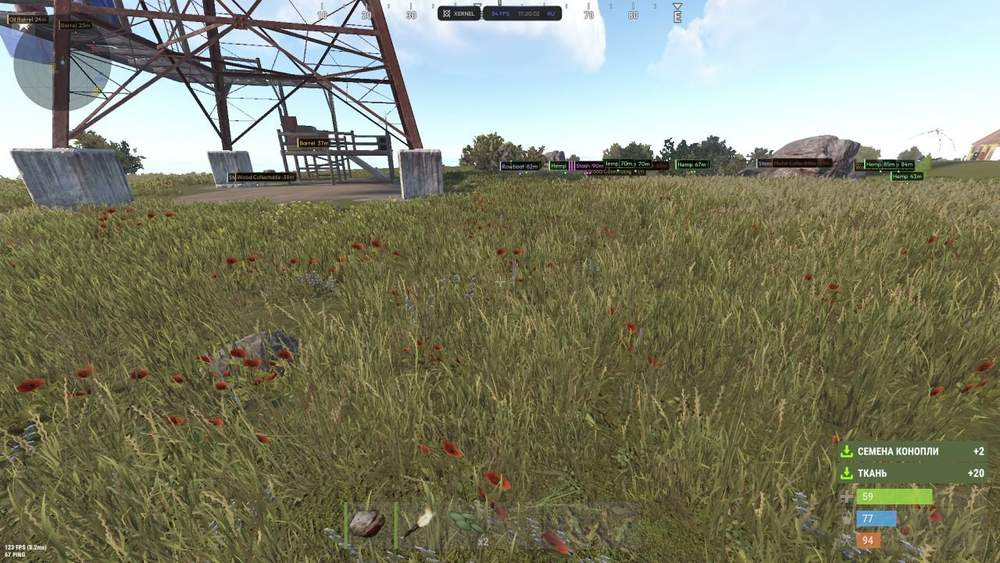
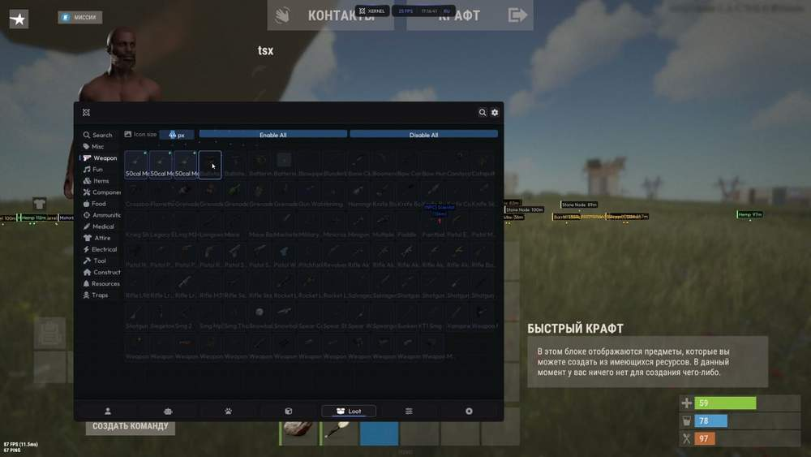
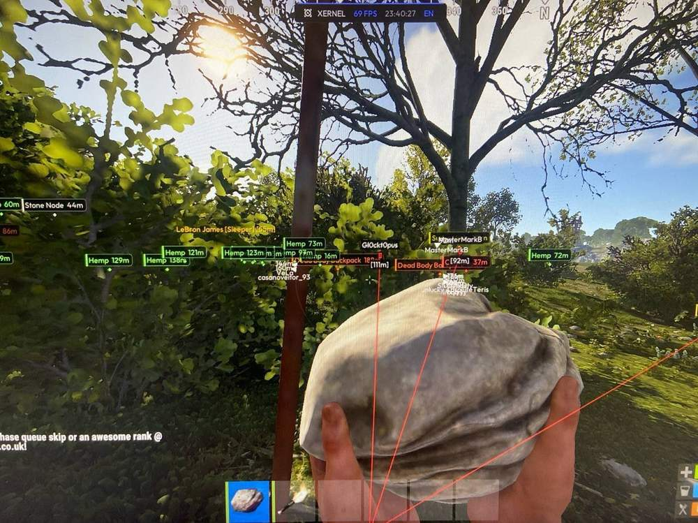
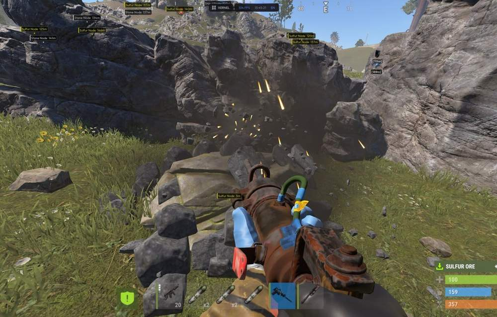
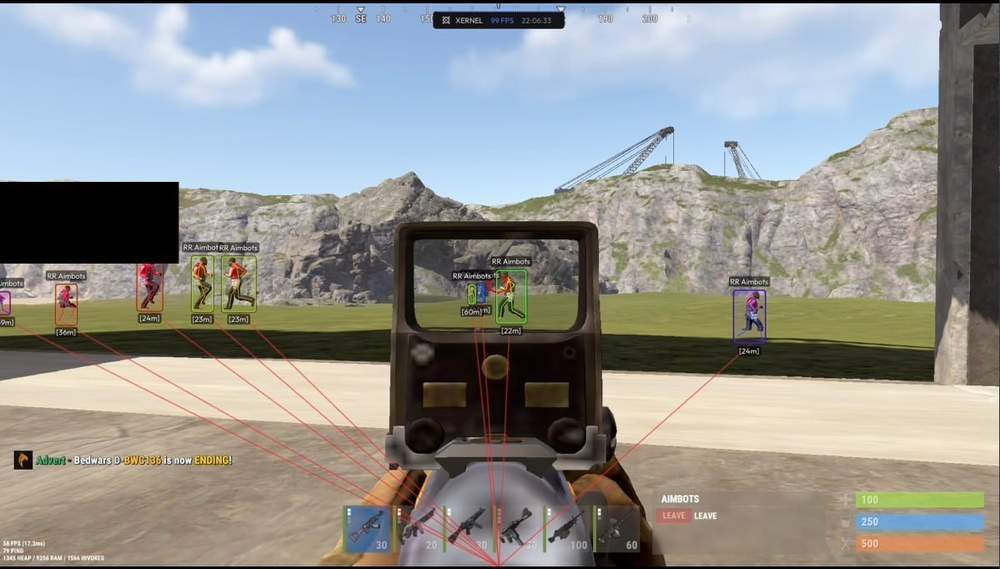

# rust – Rust [ ☢ Xernel ]

## 📸 Скриншоты

    

* Функционал Rust [ ☢ Xernel ]:

### 👤 ESP игроки и боты

* **Player ESP** – показывает игроков на выбранной дистанции
* **Bot ESP** – отдельно подсвечивает Scientists, Bandits и Dwellers
* **Sleeper ESP** – помогает находить спящих игроков
* **Box ESP** – рамки вокруг целей в стилях 2D Rect, 3D Wire, Corner и Rounded
* **Box Fill / Opacity** – заливка рамки и настройка её прозрачности
* **Rainbow Mode** – RGB-режим подсветки боксов
* **Skeleton ESP** – отображает скелет модели игрока
* **Health Bar / HP Text** – показывает здоровье полоской и числом
* **Name / Distance** – выводит ник и расстояние до цели
* **Snaplines** – рисует линии к игрокам и ботам
* **ESP Max Distance** – ограничивает дальность отображения ESP

### 🐾 ESP животные

* **Bear / Boar / Wolf ESP** – показывает опасных животных
* **Stag / Horse / Chicken ESP** – показывает мирных животных
* **Animal Name / Distance** – выводит название животного и дистанцию до него

### 📦 Объекты, ресурсы и deployables

* **Ores ESP** – показывает камень, серу и металл
* **Plants ESP** – подсвечивает коноплю, еду и собираемые растения

### 🔎 Продвинутый фильтр лута

* **Interactive Item Search** – быстрый поиск нужного предмета в настройках фильтра
* **Smart Categories** – удобные категории оружия, патронов, компонентов, ресурсов и другого лута
* **High Priority Item Override** – отдельный приоритет для особо важных предметов
* **Individual Item Snaplines** – линии к выбранным предметам
* **Custom Item Colors** – свои цвета для категорий и отдельных предметов
* **Icon Scaling** – настройка размера иконок лута

### ⚙️ Прочее и визуалы

* **Battle Mode** – убирает лишние элементы ESP во время боя
* **Inventory Viewer** – показывает инвентарь целей в заданном радиусе
* **Player Counter** – считает игроков рядом
* **Custom Crosshair** – настраиваемый прицел Cross, Dot, Circle или Cross + Dot
* **FOV Circle** – круг FOV с настройкой радиуса, толщины и заливки

### 🛰 2D радар

* **Custom Radar Window** – отдельное окно радара с настройкой положения
* **Rotate With Player** – радар поворачивается вместе с игроком
* **Entity Filters** – фильтры игроков, ботов, животных, лута, объектов и спящих
* **Custom Dot Sizes** – отдельный размер точки для себя и других объектов
* **Radar Styling** – сетка, кольца, северный индикатор, прозрачность и цвета

### 🎯 Aimbot

* **Hold / Toggle Keybind** – активация удержанием клавиши или переключателем
* **FOV** – радиус поиска цели
* **Smooth** – плавность наведения
* **Bone Choose** – выбор точки наведения
* **No Recoil** – регулировка отдачи от 0 до 100%

## 🖥 Системные требования

* **Rust [ ☢ Xernel ]:** 
* ⚙️ **️ Операционная система:** Windows 10 | 11
* 🔲 **Процессор:** Intel | AMD
* 🔲 **Видеокарта:** NVIDIA | AMD
* 🖥 **Режим игры:** В окне без рамок  |  Оконный
* 🌐 **Поддерживаемые версии игры:** Steam
* 🤖 **Встроенный спуфер:** Нет