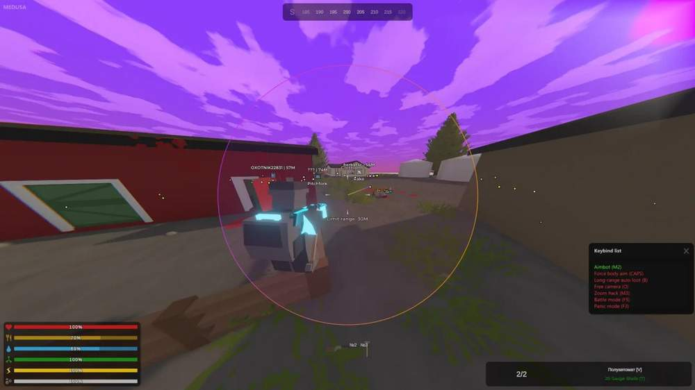
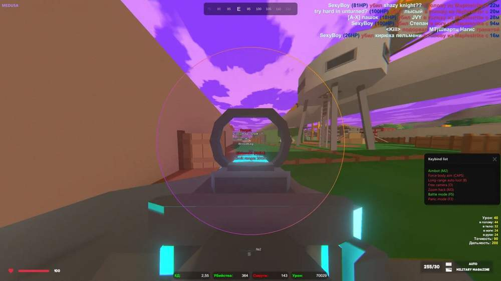
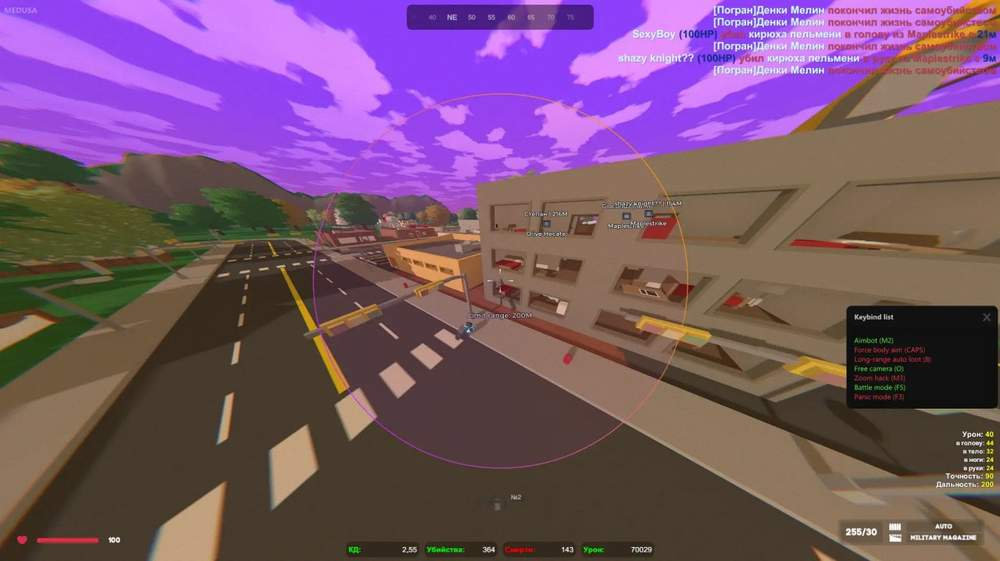

# Unturned – Unturned [ ☢ Medusa ]

## 📸 Скриншоты

  

* Функционал Unturned [ ☢ Medusa ]:

### 🎯 Aimbot

* **Enable** – включение Aimbot по выбранной клавише
* **Nearest Bone** – наведение на ближайшую доступную кость цели
* **Target Info** – отображение информации о выбранной цели
* **Target Info Color** – настройка цвета информации о цели
* **FOV** – настройка области захвата цели вокруг прицела
* **FOV Color** – настройка цвета радиуса Aimbot
* **FOV Style** – настройка визуального стиля радиуса
* **Filled FOV Style** – настройка стиля заливки радиуса
* **Filled FOV Color** – настройка цвета заливки радиуса
* **Force Body Aim** – принудительное наведение в корпус
* **Auto Max Distance** – автоматический подбор рабочей дистанции Aimbot
* **Show Distance Limit** – отображение лимита дистанции работы Aimbot
* **Max Distance** – ограничение дальности работы Aimbot
* **Bone** – выбор точки наведения: голова, тело или другие части

### 🔫 Weapon

* **No Recoil** – отключение отдачи оружия
* **No Spread** – отключение разброса пуль
* **No Sway** – отключение раскачивания оружия при движении и прицеливании
* **Melee Attack Range** – увеличение радиуса атаки ближнего боя

### 👤 Visuals / Players

* **Enable** – включение отображения игроков
* **Outline** – подсветка игрока для лучшей видимости
* **Info** – отображение информации об игроке
* **Info Color** – настройка цвета информации
* **Only Visible** – отображение только видимых игроков
* **Box Color** – настройка цвета рамки игрока
* **Box Style** – настройка типа рамки вокруг игрока
* **Filled Box Style** – настройка стиля заливки рамки
* **Filled Box Color** – настройка цвета заливки рамки
* **Skeleton** – отображение скелета модели игрока
* **Friends** – отдельное отображение друзей, чтобы не путать их с целями

### 🧟 Visuals / Zombies

* **Enable** – включение отображения зомби
* **Only Visible** – отображение только видимых зомби
* **Box Style** – настройка типа рамки вокруг зомби
* **Box Color** – настройка цвета рамки зомби
* **Filled Box Style** – настройка стиля заливки рамки
* **Filled Box Color** – настройка цвета заливки рамки
* **Skeleton** – отображение скелета модели зомби
* **Outline** – подсветка зомби для быстрого распознавания
* **Info** – отображение информации о зомби
* **Info Color** – настройка цвета текста информации

### 🚗 Visuals / Transport

* **Enable** – включение отображения транспорта
* **Distance** – отображение расстояния до транспорта
* **Vehicle Type** – отображение типа найденного транспорта
* **Hide In Battle Mode** – скрытие транспортных меток во время боя
* **Show Only When Hovering** – отображение информации о транспорте только при наведении

### 📌 Visuals / Objects

* **Enable** – включение отображения игровых объектов
* **Distance** – отображение расстояния до объекта
* **Types** – выбор категорий объектов для отображения
* **Hide In Battle Mode** – скрытие объектов во время боя

### 🐺 Visuals / Animals

* **Enable** – включение отображения животных
* **Max Distance** – ограничение дальности отображения животных
* **Hide In Battle Mode** – скрытие меток животных во время боя

### 🔎 Loot

* **Enable** – включение отображения предметов
* **Category** – отображение категории найденного предмета
* **Rarity** – отображение редкости предмета
* **Rarity Color** – окрашивание предметов по уровню редкости
* **Categories** – выбор нужных типов предметов для отображения
* **Rarity Filter** – фильтрация предметов по редкости
* **Show Only When Hovering** – отображение информации о предмете только при наведении
* **Hide In Battle Mode** – скрытие лута во время боя
* **Max Distance** – ограничение дальности отображения предметов

### 🎥 Camera

* **Free Camera** – свободное управление камерой
* **FOV** – настройка ширины обзора камеры
* **Aspect Ratio Changer** – изменение соотношения сторон изображения
* **View Angle Changer** – настройка угла обзора камеры

### 🌦 Weather Controller

* **Enable** – включение контроллера погоды
* **Sky Color** – настройка цвета неба
* **Equator Color** – изменение цвета линии горизонта
* **Ground Color** – настройка оттенка земли
* **Sun Color** – изменение цвета солнца

### 🎭 Skin Changer

* **Enable** – включение модуля замены скинов
* **Skin List** – список доступных скинов
* **Use One Character Skin** – применение одного выбранного скина к персонажу
* **Character Skin ID** – ручной ввод ID скина персонажа
* **Weapon Skin ID** – ручной ввод ID скина оружия

### 👥 Player List

* **Search** – быстрый поиск нужного игрока в списке
* **Player List** – отображение игроков на сервере

### ⚙️ Misc

* **Zoom Hack** – изменение масштаба обзора по горячей клавише
* **Unlock Map** – открытие доступа к карте
* **Skin Changer** – быстрая замена скинов персонажа и оружия
* **Anti Watcher** – скрытие работы функций при проверке через режим наблюдения
* **Auto Pickup** – автоматический подбор предметов на заданной дистанции
* **Compass** – отображение компаса на экране

### 🧩 Config

* **Config List** – список сохранённых профилей настроек
* **Name** – поле для названия новой конфигурации
* **Add** – создание новой конфигурации
* **Save** – сохранение текущих настроек в выбранный профиль
* **Load** – загрузка выбранной конфигурации
* **Rename** – переименование выбранного профиля
* **Delete** – удаление выбранной конфигурации
* **Default AutoLoad** – выбор конфига для автоматической загрузки
* **Import** – импорт конфигурации из буфера обмена
* **Export** – копирование выбранной конфигурации
* **Export All** – экспорт всех сохранённых конфигураций
* **Reset Settings** – сброс настроек к значениям по умолчанию

### ⚙️ Settings

* **Menu Key** – назначение клавиши открытия меню
* **Panic Key** – клавиша быстрого отключения функций
* **Battle Mode Key** – назначение клавиши боевого режима
* **Main Color** – настройка основного цвета интерфейса
* **Color Style** – изменение стиля окраски интерфейса
* **Theme Color** – переключение темы оформления
* **DPI Scale** – изменение масштаба интерфейса
* **Language** – переключение языка меню
* **Watermark** – настройка отображения водяного знака
* **Save** – сохранение настроек интерфейса
* **Load** – загрузка сохранённых настроек интерфейса

## 🖥 Системные требования

* **Unturned [ ☢ Medusa ]:** 
* ⚙️ **️ Операционная система:** Windows 10 - 11 [21H2 / 22H2 / 23H2]
* 🔲 **Процессор:** Intel / AMD
* 🔲 **Видеокарта:** Nvidia / AMD
* 🖥 **Режим игры:** В окне без рамок / Оконный / Полноэкранный
* 🌐 **Поддерживаемые версии игры:** Battlestate Games Launcher (BSG) / Steam
* 🤖 **Встроенный спуфер:** нет